

# Universidad Peruana de Ciencias Aplicadas

## Carrera de Ingeniería de Software

**1ACC0238**
 
**Aplicaciones para Dispositivos Móviles**

NRC

**4950**

# Informe de Trabajo Final

 

Docente

**Mayta Guillermo, Jorge Luis**

Equipo

**CogniTech**

Proyecto

**MindFlow**
 
 

### Integrantes

| Código      | Apellidos y Nombres |
| ----------- | -------------------- |
| u202412462  | Cabrera Sotelo, Camila Celeste |
| u202410421  | Dias de la Cruz, Sebastian Gabriel |
| u202413169  | Güere Calero, Fernando Julio |
| U202410024  | Jáuregui Cerna, Jean Franco |
| U202410382  | Limache Coronel, Imanol Fabrizio |

 

**Periodo 202620**

**Setiembre 2026**

---

# Registro de Versiones del Informe

<table>
  <tr>
    <th>Versión</th>
    <th>Fecha</th>
    <th>Autor</th>
    <th>Descripción de modificación</th>
  </tr>

  <tr>
    <td><b>Primera Entrega (AV1)</b></td>
    <td>18/09/2026</td>
    <td>
      Cabrera Sotelo, Camila Celeste  
       
      

      Dias de la Cruz, Sebastian Gabriel  
       
      

      Güere Calero, Fernando Julio  
       
      

      Jáuregui Cerna, Jean Franco  
       
      

      Limache Coronel, Imanol Fabrizio  
    </td>
    <td>
      Capítulo I: Presentación (Startup Profile, Lean UX Process)  
      Capítulo II: Requirements Development and Software Solution Design (Needfinding - Big Picture EventStorming; Strategic-Level DDD - EventStorming, Candidate Context Discovery)
    </td>
  </tr>
  <!-- 
  <tr>
    <td><b>Primera Entrega (TB1)</b></td>
    <td>[Fecha]</td>
    <td>[Autor(es)]</td>
    <td>[Avance]</td>
  </tr>
  <tr>
    <td><b>Segunda Entrega (TP)</b></td>
    <td>[Fecha]</td>
    <td>[Autor(es)]</td>
    <td>[Avance]</td>
  </tr>
  <tr>
    <td><b>Tercera Entrega (TB2)</b></td>
    <td>[Fecha]</td>
    <td>[Autor(es)]</td>
    <td>[Avance]</td>
  </tr>
  <tr>
    <td><b>Cuarta Entrega (TF)</b></td>
    <td>[Fecha]</td>
    <td>[Autor(es)]</td>
    <td>[Avance]</td>
  </tr>
  -->
</table>
-->

---

# Project Report Collaboration Insights

El informe del proyecto fue desarrollado de manera colaborativa por el equipo mediante el repositorio de GitHub creado para la gestión del Project Report de MindFlow. Este repositorio contiene los archivos del informe, los diagramas, las evidencias y el historial de versiones correspondiente a cada entrega.

URL de la organización de GitHub: https://github.com/upc-pre-202620-1acc0238-4950-CogniTech

**Primera Entrega (AV1)**

Durante la primera entrega del proyecto MindFlow, el equipo trabajó de manera colaborativa en la elaboración del Project Report, organizando las actividades y responsabilidades de forma grupal para cubrir las diferentes secciones del informe correspondientes a esta etapa.

El desarrollo del trabajo incluyó actividades de investigación y documentación del dominio del negocio: la descripción de la Startup y el desarrollo del Lean UX Process (Problem Statements y Assumptions) para el Capítulo I, así como el modelado del negocio mediante Big Picture EventStorming y el inicio del Strategic-Level Domain-Driven Design (sesión de EventStorming y Candidate Context Discovery) para el Capítulo II, permitiendo al equipo consolidar una primera visión compartida de los Bounded Contexts candidatos de la solución.

Para la organización y seguimiento del trabajo, el equipo utilizó GitHub como plataforma principal de colaboración y control de versiones, siguiendo el flujo de trabajo GitFlow (ramas `feature/*` sobre `develop`, integradas mediante Pull Requests). Mediante ramas de trabajo, commits y Pull Requests, fue posible registrar los avances realizados en el informe y mantener evidencia continua de la participación grupal durante esta primera entrega.

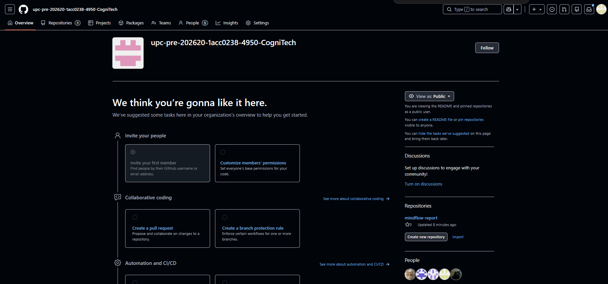

*Figura: Creación y organización del repositorio del Project Report en GitHub.*

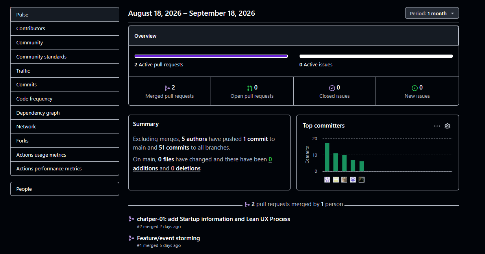

*Figura: Historial de commits del equipo durante la primera entrega (AV1).*

---

# Contenido

## Tabla de Contenidos

- [Registro de Versiones del Informe](#registro-de-versiones-del-informe)
- [Project Report Collaboration Insights](#project-report-collaboration-insights)
- [Contenido](#contenido)
  - [Tabla de Contenidos](#tabla-de-contenidos)
- [Student Outcome](#student-outcome)
- [Objetivos SMART](#objetivos-smart)
- [Capítulo I: Presentación](#capítulo-i-presentación)
  - [1.1. Startup Profile](#11-startup-profile)
    - [1.1.1. Descripción de la Startup](#111-descripción-de-la-startup)
    - [1.1.2. Perfiles de integrantes del equipo](#112-perfiles-de-integrantes-del-equipo)
  - [1.2. Solution Profile](#12-solution-profile)
    - [1.2.1. Antecedentes y problemática](#121-antecedentes-y-problemática)
    - [1.2.2. Lean UX Process](#122-lean-ux-process)
      - [1.2.2.1. Lean UX Problem Statements](#1221-lean-ux-problem-statements)
      - [1.2.2.2. Lean UX Assumptions](#1222-lean-ux-assumptions)
      - [1.2.2.3. Lean UX Hypothesis Statements](#1223-lean-ux-hypothesis-statements)
      - [1.2.2.4. Lean UX Canvas](#1224-lean-ux-canvas)
  - [1.3. Segmentos objetivo](#13-segmentos-objetivo)
- [Capítulo II: Requirements Development and Software Solution Design](#capítulo-ii-requirements-development-and-software-solution-design)
  - [2.1. Competidores](#21-competidores)
    - [2.1.1. Análisis competitivo](#211-análisis-competitivo)
    - [2.1.2. Estrategias y tácticas frente a competidores](#212-estrategias-y-tácticas-frente-a-competidores)
  - [2.2. Entrevistas](#22-entrevistas)
    - [2.2.1. Diseño de entrevistas](#221-diseño-de-entrevistas)
    - [2.2.2. Registro de entrevistas](#222-registro-de-entrevistas)
    - [2.2.3. Análisis de entrevistas](#223-análisis-de-entrevistas)
  - [2.3. Needfinding](#23-needfinding)
    - [2.3.1. User Personas](#231-user-personas)
    - [2.3.2. User Task Matrix](#232-user-task-matrix)
    - [2.3.3. User Journey Mapping](#233-user-journey-mapping)
    - [2.3.4. Empathy Mapping](#234-empathy-mapping)
    - [2.3.5. Big Picture EventStorming](#235-big-picture-eventstorming)
    - [2.3.6. Ubiquitous Language](#236-ubiquitous-language)
  - [2.4. Requirements Specification](#24-requirements-specification)
    - [2.4.1. User Stories](#241-user-stories)
    - [2.4.2. Impact Mapping](#242-impact-mapping)
    - [2.4.3. Product Backlog](#243-product-backlog)
  - [2.5. Strategic-Level Domain-Driven Design](#25-strategic-level-domain-driven-design)
    - [2.5.1. EventStorming](#251-eventstorming)
      - [2.5.1.1. Candidate Context Discovery](#2511-candidate-context-discovery)
      - [2.5.1.2. Domain Message Flows Modeling](#2512-domain-message-flows-modeling)
      - [2.5.1.3. Bounded Context Canvases](#2513-bounded-context-canvases)
    - [2.5.2. Context Mapping](#252-context-mapping)
    - [2.5.3. Software Architecture](#253-software-architecture)
      - [2.5.3.1. Software Architecture Context Level Diagrams](#2531-software-architecture-context-level-diagrams)
      - [2.5.3.2. Software Architecture Container Level Diagrams](#2532-software-architecture-container-level-diagrams)
      - [2.5.3.3. Software Architecture Deployment Diagrams](#2533-software-architecture-deployment-diagrams)
  - [2.6. Tactical-Level Domain-Driven Design](#26-tactical-level-domain-driven-design)
    - [2.6.1. Bounded Context: IAM](#261-bounded-context-iam)
      - [2.6.1.1. Domain Layer](#2611-domain-layer)
      - [2.6.1.2. Interface Layer](#2612-interface-layer)
      - [2.6.1.3. Application Layer](#2613-application-layer)
      - [2.6.1.4. Infrastructure Layer](#2614-infrastructure-layer)
      - [2.6.1.5. Bounded Context Software Architecture Component Level Diagrams](#2615-bounded-context-software-architecture-component-level-diagrams)
      - [2.6.1.6. Bounded Context Software Architecture Code Level Diagrams](#2616-bounded-context-software-architecture-code-level-diagrams)
        - [2.6.1.6.1. Bounded Context Domain Layer Class Diagrams](#26161-bounded-context-domain-layer-class-diagrams)
        - [2.6.1.6.2. Bounded Context Database Design Diagram](#26162-bounded-context-database-design-diagram)
    - [2.6.2. Bounded Context: Journal](#262-bounded-context-journal)
      - [2.6.2.1. Domain Layer](#2621-domain-layer)
      - [2.6.2.2. Interface Layer](#2622-interface-layer)
      - [2.6.2.3. Application Layer](#2623-application-layer)
      - [2.6.2.4. Infrastructure Layer](#2624-infrastructure-layer)
      - [2.6.2.5. Bounded Context Software Architecture Component Level Diagrams](#2625-bounded-context-software-architecture-component-level-diagrams)
      - [2.6.2.6. Bounded Context Software Architecture Code Level Diagrams](#2626-bounded-context-software-architecture-code-level-diagrams)
        - [2.6.2.6.1. Bounded Context Domain Layer Class Diagrams](#26261-bounded-context-domain-layer-class-diagrams)
        - [2.6.2.6.2. Bounded Context Database Design Diagram](#26262-bounded-context-database-design-diagram)
    - [2.6.3. Bounded Context: AI Assistant](#263-bounded-context-ai-assistant)
      - [2.6.3.1. Domain Layer](#2631-domain-layer)
      - [2.6.3.2. Interface Layer](#2632-interface-layer)
      - [2.6.3.3. Application Layer](#2633-application-layer)
      - [2.6.3.4. Infrastructure Layer](#2634-infrastructure-layer)
      - [2.6.3.5. Bounded Context Software Architecture Component Level Diagrams](#2635-bounded-context-software-architecture-component-level-diagrams)
      - [2.6.3.6. Bounded Context Software Architecture Code Level Diagrams](#2636-bounded-context-software-architecture-code-level-diagrams)
        - [2.6.3.6.1. Bounded Context Domain Layer Class Diagrams](#26361-bounded-context-domain-layer-class-diagrams)
        - [2.6.3.6.2. Bounded Context Database Design Diagram](#26362-bounded-context-database-design-diagram)
    - [2.6.4. Bounded Context: Habits & Wellness](#264-bounded-context-habits--wellness)
      - [2.6.4.1. Domain Layer](#2641-domain-layer)
      - [2.6.4.2. Interface Layer](#2642-interface-layer)
      - [2.6.4.3. Application Layer](#2643-application-layer)
      - [2.6.4.4. Infrastructure Layer](#2644-infrastructure-layer)
      - [2.6.4.5. Bounded Context Software Architecture Component Level Diagrams](#2645-bounded-context-software-architecture-component-level-diagrams)
      - [2.6.4.6. Bounded Context Software Architecture Code Level Diagrams](#2646-bounded-context-software-architecture-code-level-diagrams)
        - [2.6.4.6.1. Bounded Context Domain Layer Class Diagrams](#26461-bounded-context-domain-layer-class-diagrams)
        - [2.6.4.6.2. Bounded Context Database Design Diagram](#26462-bounded-context-database-design-diagram)
    - [2.6.5. Bounded Context: Analytics & Reporting](#265-bounded-context-analytics--reporting)
      - [2.6.5.1. Domain Layer](#2651-domain-layer)
      - [2.6.5.2. Interface Layer](#2652-interface-layer)
      - [2.6.5.3. Application Layer](#2653-application-layer)
      - [2.6.5.4. Infrastructure Layer](#2654-infrastructure-layer)
      - [2.6.5.5. Bounded Context Software Architecture Component Level Diagrams](#2655-bounded-context-software-architecture-component-level-diagrams)
      - [2.6.5.6. Bounded Context Software Architecture Code Level Diagrams](#2656-bounded-context-software-architecture-code-level-diagrams)
        - [2.6.5.6.1. Bounded Context Domain Layer Class Diagrams](#26561-bounded-context-domain-layer-class-diagrams)
        - [2.6.5.6.2. Bounded Context Database Design Diagram](#26562-bounded-context-database-design-diagram)
    - [2.6.6. Bounded Context: Notifications](#266-bounded-context-notifications)
      - [2.6.6.1. Domain Layer](#2661-domain-layer)
      - [2.6.6.2. Interface Layer](#2662-interface-layer)
      - [2.6.6.3. Application Layer](#2663-application-layer)
      - [2.6.6.4. Infrastructure Layer](#2664-infrastructure-layer)
      - [2.6.6.5. Bounded Context Software Architecture Component Level Diagrams](#2665-bounded-context-software-architecture-component-level-diagrams)
      - [2.6.6.6. Bounded Context Software Architecture Code Level Diagrams](#2666-bounded-context-software-architecture-code-level-diagrams)
        - [2.6.6.6.1. Bounded Context Domain Layer Class Diagrams](#26661-bounded-context-domain-layer-class-diagrams)
        - [2.6.6.6.2. Bounded Context Database Design Diagram](#26662-bounded-context-database-design-diagram)
    - [2.6.7. Bounded Context: Subscriptions](#267-bounded-context-subscriptions)
      - [2.6.7.1. Domain Layer](#2671-domain-layer)
      - [2.6.7.2. Interface Layer](#2672-interface-layer)
      - [2.6.7.3. Application Layer](#2673-application-layer)
      - [2.6.7.4. Infrastructure Layer](#2674-infrastructure-layer)
      - [2.6.7.5. Bounded Context Software Architecture Component Level Diagrams](#2675-bounded-context-software-architecture-component-level-diagrams)
      - [2.6.7.6. Bounded Context Software Architecture Code Level Diagrams](#2676-bounded-context-software-architecture-code-level-diagrams)
        - [2.6.7.6.1. Bounded Context Domain Layer Class Diagrams](#26761-bounded-context-domain-layer-class-diagrams)
        - [2.6.7.6.2. Bounded Context Database Design Diagram](#26762-bounded-context-database-design-diagram)
    - [2.6.8. Bounded Context: Support](#268-bounded-context-support)
      - [2.6.8.1. Domain Layer](#2681-domain-layer)
      - [2.6.8.2. Interface Layer](#2682-interface-layer)
      - [2.6.8.3. Application Layer](#2683-application-layer)
      - [2.6.8.4. Infrastructure Layer](#2684-infrastructure-layer)
      - [2.6.8.5. Bounded Context Software Architecture Component Level Diagrams](#2685-bounded-context-software-architecture-component-level-diagrams)
      - [2.6.8.6. Bounded Context Software Architecture Code Level Diagrams](#2686-bounded-context-software-architecture-code-level-diagrams)
        - [2.6.8.6.1. Bounded Context Domain Layer Class Diagrams](#26861-bounded-context-domain-layer-class-diagrams)
        - [2.6.8.6.2. Bounded Context Database Design Diagram](#26862-bounded-context-database-design-diagram)
<!--
- [Capítulo III: Solution UI/UX Design](#capítulo-iii-solution-uiux-design)
  - [3.1. Product design](#31-product-design)
    - [3.1.1. Style Guidelines](#311-style-guidelines)
      - [3.1.1.1. General Style Guidelines](#3111-general-style-guidelines)
    - [3.1.2. Information Architecture](#312-information-architecture)
      - [3.1.2.1. Organization Systems](#3121-organization-systems)
      - [3.1.2.2. Labelling Systems](#3122-labelling-systems)
      - [3.1.2.3. SEO Tags and Meta Tags](#3123-seo-tags-and-meta-tags)
      - [3.1.2.4. Searching Systems](#3124-searching-systems)
      - [3.1.2.5. Navigation Systems](#3125-navigation-systems)
    - [3.1.3. Landing Page UI Design](#313-landing-page-ui-design)
      - [3.1.3.1. Landing Page Wireframe](#3131-landing-page-wireframe)
      - [3.1.3.2. Landing Page Mock-up](#3132-landing-page-mock-up)
    - [3.1.4. Mobile Applications UX/UI Design](#314-mobile-applications-uxui-design)
      - [3.1.4.1. Mobile Applications Wireframes](#3141-mobile-applications-wireframes)
      - [3.1.4.2. Mobile Applications Wireflow Diagrams](#3142-mobile-applications-wireflow-diagrams)
      - [3.1.4.3. Mobile Applications Mock-ups](#3143-mobile-applications-mock-ups)
      - [3.1.4.4. Mobile Applications User Flow Diagrams](#3144-mobile-applications-user-flow-diagrams)
      - [3.1.4.5. Mobile Applications Prototyping](#3145-mobile-applications-prototyping)
- [Capítulo IV: Product Implementation & Validation](#capítulo-iv-product-implementation--validation)
  - [4.1. Software Configuration Management](#41-software-configuration-management)
    - [4.1.1. Software Development Environment Configuration](#411-software-development-environment-configuration)
    - [4.1.2. Source Code Management](#412-source-code-management)
    - [4.1.3. Source Code Style Guide & Conventions](#413-source-code-style-guide--conventions)
    - [4.1.4. Software Deployment Configuration](#414-software-deployment-configuration)
  - [4.2. Landing Page & Mobile Application Implementation](#42-landing-page--mobile-application-implementation)
    - [4.2.1. Sprint 1](#421-sprint-1)
      - [4.2.1.1. Sprint Planning 1](#4211-sprint-planning-1)
      - [4.2.1.2. Aspect Leaders and Collaborators](#4212-aspect-leaders-and-collaborators)
      - [4.2.1.3. Sprint Backlog 1](#4213-sprint-backlog-1)
      - [4.2.1.4. Development Evidence for Sprint Review](#4214-development-evidence-for-sprint-review)
      - [4.2.1.5. Testing Suite Evidence for Sprint Review](#4215-testing-suite-evidence-for-sprint-review)
      - [4.2.1.6. Execution Evidence for Sprint Review](#4216-execution-evidence-for-sprint-review)
      - [4.2.1.7. Services Documentation Evidence for Sprint Review](#4217-services-documentation-evidence-for-sprint-review)
      - [4.2.1.8. Software Deployment Evidence for Sprint Review](#4218-software-deployment-evidence-for-sprint-review)
      - [4.2.1.9. Team Collaboration Insights during Sprint](#4219-team-collaboration-insights-during-sprint)
  - [4.3. Validation Interviews](#43-validation-interviews)
    - [4.3.1. Diseño de Entrevistas](#431-diseño-de-entrevistas)
    - [4.3.2. Registro de Entrevistas](#432-registro-de-entrevistas)
    - [4.3.3. Evaluaciones según heurísticas](#433-evaluaciones-según-heurísticas)
-->
- [Conclusiones](#conclusiones)
  - [Conclusiones y recomendaciones](#conclusiones-y-recomendaciones)
<!--
  - [Video App Validation](#video-app-validation)
  - [Video About the product](#video-about-the-product)
  - [Video About the team](#video-about-the-team) 
- [Glosario](#glosario)-->
- [Bibliografía](#bibliografía)
<!--
- [Anexos](#anexos)
-->

---

# Student Outcome

El curso contribuye al cumplimiento del Student Outcome ABET:

**ABET – EAC - Student Outcome 7**

**Criterio:** *La capacidad de adquirir y aplicar nuevos conocimientos según sea necesario, utilizando estrategias de aprendizaje apropiadas.*

En el siguiente cuadro se describe las acciones realizadas y enunciados de conclusiones por parte del grupo, que permiten sustentar el haber alcanzado el logro del ABET – EAC - Student Outcome 7.

<table>
  <tr>
    <th>Criterio específico</th>
    <th>Acciones realizadas</th>
    <th>Conclusiones</th>
  </tr>
  <tr>
    <td><b>Actualiza conceptos y conocimientos necesarios para su desarrollo profesional y en especial para su proyecto en soluciones de software.</b></td>
    <td>
      <b>Cabrera Sotelo, Camila Celeste</b> 
      <u>AV1</u> 
      _Pendiente_
        
      <b>Dias de la Cruz, Sebastian Gabriel</b> 
      <u>AV1</u> 
      _Pendiente_
        
      <b>Güere Calero, Fernando Julio</b> 
      <u>AV1</u> 
      Investigó y aplicó por primera vez las técnicas de Big Picture EventStorming y EventStorming estratégico para modelar el dominio de negocio de MindFlow, adquiriendo conocimientos nuevos de Domain-Driven Design y aplicándolos en la identificación de los Bounded Contexts candidatos del proyecto.
        
      <b>Jáuregui Cerna, Jean Franco</b> 
      <u>AV1</u> 
      _Pendiente_
        
      <b>Limache Coronel, Imanol Fabrizio</b> 
      <u>AV1</u> 
      Ya contaba con base previa en Domain-Driven Design y en el C4 Model, pero en este proyecto actualizó ese conocimiento al aplicarlo a un caso real con varios bounded contexts interdependientes (IAM, Journal, AI Assistant y Habits & Wellness) y al elaborar por primera vez un Deployment Diagram sobre infraestructura cloud concreta (Azure App Service, Azure Database for MySQL), integrando patrones de Application Layer distintos entre sí (Command Service unificado, CQRS, servicios planos) según las necesidades específicas de cada contexto.
    </td>
    <td>
      <u>AV1</u> 
      El equipo actualizó sus conocimientos en Domain-Driven Design mediante la aplicación práctica de EventStorming y Candidate Context Discovery, metodologías no abordadas previamente en el curso, fortaleciendo su capacidad de modelar dominios de negocio complejos y aplicando ese aprendizaje directamente en el diseño de la solución MindFlow.
    </td>
  </tr>
  <tr>
    <td><b>Reconoce la necesidad del aprendizaje permanente para el desempeño profesional y el desarrollo de proyectos en soluciones de software.</b></td>
    <td>
      <b>Cabrera Sotelo, Camila Celeste</b> 
      <u>AV1</u> 
      _Pendiente_
        
      <b>Dias de la Cruz, Sebastian Gabriel</b> 
      <u>AV1</u> 
      _Pendiente_
        
      <b>Güere Calero, Fernando Julio</b> 
      <u>AV1</u> 
      Reconoció la necesidad de seguir aprendiendo de forma autónoma al investigar por cuenta propia las técnicas start-with-value, start-with-simple y look-for-pivotal-events para Candidate Context Discovery, aplicándolas sin haber recibido instrucción previa detallada en clase, como parte de su compromiso con el aprendizaje continuo.
        
      <b>Jáuregui Cerna, Jean Franco</b> 
      <u>AV1</u> 
      _Pendiente_
        
      <b>Limache Coronel, Imanol Fabrizio</b> 
      <u>AV1</u> 
      Tuvo que investigar por cuenta propia detalles no cubiertos antes, como el despliegue de un backend .NET sobre Azure App Service y Azure Database for MySQL, y las particularidades de integrar un proveedor de IA generativa (Gemini) como dependencia transversal entre varios bounded contexts, reconociendo que ese conocimiento previo necesita actualizarse constantemente frente a cada proyecto y stack tecnológico concreto.
    </td>
    <td>
      <u>AV1</u> 
      El equipo reconoció que el aprendizaje permanente es indispensable para adaptar metodologías de Domain-Driven Design a un proyecto real, investigando de forma autónoma técnicas de descubrimiento de bounded contexts y comprometiéndose a seguir profundizando en Context Mapping y Bounded Context Canvas en las siguientes entregas.
    </td>
  </tr>
</table>

---

# Objetivos SMART

Cada miembro del equipo formula un plan que incluye al menos dos objetivos SMART, centrados en su desarrollo profesional una vez finalizada su carrera.

### Cabrera Sotelo, Camila Celeste

1. _Pendiente_
2. _Pendiente_

### Dias de la Cruz, Sebastian Gabriel

1. _Pendiente_
2. _Pendiente_

### Güere Calero, Fernando Julio

1. Obtener, antes de diciembre de 2027, una certificación en arquitectura de software y Domain-Driven Design, dedicando al menos 5 horas semanales de estudio autónomo durante el próximo año, para fortalecer las competencias técnicas aplicadas en este curso.
2. Participar, durante el primer año tras egresar (2029), como desarrollador en al menos dos proyectos reales que apliquen microservicios o arquitecturas basadas en bounded contexts, consolidando mi especialización profesional en diseño de soluciones de software escalables.

### Jáuregui Cerna, Jean Franco

1. A inicios de marzo de 2027, sacar mi certificación 
2. _Pendiente_

### Limache Coronel, Imanol Fabrizio

1. Dominar la optimización de rendimiento y desarrollo de bajo nivel en C++ mediante el estudio de arquitectura de computadores e implementación de estructuras de datos avanzadas.
2. Asegurar un rol profesional como Ingeniero de Software enfocado en desarrollo backend

---

# Capítulo I: Presentación

## 1.1. Startup Profile

### 1.1.1. Descripción de la Startup

CogniTech es una startup tecnológica emergente enfocada en la intersección entre la salud mental y la inteligencia artificial. Nuestro propósito es democratizar el acceso a herramientas de bienestar emocional a través de soluciones de software innovadoras, escalables y centradas en el usuario.

| Atributo | Declaración Estratégica |
| :--- | :--- |
| **Misión** | Empoderar a las personas en la gestión de su bienestar emocional mediante el desarrollo de aplicaciones inteligentes, accesibles y éticas que faciliten la construcción de hábitos saludables y el autoconocimiento. |
| **Visión** | Ser la *startup* líder en la región en la creación de ecosistemas digitales de salud mental, transformando la manera en que la tecnología asiste al ser humano en su desarrollo personal y equilibrio emocional. |

### 1.1.2. Perfiles de integrantes del equipo

<table>
  <tr>
    <td rowspan="4" align="center">
      
    </td>
    <td><b>Nombre:</b> Fernando Julio Güere Calero</td>
  </tr>
  <tr>
    <td><b>Código:</b> u202413169</td>
  </tr>
  <tr>
    <td>
    

      <b>Descripción:</b> 
      Soy <b>Fernando Julio Güere Calero</b>, tengo 19 años y estudio la carrera de Ingeniería de Software en la UPC, estoy cursando el 5to ciclo de la carrera. Cuento con los conocimientos para programar en C++, Python y gestión de base de datos SQL. Además, tengo conocimiento para el desarrollo de páginas web usando HTML, CSS y JavaScript. Siempre estoy interesado en expandir mis conocimientos con otros lenguajes de programación para fortalecer mis competencias técnicas y enfrentar retos en la industria. 
        
      Dentro del equipo, cumplo con las actividades de documentación y programación en un nivel intermedio. También quisiera destacar que soy responsable con las distintas tareas establecidas.
      

    </td>
  </tr>

  <tr>
  </tr>
</table>
<table>
  <tr>
    <td rowspan="4" align="center">
      <!-- Reemplaza el src con la ruta de tu foto -->
      
    </td>
    <td><b>Nombre:</b> Jean Franco Jáuregui Cerna</td>
  </tr>
  <tr>
    <td><b>Código:</b> U202410024</td>
  </tr>
  <tr>
    <td>
    

      <b>Descripción:</b> 
      Soy <b>Jean Franco Jáuregui Cerna</b> y estudio la carrera de Ingeniería de Software en la UPC, donde me encuentro cursando el 5to ciclo. Cuento con sólidos conocimientos en el desarrollo de aplicaciones web utilizando Angular, Vue.js, Node.js y Python, así como en el modelado y gestión de bases de datos con MySQL y MongoDB. Además, tengo experiencia configurando despliegues y entornos de desarrollo utilizando Docker, Google Cloud Platform y Azure. Siempre busco aplicar buenas prácticas de arquitectura de software y expandir mis capacidades técnicas en proyectos de la industria.
        
      Dentro del equipo, aporto directamente en el desarrollo full-stack, el diseño de la base de datos y la estructuración del proyecto. Destaco por ser una persona proactiva, enfocada en la resolución analítica de problemas y muy responsable con los plazos y objetivos establecidos.
      

    </td>
  </tr>
  <tr>
  </tr>
</table>

<table>
  <tr>
    <td rowspan="4" align="center">
      
    </td>
    <td><b>Nombre:</b> Imanol Fabrizio Limache Coronel</td>
  </tr>
  <tr>
    <td><b>Código:</b> u202410382</td>
  </tr>
  <tr>
    <td>
    

      <b>Descripción:</b> 
      Soy Imanol Fabrizio Limache Coronel, tengo 19 años y me encuentro en el 6to ciclo de la carrera de Ingeniería de Software. Tengo conociemientos en c++ y desarrollo web. Siempre estoy dispuesto a aprender nuevas cosas.
      

    </td>
  </tr>

  <tr>
  </tr>
</table>

## 1.2. Solution Profile

### 1.2.1. Antecedentes y problemática

En la actualidad, la salud mental representa uno de los desafíos más críticos para la población joven e interconectada. Las presiones académicas, el entorno laboral competitivo y la constante sobreestimulación digital actúan como detonantes principales del estrés crónico, la ansiedad y el agotamiento (*burnout*). A pesar de la creciente conciencia sobre la importancia del bienestar emocional, el acceso a servicios de atención psicológica tradicionales sigue siendo limitado debido a barreras económicas, falta de tiempo y estigma social.

Si bien existen soluciones de software en el mercado orientadas al bienestar, la mayoría se limitan a ser registros estáticos o listas de tareas básicas que carecen de retroalimentación activa, resultando en altas tasas de abandono. Frente a este escenario, se propone el desarrollo de **MindFlow**, una plataforma inteligente que integra análisis de sentimiento mediante inteligencia artificial para ofrecer apoyo emocional proactivo y seguimiento de hábitos.

Para delimitar y comprender a profundidad el alcance de esta problemática, se emplea el marco de análisis **5W2H**:

* **Who (Quién):** Estudiantes universitarios (18-25 años) y profesionales jóvenes (26-35 años) que enfrentan altos niveles de exigencia académica o laboral, y que son nativos digitales en busca de herramientas de autogestión emocional.
* **What (Qué):** Alta prevalencia de estrés, ansiedad y *burnout*, sumado a la incapacidad de mantener rutinas de bienestar sostenibles y a la alta tasa de abandono de las aplicaciones de salud mental convencionales por su falta de personalización e interactividad.
* **Where (Dónde):** En entornos académicos (universidades, institutos) y espacios laborales (oficinas, esquemas de teletrabajo) a nivel nacional en Perú y la región latinoamericana, donde el ritmo de vida acelerado dificulta la desconexión mental.
* **When (Cuándo):** De manera constante, pero con picos de intensidad durante periodos de evaluaciones universitarias, cierres de proyectos laborales, o momentos de crisis personal donde no se dispone de asistencia psicológica inmediata.
* **Why (Por qué):** Debido a los altos costos económicos de la terapia tradicional, la falta de tiempo para agendar sesiones físicas, el estigma social que aún rodea a la vulnerabilidad emocional, y la carencia de herramientas digitales que ofrezcan empatía y retroalimentación clínica validada en tiempo real.
* **How (Cómo):** El problema se manifiesta a través del agotamiento cognitivo, alteraciones del sueño y baja productividad. Actualmente, los usuarios intentan mitigarlo mediante diarios en papel o aplicaciones genéricas que fallan al no analizar el estado del usuario. Para resolver esto de forma efectiva, la integración de intervenciones digitales impulsadas por Inteligencia Artificial resulta fundamental; según la Organización Mundial de la Salud (OMS), las herramientas de salud digital basadas en algoritmos tienen el potencial de superar barreras históricas de acceso y ofrecer un monitoreo continuo que empodera al paciente en su autocuidado (OMS, 2021, *Global strategy on digital health 2020-2025*).
* **How much (Cuánto):** El costo y el impacto de esta problemática son cuantificables y alarmantes. A nivel global, la depresión y la ansiedad generan la pérdida de 12,000 millones de días de trabajo cada año, costando a la economía mundial cerca de 1 billón de dólares anuales en pérdida de productividad (OMS, 2022, *World mental health report*). En el contexto peruano, el Ministerio de Salud (MINSA) reportó que solo en el año 2023 se atendieron más de 1.3 millones de casos relacionados a trastornos de salud mental, destacando que la ansiedad y la depresión son las principales causas de pérdida de años de vida saludables en la población joven (MINSA, 2023, *Boletín Epidemiológico del Perú*).

### 1.2.2. Lean UX Process

#### 1.2.2.1. Lean UX Problem Statements

El estado actual del mercado de aplicaciones de salud mental y *habit tracking* revela una deficiencia crítica en la interactividad. Las soluciones existentes obligan a los usuarios a realizar el esfuerzo cognitivo de registrar sus emociones en aislamiento, ofreciendo únicamente métricas pasivas sin proporcionar contención ni guía en tiempo real.
A raíz de esta problemática, planteamos los siguiente problem statement:
* **Problem Statement 1 (Enfoque de contención emocional):**
  Hemos observado que los estudiantes universitarios y jóvenes profesionales intentan gestionar su estrés mediante diarios digitales o físicos, pero abandonan estas prácticas rápidamente debido a la falta de retroalimentación inmediata, lo que resulta en frustración y en la persistencia de episodios de ansiedad no tratados. *¿Cómo podríamos proporcionarles una herramienta que procese sus registros emocionales y les ofrezca una respuesta empática y accionable en tiempo real, de modo que perciban un apoyo constante y mejoren su autorregulación?*

* **Problem Statement 2 (Enfoque de adherencia a hábitos):**
  Hemos observado que las aplicaciones tradicionales de seguimiento de hábitos exigen una alta disciplina inicial que los usuarios con altos niveles de estrés (burnout) no logran sostener. *¿Cómo podríamos integrar el análisis del estado de ánimo con el seguimiento de rutinas, de manera que la plataforma ajuste dinámicamente sus recomendaciones diarias para maximizar la retención y la construcción de hábitos a largo plazo?*

#### 1.2.2.2. Lean UX Assumptions

Para fundamentar nuestra experimentación y mitigar riesgos en el desarrollo, hemos completado el **Assumptions Worksheet**, desglosando nuestras suposiciones estratégicas en cuatro dimensiones clave:

**1. Business Outcomes (Resultados de Negocio esperados):**
* Alcanzar una tasa de retención semanal superior al 40% de los usuarios activos durante el primer trimestre de lanzamiento.
* Lograr una tasa de conversión del 5% de usuarios del plan gratuito (*Freemium*) al plan de pago mensual (*Premium*) basado en reportes avanzados.
* Reducir los costos de adquisición de clientes (CAC) apalancándose en la viralidad orgánica dentro de comunidades universitarias y redes profesionales.

**2. User Outcomes (Resultados esperados para el Usuario):**
* **Contención inmediata:** Reducción de la carga mental y el estrés agudo gracias a la validación empática recibida justo en el momento de registrar una emoción negativa.
* **Consistencia:** Mayor adherencia a rutinas de bienestar mediante recomendaciones que se adaptan dinámicamente a la capacidad de energía diaria del usuario, evitando la frustración.
* **Autodescubrimiento:** Empoderamiento del usuario al identificar patrones de comportamiento y detonadores de ansiedad a través de análisis de datos históricos.

**3. Features (Características del Producto a validar):**
* **AI Mood Journal:** Diario interactivo impulsado por Procesamiento de Lenguaje Natural (NLP) que analiza el sentimiento del texto y devuelve respuestas empáticas en tiempo real.
* **Dynamic Habit Tracker:** Gestor de hábitos inteligente que ajusta la dificultad o cantidad de tareas sugeridas basándose en el estado de ánimo detectado por la IA.
* **Smart Interventions:** Sugerencia automatizada de micro-ejercicios (ej. técnica de respiración 4-7-8 o pausas activas) cuando se detectan picos de estrés.
* **Wellness Analytics Dashboard:** Panel de tendencias emocionales con capacidad de exportar reportes clínicos en PDF (Funcionalidad Premium) para ser compartidos con terapeutas.

**4. Business & User Assumptions (Supuestos Críticos):**
* **Supuesto de Valor (Negocio):** Creemos que la ventaja competitiva de MindFlow radica en la analítica de sentimientos, y que los usuarios pagarán por acceder a su historial de datos estructurado.
* **Supuesto de Adopción (Usuario):** Creemos que los jóvenes profesionales y estudiantes preferirán tipear en su móvil antes de dormir, en lugar de usar un cuaderno físico.
* **Supuesto de Confianza (Usuario):** Asumimos que los usuarios están dispuestos a compartir información vulnerable con un motor de IA, siempre y cuando se garantice la encriptación de extremo a extremo y el sistema sea transparente respecto a que no reemplaza a un profesional médico clínico.

#### 1.2.2.3. Lean UX Hypothesis Statements

Para validar nuestros supuestos, planteamos las siguientes hipótesis de diseño, formuladas con métricas de éxito cuantificables bajo la estructura estándar:

* **Hipótesis 1 (Feedback IA y Retención):**
  **Creemos que** implementar un motor de IA que genere respuestas empáticas inmediatas tras cada entrada del diario emocional aumentará significativamente el compromiso continuo del usuario.
  **Sabremos que** tuvimos éxito
  **Cuando veamos** que la tasa de retención semanal supera el 40% y el promedio de uso es mayor a 3 sesiones por semana durante el primer mes de lanzamiento.

* **Hipótesis 2 (Recomendaciones Dinámicas y Estrés):**
  **Creemos que** sugerir micro-ejercicios (como pausas activas o respiración guiada) basados en el análisis de sentimiento del usuario proporcionará herramientas efectivas de mitigación del estrés.
  **Sabremos que** estamos en lo correcto
  **Cuando veamos** que al menos el 50% de los usuarios que reciben una alerta de "alto estrés" hacen clic en la recomendación y la califican positivamente (4 o 5 estrellas de utilidad).

* **Hipótesis 3 (Generación de Ingresos):**
  **Creemos que** ofrecer la exportación de "Reportes de Tendencia Emocional" avanzados como una función de pago validará nuestro modelo de monetización Freemium.
  **Sabremos que** nuestra estrategia de negocio funciona
  **Cuando veamos** una tasa de conversión del 5% de usuarios gratuitos a usuarios *premium* dentro del primer trimestre de operación.

#### 1.2.2.4. Lean UX Canvas

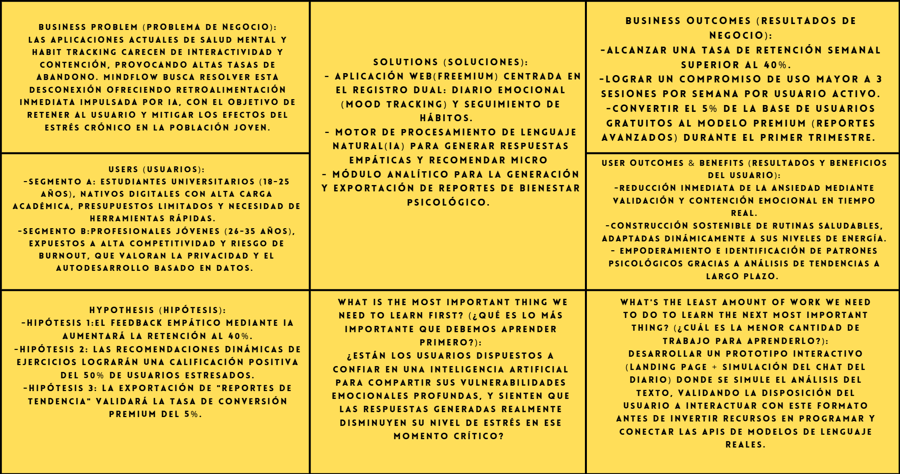

## 1.3. Segmentos objetivo

La identificación de los segmentos objetivo para **MindFlow** se basa en la intersección entre la alta exposición a entornos de estrés crónico y la alta competencia digital. Hemos definido dos segmentos principales que presentan perfiles de necesidad diferenciados, pero que convergen en la búsqueda de soluciones de salud mental accesibles y tecnológicas.

#### 1.3.1. Segmento A: Estudiantes Universitarios (Tech-Native Scholars)
Este segmento comprende jóvenes entre los 18 y 25 años que cursan estudios de pregrado en entornos de alta exigencia académica (universidades e institutos técnicos).

* **Perfil Psicográfico:** Individuos con una alta carga cognitiva diaria, sometidos a periodos críticos de evaluación. Valoran la inmediatez y la gratificación instantánea. Suelen priorizar herramientas gratuitas o de bajo costo debido a su presupuesto limitado.
* **Necesidades Críticas:** Contención rápida durante crisis de ansiedad por exámenes, gestión de la procrastinación y una herramienta que no se sienta como una "tarea extra" en su día a día.
* **Puntos de Dolor:** Sentimiento de aislamiento académico, falta de recursos para costear terapia privada y dificultad para mantener hábitos saludables (sueño, alimentación) bajo presión.

#### 1.3.2. Segmento B: Profesionales Jóvenes (High-Performance Achievers)
Este segmento abarca adultos entre los 26 y 35 años que se encuentran en las primeras etapas de consolidación de su carrera profesional o en roles de mando medio.

* **Perfil Psicográfico:** Personas altamente competitivas que enfrentan el fenómeno del *burnout* laboral. Buscan la optimización del tiempo y valoran los datos (analítica) para medir su progreso personal. Tienen mayor disposición al pago si perciben una mejora directa en su productividad y bienestar.
* **Necesidades Críticas:** Herramientas de desconexión efectiva, monitoreo de la salud mental como preventivo del agotamiento laboral y reportes estructurados que les permitan entender sus detonadores de estrés.
* **Puntos de Dolor:** Desequilibrio entre la vida laboral y personal, estigma en el entorno corporativo sobre la salud mental y falta de tiempo para asistir a sesiones presenciales de psicología.

---

# Capítulo II: Requirements Development and Software Solution Design

## 2.1. Competidores

En el contexto actual del mercado digital de bienestar, existen diversas aplicaciones que abordan la gestión emocional y el desarrollo de hábitos desde distintos enfoques. A continuación, se presentan los principales competidores de MindFlow, considerando su propuesta de valor y alcance funcional:

- Daylio: Aplicación enfocada en el registro diario del estado de ánimo mediante interfaces simples y estadísticas visuales. Su principal fortaleza radica en su facilidad de uso, aunque carece de retroalimentación inteligente o análisis profundo.

- Reflectly: Plataforma de journaling digital que utiliza inteligencia artificial básica para guiar reflexiones personales. Destaca por su experiencia de usuario, pero su nivel de personalización es limitado.

- Habitica: Aplicación de seguimiento de hábitos con un enfoque gamificado que incentiva la constancia mediante recompensas. Sin embargo, no considera el estado emocional del usuario en sus recomendaciones.

Estas soluciones representan enfoques parciales del problema, lo que evidencia una oportunidad para MindFlow de integrar análisis emocional, personalización dinámica y acompañamiento en tiempo real.

### 2.1.1. Análisis competitivo

<table border="1" cellspacing="0" cellpadding="5">
  <tr>
    <th colspan="7">Competitive Analysis Landscape</th>
  </tr>

  <tr>
    <td colspan="2" rowspan="2"><b>¿Por qué llevar a cabo este análisis?</b></td>
    <td colspan="5">
      Identificar las fortalezas, debilidades y oportunidades de las aplicaciones actuales de bienestar digital, con el fin de comprender el posicionamiento de MindFlow dentro del mercado.
    </td>
  </tr>
  <tr>
    <td colspan="5">
      Comparar funcionalidades, estrategias y propuestas de valor para validar el uso de inteligencia artificial como elemento diferenciador en la gestión emocional y de hábitos.
    </td>
  </tr>

   <tr>
    <td colspan="3"></td>
    <td align="center">
      <b>MindFlow</b> 
      
    </td>
    <td align="center">
      <b>Daylio</b> 
      
    </td>
    <td align="center">
      <b>Reflectly</b> 
      
    </td>
    <td align="center">
      <b>Habitica</b> 
      
    </td>
  </tr>

  <tr>
    <td rowspan="2"><b>Perfil</b></td>
    <td colspan="2">Overview</td>
    <td>Plataforma de salud mental con IA que integra diario emocional, análisis de sentimiento y hábitos dinámicos.</td>
    <td>Aplicación de registro de emociones con estadísticas simples.</td>
    <td>Diario digital guiado con inteligencia artificial básica.</td>
    <td>Aplicación de hábitos basada en gamificación.</td>
  </tr>

  <tr>
    <td colspan="2">Ventaja competitiva ¿Qué valor ofrece a los clientes?</td>
    <td>Personalización en tiempo real y acompañamiento emocional inteligente basado en IA.</td>
    <td>Facilidad de uso y rapidez en el registro de emociones.</td>
    <td>Experiencia de usuario atractiva enfocada en la reflexión personal.</td>
    <td>Motivación mediante recompensas y mecánicas de juego.</td>
  </tr>

  <tr>
    <td rowspan="2"><b>Perfil de Marketing</b></td>
    <td colspan="2">Mercado objetivo</td>
    <td>Jóvenes (18–35) con estrés académico o laboral.</td>
    <td>Público general.</td>
    <td>Usuarios interesados en journaling y bienestar.</td>
    <td>Personas orientadas a productividad.</td>
  </tr>

  <tr>
    <td colspan="2">Estrategias de marketing</td>
    <td>Modelo freemium, contenido educativo y crecimiento en redes sociales.</td>
    <td>Posicionamiento como app simple y accesible.</td>
    <td>Enfoque en diseño emocional y experiencia visual.</td>
    <td>Gamificación y comunidad activa.</td>
  </tr>

  <tr>
    <td rowspan="3"><b>Perfil de Producto</b></td>
    <td colspan="2">Productos & Servicios</td>
    <td>Diario emocional IA, hábitos adaptativos, intervenciones inteligentes.</td>
    <td>Registro de estado de ánimo.</td>
    <td>Diario guiado.</td>
    <td>Seguimiento de hábitos.</td>
  </tr>

  <tr>
    <td colspan="2">Precios & Costos</td>
    <td>Freemium + funciones premium.</td>
    <td>Freemium.</td>
    <td>Suscripción premium.</td>
    <td>Freemium con compras opcionales.</td>
  </tr>

  <tr>
    <td colspan="2">Canales de distribución (Web y/o Móvil)</td>
    <td>Web y aplicación móvil.</td>
    <td>Aplicación móvil.</td>
    <td>Aplicación móvil.</td>
    <td>Web y aplicación móvil.</td>
  </tr>

  <tr>
    <td rowspan="5"><b>Análisis SWOT</b></td>
  </tr>

  <tr>
    <td colspan="2">Fortalezas</td>
    <td>IA emocional, personalización dinámica, enfoque integral.</td>
    <td>Simplicidad y rapidez.</td>
    <td>Diseño atractivo.</td>
    <td>Gamificación efectiva.</td>
  </tr>

  <tr>
    <td colspan="2">Debilidades</td>
    <td>Dependencia tecnológica, necesidad de generar confianza.</td>
    <td>Sin inteligencia ni personalización.</td>
    <td>IA limitada.</td>
    <td>No aborda salud emocional.</td>
  </tr>

  <tr>
    <td colspan="2">Oportunidades</td>
    <td>Crecimiento del mercado de salud mental digital.</td>
    <td>Usuarios nuevos.</td>
    <td>Expansión del journaling.</td>
    <td>Crecimiento del mercado de productividad.</td>
  </tr>

  <tr>
    <td colspan="2">Amenazas</td>
    <td>Competidores consolidados y preocupaciones por privacidad.</td>
    <td>Apps más avanzadas.</td>
    <td>Competencia con mayor innovación.</td>
    <td>Integración de funciones en apps más completas.</td>
  </tr>

</table>

### 2.1.2. Estrategias y tácticas frente a competidores

A partir del análisis competitivo y del análisis SWOT realizado, se definen estrategias y tácticas preliminares que permitirán a MindFlow afrontar las fortalezas de sus competidores, aprovechar sus debilidades y capitalizar las oportunidades del entorno, mitigando a su vez las amenazas del mercado.

#### Estrategias

- **Estrategia de diferenciación frente a fortalezas de competidores:**  
  Mientras aplicaciones como Daylio destacan por su simplicidad y Habitica por su gamificación, MindFlow propone una diferenciación basada en inteligencia artificial, integrando análisis emocional y personalización dinámica, lo cual permite ofrecer una experiencia más profunda y significativa.

- **Estrategia de aprovechamiento de debilidades del mercado:**  
  Se identificó que los competidores carecen de retroalimentación en tiempo real y adaptación al estado emocional. MindFlow capitaliza esta debilidad mediante un sistema que responde activamente al usuario, incrementando la retención.

- **Estrategia de explotación de oportunidades:**  
  El crecimiento del mercado de salud mental digital y la aceptación de soluciones basadas en IA representan una oportunidad clave. MindFlow se posiciona como una solución innovadora alineada con estas tendencias.

- **Estrategia de mitigación de amenazas:**  
  Frente a la presencia de competidores consolidados, se prioriza la innovación continua, la experiencia de usuario y la generación de confianza mediante políticas de privacidad y transparencia en el uso de datos.

#### Tácticas

- **Frente a fortalezas de competidores:**
  - Diseñar una interfaz simple e intuitiva similar a Daylio, pero con mayor valor agregado.
  - Incorporar elementos motivacionales (inspirados en gamificación) sin perder el enfoque emocional.

- **Frente a debilidades de competidores:**
  - Implementar retroalimentación empática en tiempo real mediante IA.
  - Desarrollar un sistema de hábitos adaptativos basado en el estado emocional del usuario.

- **Frente a oportunidades del entorno:**
  - Crear contenido educativo sobre salud mental en redes sociales.
  - Promover el uso de la app en comunidades universitarias y profesionales jóvenes.

- **Frente a amenazas del mercado:**
  - Garantizar la seguridad y privacidad de los datos mediante encriptación.
  - Diferenciar la propuesta mediante innovación constante en funcionalidades.
  - Generar confianza comunicando claramente que la app no reemplaza terapia profesional.

#### Enfoque estratégico

MindFlow adopta una estrategia de diferenciación centrada en la innovación tecnológica y la experiencia del usuario. A diferencia de los competidores que abordan el problema de manera fragmentada, la plataforma integra múltiples funcionalidades en un sistema adaptativo, lo que le permite posicionarse como una solución más completa, inteligente y alineada con las necesidades actuales del usuario.

## 2.2. Entrevistas

### 2.2.1. Diseño de entrevistas

Se han diseñado dos bloques de preguntas dirigidos a los principales segmentos objetivo: estudiantes universitarios y profesionales jóvenes. Las preguntas han sido estructuradas para recopilar información cualitativa relevante en torno a aspectos demográficos, hábitos digitales, gestión del estrés y percepción sobre el uso de herramientas tecnológicas para el bienestar emocional.

Asimismo, se incluyen preguntas complementarias orientadas a la construcción de arquetipos de usuario (User Personas), considerando variables demográficas, psicográficas y de comportamiento digital.

#### A. Entrevistas a Segmento 1: Estudiantes Universitarios (18–25 años)

**Objetivo:** Comprender cómo los estudiantes gestionan su estrés académico, qué herramientas utilizan actualmente y cuáles son sus principales dificultades para mantener hábitos de bienestar.

**Preguntas principales:**

- ¿Podrías contarnos un poco sobre ti? (edad, carrera, ciclo, ciudad, etc.)
- ¿Cómo describirías tu nivel de estrés durante el ciclo académico?
- ¿En qué momentos sueles sentir más ansiedad o presión?
- ¿Qué haces actualmente para manejar el estrés o la ansiedad?
- ¿Has utilizado alguna aplicación para registrar tus emociones o hábitos?
- ¿Qué dificultades tienes para mantener hábitos saludables?
- ¿Qué tan cómodo(a) te sientes usando apps para tu bienestar?
- ¿Con qué dispositivos accedes más a aplicaciones? (móvil, laptop, etc.)
- ¿Qué aplicaciones usas con mayor frecuencia en tu día a día?
- ¿Qué redes sociales utilizas más?
- ¿Cuáles son tus principales objetivos personales o académicos?
- ¿Qué situaciones te generan mayor frustración actualmente?
- ¿Cómo describirías tu personalidad? (organizado, impulsivo, etc.)
- ¿Sueles seguir recomendaciones de influencers o contenido sobre bienestar?

#### B. Entrevistas a Segmento 2: Profesionales Jóvenes (26–35 años)

**Objetivo:** Identificar los retos relacionados con el estrés laboral, la gestión del tiempo y la adopción de herramientas digitales para el bienestar personal.

**Preguntas principales:**

- ¿Podrías contarnos un poco sobre ti? (edad, profesión, tipo de trabajo, etc.)
- ¿Cómo describirías tu nivel de estrés laboral?
- ¿Qué situaciones te generan mayor agotamiento?
- ¿Qué haces actualmente para reducir el estrés?
- ¿Has utilizado apps de productividad o bienestar?
- ¿Qué dificultades tienes para equilibrar trabajo y vida personal?
- ¿Qué dispositivos utilizas con mayor frecuencia?
- ¿Qué herramientas digitales usas para organizar tu día?
- ¿Qué canales digitales utilizas con mayor frecuencia?
- ¿Cuáles son tus principales objetivos profesionales y personales?
- ¿Qué factores te generan mayor frustración en tu rutina?
- ¿Qué valoras más en una aplicación digital?
- ¿Qué te generaría confianza o desconfianza al usar una app de salud mental?

### 2.2.2. Registro de entrevistas

#### Segmento 1: Estudiantes Universitarios

##### Entrevista 1

| Campo | Detalle |
|------|--------|
| Segmento Objetivo | Estudiantes universitarios (18–25 años) |
| Fecha Entrevista | 18/04/2026 |
| Entrevistador | Sebastián Díaz |
| Entrevistado | Jiss Zerpa |
| Edad | 18 años |
| Distrito | La Molina |
| Link del Video | [Ver video](https://upcedupe-my.sharepoint.com/:v:/g/personal/u202410421_upc_edu_pe/IQC6LCtoZRnfR4iKU3dIHCeYATI4FuIHWP1zmVrAm3H4_R8?nav=eyJyZWZlcnJhbEluZm8iOnsicmVmZXJyYWxBcHAiOiJPbmVEcml2ZUZvckJ1c2luZXNzIiwicmVmZXJyYWxBcHBQbGF0Zm9ybSI6IldlYiIsInJlZmVycmFsTW9kZSI6InZpZXciLCJyZWZlcnJhbFZpZXciOiJNeUZpbGVzTGlua0NvcHkifX0&e=jFGNLe) |
| Minuto de Inicio | 0:00 |
| Duración | 2:47 |
| Resumen | Jiss, estudiante de Ingeniería Petroquímica, presenta un nivel de estrés de 7/10 con picos de 9 en exámenes. Su comportamiento refleja evitación del estrés mediante distracciones como TikTok y videojuegos. Reconoce que estas actividades le generan alivio momentáneo, pero posteriormente incrementan su ansiedad. Ha probado apps, pero las abandona rápidamente por requerir esfuerzo adicional. Insight principal: comportamiento de evitación frente al estrés. Hallazgos clave: alta procrastinación, baja tolerancia al esfuerzo y falta de estructura. Citas relevantes: “Me distraigo… pero después me estreso más.”, “No usaría una app si tengo que escribir mucho.” Conclusión: requiere soluciones simples, automáticas y de mínima interacción. |

##### Entrevista 2

| Campo | Detalle |
|------|--------|
| Segmento Objetivo | Estudiantes universitarios (18–25 años) |
| Fecha Entrevista | 19/04/2026 |
| Entrevistador | Sebastián Díaz |
| Entrevistado | Lucero |
| Edad | 19 años |
| Distrito | La Molina |
| Link del Video | [Ver video](https://upcedupe-my.sharepoint.com/:v:/g/personal/u202410421_upc_edu_pe/IQAp-_6iUOSJS4FRQuTW-F-9AdcZK5XV42aVZmzgo0PuIAw?nav=eyJyZWZlcnJhbEluZm8iOnsicmVmZXJyYWxBcHAiOiJPbmVEcml2ZUZvckJ1c2luZXNzIiwicmVmZXJyYWxBcHBQbGF0Zm9ybSI6IldlYiIsInJlZmVycmFsTW9kZSI6InZpZXciLCJyZWZlcnJhbFZpZXciOiJNeUZpbGVzTGlua0NvcHkifX0&e=HwtMjV) |
| Minuto de Inicio | 0:00 |
| Duración | 2:41 |
| Resumen | Lucero, estudiante de Psicología, presenta un nivel de estrés de 6/10 con picos de 8. Tiene alta autoconciencia emocional y utiliza journaling, pero percibe que las herramientas actuales no generan cambios reales. Insight principal: perfil reflexivo con insatisfacción en el impacto de las soluciones actuales. Hallazgos clave: uso de journaling sin resultados, necesidad de análisis profundo y rechazo a la repetición. Citas relevantes: “Escribir me ayuda a entenderme, pero no cambia cómo me siento.”, “Las apps se vuelven repetitivas.” Conclusión: necesita soluciones que aporten análisis significativo y evolución emocional. |

##### Entrevista 3

| Campo | Detalle |
|------|--------|
| Segmento Objetivo | Estudiantes universitarios (18–25 años) |
| Fecha Entrevista | 20/04/2026 |
| Entrevistador | Sebastián Díaz |
| Entrevistado | Jimena |
| Edad | 19 años |
| Distrito | San Isidro |
| Link del Video | [Ver video](https://upcedupe-my.sharepoint.com/:v:/g/personal/u202410421_upc_edu_pe/IQDiIjKmBwlYSY162dNCHfq1AcmQjaPB0B48xM6UgMCISww?nav=eyJyZWZlcnJhbEluZm8iOnsicmVmZXJyYWxBcHAiOiJPbmVEcml2ZUZvckJ1c2luZXNzIiwicmVmZXJyYWxBcHBQbGF0Zm9ybSI6IldlYiIsInJlZmVycmFsTW9kZSI6InZpZXciLCJyZWZlcnJhbFZpZXciOiJNeUZpbGVzTGlua0NvcHkifX0&e=ciHjIU) |
| Minuto de Inicio | 0:00 |
| Duración | 2:48 |
| Resumen | Jimena, estudiante de Ingeniería de Software, presenta un nivel de estrés de 6/10 con picos de 8–9. Experimenta frustración en tareas académicas que deriva en bloqueo cognitivo y procrastinación. Ha utilizado múltiples apps, pero las abandona por falta de valor inmediato. Insight principal: patrón frustración → bloqueo → evasión. Hallazgos clave: bloqueo cognitivo, uso de distracción como escape y abandono rápido de apps. Citas relevantes: “Me bloqueo… y termino dejando todo.”, “Las apps solo te hacen escribir, pero no te ayudan.” Conclusión: requiere intervenciones en tiempo real que ayuden en momentos críticos. |

#### Segmento 2: Profesionales Jóvenes

##### Entrevista 4

| Campo | Detalle |
|------|--------|
| Segmento Objetivo | Profesionales jóvenes (26–35 años) |
| Fecha Entrevista | 18/04/2026 |
| Entrevistador | Sebastián Díaz |
| Entrevistado | Alexandra Montenegro |
| Edad | 26 años |
| Distrito | Barranco |
| Link del Video | [Ver video](https://upcedupe-my.sharepoint.com/:v:/g/personal/u202410421_upc_edu_pe/IQBLlsZ3G-OZSLcOUS5eF6rQARMpWE6b_f3IIphyY7o3vlI?nav=eyJyZWZlcnJhbEluZm8iOnsicmVmZXJyYWxBcHAiOiJPbmVEcml2ZUZvckJ1c2luZXNzIiwicmVmZXJyYWxBcHBQbGF0Zm9ybSI6IldlYiIsInJlZmVycmFsTW9kZSI6InZpZXciLCJyZWZlcnJhbFZpZXciOiJNeUZpbGVzTGlua0NvcHkifX0&e=p0isA8) |
| Minuto de Inicio | 0:00 |
| Duración | 3:15 |
| Resumen | Alexandra, profesional en Recursos Humanos, presenta un nivel de estrés de 8/10 con picos de 9. Su principal limitación es la falta de energía tras la jornada laboral, lo que impide sostener hábitos. Insight principal: limitación de tiempo y energía. Hallazgos clave: dificultad para mantener rutinas, percepción de apps como costo de tiempo y preferencia por soluciones inmediatas. Citas relevantes: “Llego cansada del trabajo… no tengo energía para seguir una rutina.”, “Las apps me quitaban tiempo o no me daban algo útil en el momento.” Conclusión: requiere soluciones rápidas, de bajo esfuerzo y con valor inmediato. |

##### Entrevista 5

| Campo | Detalle |
|------|--------|
| Segmento Objetivo | Profesionales jóvenes (26–35 años) |
| Fecha Entrevista | 19/04/2026 |
| Entrevistador | Sebastián Díaz |
| Entrevistado | Luciana Poma |
| Edad | 27 años |
| Distrito | Chorrillos |
| Link del Video | [Ver video](https://upcedupe-my.sharepoint.com/:v:/g/personal/u202410421_upc_edu_pe/IQAXQKz8cFuBRYmMRiluA61vAYFJfoUS8D6IibXF6VSNjnE?nav=eyJyZWZlcnJhbEluZm8iOnsicmVmZXJyYWxBcHAiOiJPbmVEcml2ZUZvckJ1c2luZXNzIiwicmVmZXJyYWxBcHBQbGF0Zm9ybSI6IldlYiIsInJlZmVycmFsTW9kZSI6InZpZXciLCJyZWZlcnJhbFZpZXciOiJNeUZpbGVzTGlua0NvcHkifX0&e=qxkwbB) |
| Minuto de Inicio | 0:00 |
| Duración | 3:06 |
| Resumen | Luciana, profesional de marketing digital, presenta un nivel de estrés de 8/10 con picos de 9. Usa apps frecuentemente, pero abandona aquellas que no se adaptan a su ritmo. Insight principal: necesidad de personalización dinámica. Hallazgos clave: frustración con apps rígidas, alta presión por resultados y relación entre bienestar y productividad. Citas relevantes: “Las apps no se adaptan a tu ritmo real.”, “Si no se adapta a mí, la dejo.” Conclusión: el producto debe ofrecer adaptación en tiempo real. |

##### Entrevista 6

| Campo | Detalle |
|------|--------|
| Segmento Objetivo | Profesionales jóvenes (26–35 años) |
| Fecha Entrevista | 21/04/2026 |
| Entrevistador | Sebastián Díaz |
| Entrevistado | Nordie Sanabria |
| Edad | 29 años |
| Distrito | La Molina |
| Link del Video | [Ver video](https://upcedupe-my.sharepoint.com/:v:/g/personal/u202410421_upc_edu_pe/IQAu709K0qBWQZsvqeI53bCHAdB9HmsozDqHD-ua8jw6HjU?nav=eyJyZWZlcnJhbEluZm8iOnsicmVmZXJyYWxBcHAiOiJPbmVEcml2ZUZvckJ1c2luZXNzIiwicmVmZXJyYWxBcHBQbGF0Zm9ybSI6IldlYiIsInJlZmVycmFsTW9kZSI6InZpZXciLCJyZWZlcnJhbFZpZXciOiJNeUZpbGVzTGlua0NvcHkifX0&e=rM0yrn) |
| Minuto de Inicio | 0:00 |
| Duración | 2:52 |
| Resumen | Nordie, coordinadora de marketing, presenta un nivel de estrés constante de 9/10, cercano al burnout. Ha probado múltiples apps sin éxito. Insight principal: rechazo a cualquier esfuerzo adicional. Hallazgos clave: estrés constante, rechazo a interacción compleja y necesidad de automatización total. Citas relevantes: “Siento que estoy siempre en alerta.”, “Cuando ya estás agotada, no quieres hacer más cosas.”, “Necesito algo que me dé soluciones sin tener que pensar mucho.” Conclusión: requiere una solución altamente automatizada, predictiva y sin fricción. |

### 2.2.3. Análisis de entrevistas

A partir de las entrevistas realizadas a los dos segmentos objetivo, se identificaron patrones de comportamiento, necesidades y frustraciones diferenciadas. Este análisis permite validar los supuestos planteados y orientar el diseño de la solución.

### Segmento 1: Estudiantes Universitarios (18–25 años)

**Entrevistados:** Jiss, Lucero, Jimena

#### Nivel de estrés y comportamiento

- Nivel promedio: 6–7/10
- Picos en evaluaciones: 8–9/10

El estrés en este segmento es situacional, asociado principalmente a exámenes, carga académica y dificultad en cursos.

#### Patrones de comportamiento

1. **Procrastinación como respuesta al estrés**
   - Uso de redes sociales como mecanismo de escape
   - Incremento del estrés posterior por acumulación de tareas

   > “Me distraigo… pero después me estreso más.” (Jiss)  
   > “Me bloqueo… y termino dejando todo.” (Jimena)

2. **Baja adherencia a hábitos**
   - Intentos de organización que no se sostienen en el tiempo
   - Uso de apps limitado a corto plazo

   > “He probado apps… pero las dejo rápido.” (Jimena)

3. **Rechazo a esfuerzo adicional**
   - Baja disposición a escribir o registrar emociones
   - Percepción de apps como una tarea extra

   > “No usaría una app si tengo que escribir mucho.” (Jiss)

4. **Búsqueda de guía**
   - Necesidad de orientación clara ante situaciones de estrés

   > “Que me diga qué hacer en ese momento.” (Jiss)

#### Frustraciones principales

- Aplicaciones centradas solo en registro
- Falta de retroalimentación útil
- Experiencias repetitivas

> “Era como hablar sola.” (Jimena)  
> “Siempre era lo mismo.” (Lucero)

#### Necesidades clave

- Interacción simple y rápida
- Bajo esfuerzo cognitivo
- Recomendaciones claras
- Apoyo en momentos críticos

#### Insight del segmento

Los estudiantes requieren una herramienta que intervenga en momentos de bloqueo emocional, ofreciendo guía inmediata sin aumentar la carga cognitiva.

### Segmento 2: Profesionales Jóvenes (26–35 años)

**Entrevistados:** Alexandra, Luciana, Nordie

#### Nivel de estrés y comportamiento

- Nivel promedio: 8/10
- Picos: 9/10
- Presencia de estrés constante en algunos casos

El estrés es continuo y está vinculado a presión laboral, responsabilidad y cumplimiento de objetivos.

#### Patrones de comportamiento

1. **Fatiga mental**
   - Reducción de energía al final del día
   - Dificultad para sostener hábitos

   > “No tengo energía para seguir una rutina.” (Alexandra)

2. **Rechazo a pérdida de tiempo**
   - Evaluación constante del valor de las aplicaciones
   - Abandono rápido si no generan impacto

   > “Las apps me quitaban tiempo.” (Alexandra)

3. **Necesidad de personalización**
   - Contextos variables que requieren adaptación

   > “Si no se adapta a mí, la dejo.” (Luciana)

4. **Orientación a resultados**
   - Búsqueda de soluciones prácticas y eficientes

   > “Necesito soluciones prácticas.” (Alexandra)

5. **Burnout y automatización**
   - Rechazo a cualquier esfuerzo adicional en estados de agotamiento

   > “Cuando ya estás agotada, no quieres hacer más cosas.” (Nordie)  
   > “Necesito algo que me dé soluciones sin tener que pensar mucho.” (Nordie)

#### Frustraciones principales

- Aplicaciones genéricas
- Falta de personalización
- Falta de resultados inmediatos

> “Las apps no se adaptan a tu ritmo.” (Luciana)  
> “Son muy genéricas.” (Nordie)

#### Necesidades clave

- Personalización en tiempo real
- Interacción de bajo esfuerzo
- Recomendaciones prácticas
- Valor inmediato

#### Insight del segmento

Los profesionales requieren soluciones que optimicen su bienestar sin demandar tiempo ni esfuerzo adicional, integrándose de forma eficiente en su rutina.

### Comparación entre segmentos

| Factor | Estudiantes | Profesionales |
|--------|------------|--------------|
| Tipo de estrés | Situacional | Crónico |
| Nivel promedio | 6–7 | 8–9 |
| Problema principal | Procrastinación | Fatiga mental |
| Barrera | Falta de disciplina | Falta de tiempo |
| Rechazo | Esfuerzo cognitivo | Pérdida de tiempo |
| Necesidad clave | Guía | Eficiencia |

### Insight estratégico general

Ambos segmentos coinciden en que las soluciones actuales fallan por ser pasivas, genéricas y demandar demasiado esfuerzo. Esto evidencia la oportunidad de desarrollar una plataforma que proporcione respuestas en tiempo real, minimice el esfuerzo del usuario y ofrezca recomendaciones personalizadas con impacto inmediato.

## 2.3. Needfinding

En esta sección se presentan los artefactos resultantes del proceso de análisis de la información recolectada a través de entrevistas. El objetivo del needfinding es transformar los hallazgos cualitativos en representaciones estructuradas que permitan comprender profundamente a los usuarios, sus necesidades, comportamientos y puntos de dolor.

A partir de los insights obtenidos, se desarrollan los siguientes artefactos:

- User Personas  
- User Task Matrix  
- User Journey Mapping  
- Empathy Mapping  
- Big Picture EventStorming  
- Ubiquitous Language  

Estos elementos permiten al equipo alinear la comprensión del problema, identificar oportunidades de diseño y establecer una base sólida para la definición de requerimientos del sistema.

El proceso de needfinding evidencia que los usuarios no solo buscan registrar su estado emocional, sino recibir apoyo activo, personalizado y en tiempo real, lo cual guía directamente la propuesta de valor de la solución MindFlow.

### 2.3.1. User Personas
#### Segmento Estudiantes Universitarios:
  
  
#### Segmento Profesionales jóvenes:
  

### 2.3.2. User Task Matrix

En esta sección se presenta la matriz de tareas de usuario (User Task Matrix), construida a partir de los User Personas definidos: **Jimena** (estudiante universitaria) y **Nordie** (profesional joven).  

La matriz identifica las tareas que ambos segmentos realizan para gestionar su bienestar emocional y productividad en su día a día, independientemente de la existencia de una solución tecnológica.  

Cada tarea se evalúa en función de:  
- **Frecuencia:** Número aproximado de veces que realiza la tarea (diaria/semanal)  
- **Importancia:** Nivel de relevancia para el usuario (Alta, Media, Baja)  

---

#### User Task Matrix

| Tareas del Usuario | Jimena (Frecuencia) | Jimena (Importancia) | Nordie (Frecuencia) | Nordie (Importancia) |
|------------------|---------------------|----------------------|---------------------|----------------------|
| Identificar que está estresado o abrumado | 2–3 veces al día | Alta | 3–5 veces al día | Alta |
| Intentar continuar con sus responsabilidades a pesar del estrés | Diario | Alta | Diario | Alta |
| Buscar distracciones (redes sociales, entretenimiento) | 2–4 veces al día | Media | 1–2 veces al día | Baja |
| Tomar pausas para despejarse | 1–2 veces al día | Alta | 1–2 veces al día | Alta |
| Intentar organizar tareas o responsabilidades | 3–4 veces por semana | Alta | Diario | Alta |
| Reflexionar sobre cómo se siente | 1–2 veces por semana | Media | 1 vez por semana | Media |
| Buscar soluciones rápidas para reducir el estrés | 1–2 veces al día | Alta | 2–3 veces al día | Alta |
| Intentar mantener hábitos de bienestar (ejercicio, descanso) | 2–3 veces por semana | Alta | 1–2 veces por semana | Alta |
| Usar herramientas digitales para organizarse o mejorar su bienestar | 3–4 veces por semana | Media | 2–3 veces por semana | Alta |
| Abandonar herramientas o rutinas por falta de resultados | 1 vez por semana | Alta | 1 vez por semana | Alta |

---

### Análisis de la matriz

Se observa que las tareas con mayor frecuencia e importancia en ambos segmentos están relacionadas con la **gestión inmediata del estrés**, especialmente:

- Identificación del estrés varias veces al día  
- Continuación de responsabilidades bajo presión  
- Búsqueda de soluciones rápidas para aliviar el malestar  

Esto confirma que el problema ocurre en **micro-momentos diarios**, no como eventos aislados.

---

### Coincidencias entre segmentos

- Ambos identifican el estrés múltiples veces al día  
- Buscan soluciones rápidas de forma recurrente  
- Presentan abandono semanal de herramientas que no aportan valor  
- Mantienen baja frecuencia en hábitos de bienestar  

---

### Diferencias clave

- **Jimena (Estudiante):**
  - Mayor frecuencia en distracciones (hasta 4 veces al día)  
  - Menor consistencia en organización (no diaria)  

- **Nordie (Profesional):**
  - Mayor constancia en organización (diaria)  
  - Menor uso de distracciones, pero mayor carga mental constante  

---

### Conclusión

Los datos evidencian que el problema ocurre varias veces al día, lo que requiere una solución capaz de responder en tiempo real. Además, la alta tasa de abandono semanal confirma que los usuarios priorizan herramientas que generen valor inmediato, sin requerir esfuerzo adicional.

### 2.3.3. User Journey Mapping

#### Segmento Estudiantes Universitarios:
  
  
#### Segmento Profesionales jóvenes:
  

### 2.3.4. Empathy Mapping

#### Segmento Estudiantes Universitarios

*Figura: Empathy Mapping del segmento de estudiantes universitarios.*

#### Segmento Profesionales Jóvenes

*Figura: Empathy Mapping del segmento de profesionales jóvenes.*

### 2.3.5. Big Picture EventStorming

El equipo realizó una sesión colaborativa de Big Picture EventStorming (aproximadamente 1.5 horas, usando Miro) para construir un entendimiento compartido y de alto nivel del dominio de negocio de MindFlow, antes de tomar cualquier decisión de diseño. El objetivo fue identificar los eventos de negocio significativos a lo largo de todo el panorama del negocio —registro, diario emocional, seguimiento de hábitos, el asistente de IA, reportes, suscripciones y soporte al cliente— sin discutir todavía componentes de software ni Bounded Contexts.

**Paso 1 — Generación de Domain Events**

Cada integrante del equipo escribió de forma independiente los eventos de dominio que identificó en el negocio de MindFlow, en tiempo pasado, sin discutir todavía orden ni relaciones. Este brainstorming sin orden reveló 19 eventos que abarcan todo el producto, desde la creación de la cuenta hasta la cancelación de la suscripción.

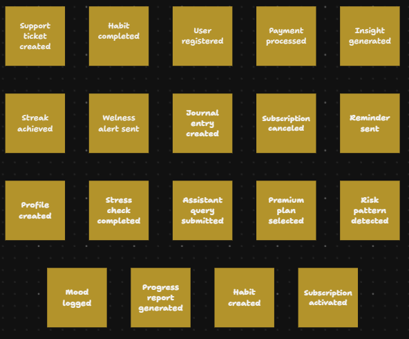
*Figura: Domain Events generados de forma independiente por el equipo.*

**Paso 2 — Ordenamiento cronológico de los Domain Events**

Luego, el equipo organizó esos mismos eventos a lo largo de una sola línea de tiempo, desde el inicio de la relación del usuario con MindFlow (registro) pasando por el uso continuo (diario, hábitos, reportes) hasta eventos comerciales y de soporte (suscripción, tickets).

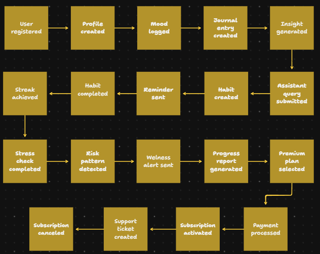
*Figura: Domain Events ordenados cronológicamente en el timeline de negocio.*

**Paso 3 — Agregar Actors y External Systems**

Finalmente, el equipo identificó quién dispara cada evento y qué sistemas externos reales están involucrados en el negocio: el **User** impulsa la mayoría de los eventos directamente, mientras que el **AI Engine**, el **Notification Service** y el **Payment Gateway** aparecen como los sistemas externos de los que ya depende el negocio de MindFlow.

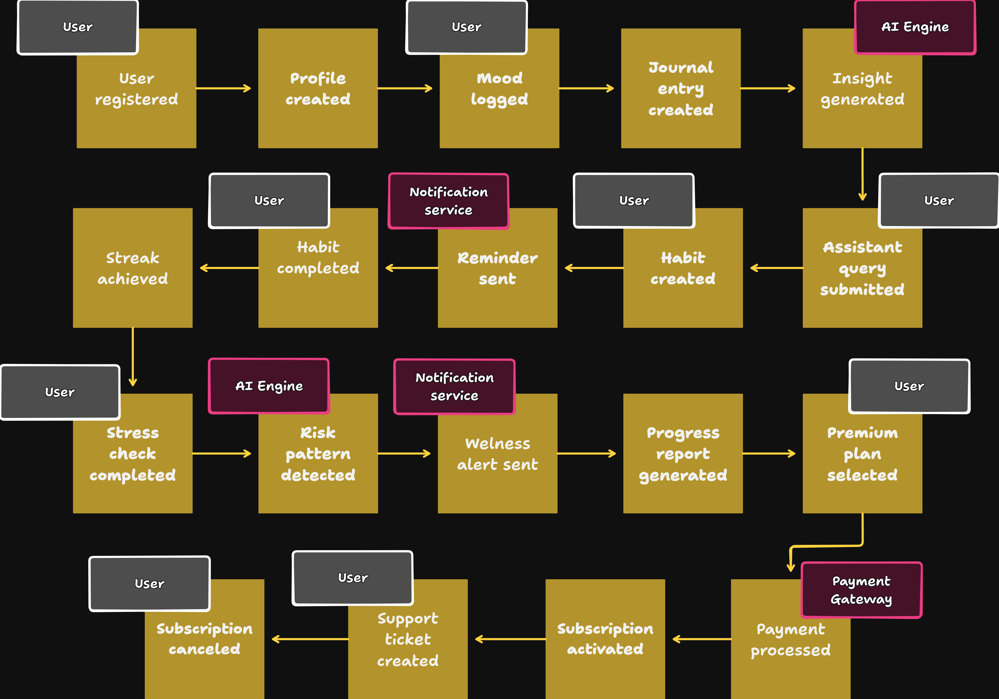
*Figura: Actors y External Systems agregados al timeline de eventos.*

Este ejercicio confirmó que el negocio de MindFlow abarca áreas de responsabilidad claramente distinguibles —identidad, journaling, insights asistidos por IA, hábitos y bienestar, reportes, notificaciones, facturación y soporte— lo cual se convirtió en el punto de partida para la sesión de EventStorming más detallada descrita en la sección 2.5.1.

### 2.3.6. Ubiquitous Language

El Lenguaje Ubicuo de MindFlow constituye el idioma común utilizado por los integrantes del equipo para eliminar la ambigüedad entre los requerimientos de salud mental y la implementación técnica. Estos términos han sido extraídos directamente del Event Storming, asegurando que cada concepto del negocio tenga una representación única y coherente en el código fuente y la base de datos.

| Término | Definición de Dominio | Relación Técnica |
|:-------:|:---------------------:|:----------------:|
| Journal Entry | Registro de texto libre donde el usuario expresa sus pensamientos y sentimientos. | Objeto persistente en DB (Colección). |
| NLP Engine | Servicio encargado de procesar el lenguaje natural para extraer emociones. | Sistema Externo (API). |
| Sentiment Label | Etiqueta (Positivo/Negativo) asignada a una entrada tras el análisis. | Atributo de la clase JournalEntry. |
| Habit Tracker | Módulo para la gestión y seguimiento de objetivos de autocuidado. | Agregado que gestiona la disciplina. |
| Workload Adjustment | Modificación automática de la carga de tareas basada en el estado de estrés detectado. | Política de negocio (Business Rule). |
| Burnout Level | Indicador de agotamiento detectado por la persistencia de ánimos negativos. | Variable de análisis para intervenciones. |

## 2.4. Requirements Specification

### 2.4.1. User Stories

Las siguientes **User Stories** definen los requerimientos funcionales y técnicos de MindFlow. Se encuentran agrupadas en cinco **Epics**, de acuerdo con las principales capacidades del producto.

Para mejorar la gestión del **Product Backlog**, cada User Story incluye un atributo de **Priority**:

- **High:** funcionalidad esencial para el MVP, el valor principal del negocio, la seguridad o la operación crítica del sistema.
- **Medium:** funcionalidad importante que mejora la experiencia del usuario, pero no es indispensable para la primera versión utilizable.
- **Low:** funcionalidad complementaria que puede implementarse después de las capacidades principales.

Adicionalmente, se incluye una **Spike Story (SP01)** para reducir la incertidumbre técnica relacionada con la integración de servicios de Inteligencia Artificial para el análisis emocional.

| Epic ID | Epic Name | Descripción |
|---|---|---|
| E1 | Identidad, Privacidad y Plataforma Principal | Gestión de seguridad, autenticación de usuarios, privacidad y configuración fundamental de la plataforma. |
| E2 | Inteligencia Emocional Impulsada por IA | Implementación de capacidades de IA para análisis de sentimientos, procesamiento del diario emocional y retroalimentación empática. |
| E3 | Bienestar Inteligente e Ingeniería de Hábitos | Gestión de hábitos, rutinas de bienestar, intervenciones frente al estrés y recomendaciones adaptativas. |
| E4 | Analítica, Monetización y Escalabilidad | Visualización de datos, reportes, monetización, soporte y capacidades técnicas orientadas a la escalabilidad. |
| E5 | Landing Page y Adquisición de Usuarios | Sitio informativo orientado a comunicar la propuesta de valor de MindFlow y atraer potenciales usuarios. |

| Epic / Story ID | Título | Descripción | Acceptance Criteria | Priority | Epic relacionado |
|---|---|---|---|---|---|
| US01 | Registro con OAuth (Google) | Como nuevo usuario, quiero registrarme utilizando mi cuenta de Google, para acceder rápidamente a la plataforma. | Dado que el usuario se encuentra en la pantalla de registro, cuando selecciona "Continuar con Google", entonces el sistema crea correctamente la cuenta vinculada. | High | E1 |
| US02 | Inicio de sesión tradicional | Como usuario, quiero iniciar sesión con correo electrónico y contraseña, para disponer de una alternativa de acceso manual. | Dado que el usuario tiene una cuenta activa, cuando ingresa credenciales válidas, entonces obtiene acceso a la aplicación. | High | E1 |
| US03 | Recuperación de cuenta | Como usuario, quiero restablecer mi contraseña mediante un enlace enviado por correo electrónico, para recuperar el acceso a mi cuenta si la olvido. | Dado que el usuario solicita el restablecimiento de contraseña, cuando recibe el correo y actualiza su contraseña, entonces puede iniciar sesión nuevamente. | Medium | E1 |
| US04 | Bloqueo mediante PIN | Como usuario, quiero configurar un PIN de seguridad, para proteger mi información privada frente a accesos físicos no autorizados. | Dado que la aplicación se encuentra abierta, cuando el bloqueo mediante PIN está activo, entonces el sistema solicita el código antes de mostrar contenido protegido. | Medium | E1 |
| US05 | Perfil de usuario | Como usuario, quiero editar mis datos personales, para que MindFlow pueda personalizar mi experiencia. | Dado que el usuario se encuentra en la configuración de su perfil, cuando actualiza sus datos, entonces los cambios quedan almacenados y se reflejan en la aplicación. | Medium | E1 |
| US06 | Modo oscuro | Como usuario, quiero activar el modo oscuro, para reducir la fatiga visual durante el uso nocturno. | Dado que el usuario modifica la configuración del tema, cuando activa el modo oscuro, entonces la interfaz adopta dicho tema. | Low | E1 |
| US07 | Eliminación de cuenta | Como usuario, quiero eliminar mi cuenta y mis registros personales, para mantener control sobre mi información. | Dado que el usuario solicita eliminar su cuenta, cuando confirma la operación, entonces el sistema elimina o anonimiza permanentemente la información asociada de acuerdo con la política de privacidad definida. | High | E1 |
| US08 (T) | Encriptación AES-256 | Como arquitecto, quiero que la información sensible del diario se almacene cifrada, para proteger la confidencialidad de los datos del usuario. | Dado que se almacena contenido sensible del diario, cuando este es persistido en la base de datos, entonces debe encontrarse cifrado. | High | E1 |
| US09 (T) | Pipeline CI/CD | Como desarrollador, quiero contar con un flujo automatizado de integración y despliegue, para realizar entregas de manera consistente y eficiente. | Dado que se integran cambios de código en la rama configurada, cuando las validaciones automatizadas finalizan correctamente, entonces puede ejecutarse el proceso de despliegue. | Medium | E1 |
| US10 (T) | Seguridad de API mediante JWT | Como desarrollador, quiero autenticar las solicitudes protegidas mediante JWT, para evitar accesos no autorizados a los servicios del backend. | Dado que un usuario autenticado solicita un recurso protegido, cuando la solicitud contiene un token válido, entonces la API procesa la petición. | High | E1 |
| US11 | Entrada de diario | Como usuario, quiero escribir entradas en mi diario, para registrar mis pensamientos, sentimientos y experiencias emocionales. | Dado que el usuario abre el editor del diario, cuando escribe y guarda una entrada, entonces el sistema la almacena asociada al usuario y a la fecha correspondiente. | High | E2 |
| US12 | Análisis de sentimientos | Como usuario, quiero que MindFlow analice el tono emocional de mi entrada de diario, para comprender mejor mi estado emocional actual. | Dado que el usuario guarda una entrada de diario, cuando se ejecuta el análisis de sentimientos, entonces el sistema proporciona una clasificación emocional asociada a la entrada. | High | E2 |
| US13 | Retroalimentación empática mediante IA | Como usuario, quiero recibir retroalimentación empática después de registrar mis emociones, para obtener orientación y acompañamiento inmediato. | Dado que se ha identificado un estado emocional, cuando la IA procesa la entrada del diario, entonces MindFlow muestra una respuesta empática apropiada. | High | E2 |
| US14 | Etiquetas contextuales | Como usuario, quiero categorizar mis entradas mediante etiquetas, para identificar situaciones o áreas relacionadas con mi estado emocional. | Dado que el usuario está editando o visualizando una entrada, cuando asigna una etiqueta, entonces la asociación queda almacenada y puede utilizarse para filtrado o análisis. | Medium | E2 |
| US15 | Adjuntos multimedia | Como usuario, quiero adjuntar contenido multimedia a mis entradas de diario, para enriquecer mis registros emocionales. | Dado que el usuario está gestionando una entrada, cuando carga un archivo multimedia soportado, entonces el archivo queda asociado a la entrada correspondiente. | Medium | E2 |
| US16 | Búsqueda por palabras clave | Como usuario, quiero buscar entradas anteriores mediante palabras clave, para localizar rápidamente experiencias específicas. | Dado que el usuario ingresa un término de búsqueda, cuando ejecuta la búsqueda, entonces el sistema devuelve las entradas relacionadas con el contenido coincidente. | Medium | E2 |
| US17 | Calendario de estado de ánimo | Como usuario, quiero visualizar mis registros emocionales a lo largo del tiempo, para identificar patrones en mi estado de ánimo. | Dado que el usuario abre el calendario emocional, cuando existe información para una fecha determinada, entonces se representa el estado emocional correspondiente. | Medium | E2 |
| US18 | Resumen semanal mediante IA | Como usuario, quiero recibir un resumen semanal de mi actividad emocional, para reflexionar sobre los cambios en mi bienestar. | Dado que existe suficiente información emocional registrada, cuando se genera el resumen semanal, entonces MindFlow presenta un resumen de los principales patrones identificados. | Medium | E2 |
| US19 (T) | Integración con API de LLM | Como desarrollador, quiero integrar un servicio basado en LLM, para que MindFlow pueda generar respuestas contextuales y empáticas. | Dado que el backend solicita una respuesta generada mediante IA, cuando el servicio externo responde correctamente, entonces el sistema procesa y devuelve el resultado estructurado. | High | E2 |
| US20 (T) | Registro de interacciones de IA | Como desarrollador, quiero registrar métricas relevantes de las interacciones con IA, para monitorear el funcionamiento y comportamiento de esta funcionalidad. | Dado que una solicitud de IA es procesada, cuando la operación finaliza, entonces se registran las métricas técnicas relevantes sin exponer contenido sensible del diario. | Medium | E2 |
| SP01 | Investigación de viabilidad de integración de IA | Como equipo de desarrollo, queremos investigar y validar alternativas para integrar análisis de sentimientos y retroalimentación empática mediante IA, para seleccionar una solución adecuada antes de completar la implementación. | Dado que MindFlow requiere análisis emocional asistido por IA, cuando finalice la Spike, entonces el equipo deberá documentar las alternativas evaluadas, restricciones técnicas, consideraciones de privacidad, costos estimados y una prueba de concepto de la alternativa seleccionada. | High | E2 |
| US21 | Creación de hábitos | Como usuario, quiero crear hábitos personalizados de bienestar, para construir una rutina constante de autocuidado. | Dado que el usuario se encuentra en la sección de hábitos, cuando completa la información requerida y guarda el hábito, entonces este es agregado a su lista de hábitos activos. | High | E3 |
| US22 | Registro de cumplimiento de hábitos | Como usuario, quiero marcar mis hábitos como completados, para monitorear mi progreso diario. | Dado que existe un hábito activo, cuando el usuario lo marca como completado, entonces su estado y progreso quedan actualizados. | High | E3 |
| US23 | Ajuste basado en nivel de estrés | Como usuario que experimenta un nivel elevado de estrés, quiero que MindFlow adapte sus recomendaciones de bienestar según mi estado emocional, para evitar sentirme sobrecargado. | Dado que el sistema identifica un nivel elevado de estrés, cuando genera recomendaciones de bienestar, entonces MindFlow sugiere actividades apropiadas para la condición actual del usuario. | High | E3 |
| US24 | Guía de respiración 4-7-8 | Como usuario, quiero acceder a un ejercicio guiado de respiración, para utilizar una técnica rápida de relajación durante momentos de estrés. | Dado que el usuario selecciona el ejercicio de respiración, cuando inicia la actividad, entonces la aplicación lo guía durante la secuencia correspondiente. | Medium | E3 |
| US25 | Micro-meditaciones | Como usuario, quiero acceder a ejercicios cortos de meditación, para incorporar actividades breves de bienestar dentro de mi rutina. | Dado que existen ejercicios disponibles, cuando el usuario selecciona uno, entonces la aplicación proporciona la actividad guiada correspondiente. | Medium | E3 |
| US26 | Feedback sobre recomendaciones | Como usuario, quiero calificar las recomendaciones de la IA, para que MindFlow registre cuáles me resultan útiles. | Dado que el usuario recibe una recomendación, cuando envía su valoración, entonces el sistema registra el feedback asociado a dicha recomendación. | Medium | E3 |
| US27 | Alerta de hidratación | Como usuario, quiero recibir recordatorios para beber agua, para mantener hábitos saludables durante mi rutina diaria. | Dado que los recordatorios de hidratación están habilitados, cuando se cumple la condición configurada, entonces el usuario recibe una notificación. | Low | E3 |
| US28 | Racha de hábitos | Como usuario, quiero visualizar mis rachas de hábitos, para mantenerme motivado mediante el seguimiento de mi constancia. | Dado que el usuario ha completado hábitos durante varios días, cuando consulta su progreso, entonces la aplicación muestra la racha correspondiente. | Medium | E3 |
| US29 (T) | Indexación de base de datos | Como desarrollador, quiero indexar adecuadamente la información consultada con frecuencia, para mantener tiempos de respuesta eficientes. | Dado que se ejecuta una consulta sobre información indexada, cuando la base de datos procesa la solicitud, entonces el rendimiento se mantiene dentro de los requerimientos no funcionales definidos. | Medium | E3 |
| US30 (T) | Sincronización de datos offline | Como usuario de la aplicación móvil, quiero registrar información del diario sin conexión y sincronizarla posteriormente, para que una conexión intermitente a Internet no me impida registrar mis pensamientos. | Dado que el dispositivo no tiene conexión a Internet, cuando el usuario crea o actualiza información soportada del diario, entonces la aplicación almacena los cambios localmente y los sincroniza cuando se restablece la conectividad. | High | E3 |
| US31 | Dashboard de analítica | Como usuario, quiero visualizar analíticas de mi actividad emocional, para comprender cómo evoluciona mi bienestar a lo largo del tiempo. | Dado que existe suficiente información emocional, cuando el usuario abre la sección de analítica, entonces la aplicación muestra las métricas y visualizaciones disponibles. | High | E4 |
| US32 | Nube de palabras | Como usuario, quiero visualizar términos recurrentes de mi actividad en el diario, para identificar temas frecuentes o posibles detonantes de estrés. | Dado que existe suficiente información en el diario, cuando se genera el análisis correspondiente, entonces el sistema muestra los términos recurrentes según su frecuencia. | Medium | E4 |
| US33 | Planes Premium | Como usuario, quiero comparar los planes disponibles, para determinar si las funcionalidades Premium me resultan útiles. | Dado que el usuario accede a la sección de suscripciones, cuando se cargan los planes, entonces el sistema muestra sus principales características y diferencias. | Medium | E4 |
| US34 | Pago seguro | Como usuario, quiero realizar el pago de mi suscripción mediante un proveedor seguro, para activar las funcionalidades Premium de manera confiable. | Dado que el usuario selecciona un plan de pago, cuando el proceso externo de pago se confirma correctamente, entonces la suscripción correspondiente queda activada. | Medium | E4 |
| US35 | Exportación en PDF | Como usuario Premium, quiero exportar un reporte estructurado en PDF, para guardar o compartir un resumen legible de mi información emocional. | Dado que el usuario tiene acceso a la funcionalidad de exportación, cuando solicita el formato PDF, entonces el sistema genera el reporte descargable correspondiente. | Medium | E4 |
| US36 | Exportación en CSV | Como usuario Premium, quiero exportar mi información en formato CSV, para analizar los datos mediante herramientas externas. | Dado que el usuario tiene acceso a la exportación de datos, cuando selecciona CSV, entonces el sistema genera un archivo descargable con la información disponible para exportación. | Low | E4 |
| US37 | Soporte técnico | Como usuario, quiero crear una solicitud de soporte, para reportar problemas técnicos o solicitar asistencia. | Dado que el usuario envía una solicitud válida, cuando esta es registrada, entonces el sistema crea el ticket de soporte correspondiente. | Medium | E4 |
| US38 (T) | Pruebas automatizadas | Como desarrollador, quiero disponer de pruebas automatizadas para los flujos críticos, para detectar regresiones antes de liberar cambios. | Dado que un flujo crítico cuenta con pruebas automatizadas, cuando se ejecuta la suite de pruebas, entonces los errores son reportados antes de liberar el cambio afectado. | High | E4 |
| US39 (T) | Diseño responsive | Como desarrollador, quiero que la Landing Page y las interfaces compatibles se adapten a diferentes tamaños de pantalla, para que puedan utilizarse correctamente desde distintos dispositivos. | Dado que cambia el tamaño de pantalla soportado, cuando se renderiza la interfaz, entonces el contenido permanece utilizable y visualmente consistente. | Medium | E4 |
| US40 (T) | Rate Limiting | Como administrador, quiero aplicar límites a las solicitudes realizadas a la API, para proteger el backend frente a un uso excesivo o abusivo. | Dado que un cliente supera el límite configurado de solicitudes, cuando realiza nuevas peticiones durante el periodo restringido, entonces la API las rechaza o limita temporalmente según la política establecida. | Medium | E4 |
| US41 | Navegación principal de la Landing Page | Como visitante, quiero contar con un menú de navegación claro, para acceder rápidamente a las secciones más importantes de la Landing Page. | Dado que el visitante se encuentra en la Landing Page, cuando selecciona una opción del menú, entonces la interfaz lo dirige hacia la sección correspondiente. | High | E5 |
| US42 | CTA principal | Como visitante, quiero visualizar un CTA principal claramente identificable, para comenzar rápidamente a utilizar MindFlow. | Dado que el visitante visualiza la sección Hero, cuando selecciona el CTA principal, entonces es dirigido al flujo correspondiente de registro o acceso a la aplicación. | High | E5 |
| US43 | Grid de funcionalidades | Como visitante, quiero visualizar las principales funcionalidades de MindFlow, para comprender rápidamente las capacidades que ofrece el producto. | Dado que el visitante llega a la sección de funcionalidades, cuando esta se muestra, entonces las principales capacidades se presentan mediante tarjetas y descripciones claramente identificables. | High | E5 |
| US44 | Vista previa de la interfaz | Como visitante, quiero visualizar ejemplos de la aplicación, para comprender cómo funciona MindFlow antes de registrarme. | Dado que el visitante llega a la sección de vista previa del producto, cuando esta se muestra, entonces se presentan interfaces representativas de MindFlow. | Medium | E5 |
| US45 | CTA de conversión | Como visitante, quiero visualizar un CTA adicional al final de la Landing Page, para comenzar a utilizar MindFlow después de conocer sus beneficios. | Dado que el visitante llega a la sección final de conversión, cuando selecciona el CTA, entonces es dirigido al flujo correspondiente de registro o acceso a la aplicación. | High | E5 |
| US46 | Navegación del footer | Como visitante, quiero acceder a enlaces legales e informativos desde el footer, para consultar información relevante sobre MindFlow. | Dado que el visitante llega al footer, cuando selecciona uno de los enlaces disponibles, entonces se muestra la información correspondiente. | Medium | E5 |
| US47 | Enlaces a redes sociales | Como visitante, quiero acceder a los perfiles oficiales de MindFlow en redes sociales, para visitar sus canales externos de comunicación. | Dado que se muestran los enlaces a redes sociales, cuando el visitante selecciona uno, entonces se abre el perfil externo correspondiente. | Low | E5 |
| US48 | Vista previa de tendencias emocionales | Como visitante, quiero visualizar un ejemplo de las tendencias emocionales, para comprender el tipo de análisis que MindFlow puede proporcionar. | Dado que el visitante llega a la sección de vista previa de analítica, cuando esta se muestra, entonces se presenta una visualización representativa de tendencias emocionales. | Medium | E5 |
| US49 | Detalle de beneficios de funcionalidades | Como visitante, quiero conocer el beneficio asociado a cada funcionalidad principal de MindFlow, para identificar cómo el producto puede contribuir a mi bienestar. | Dado que el visitante explora la sección de funcionalidades, cuando revisa una funcionalidad, entonces la interfaz presenta una explicación breve del beneficio que proporciona. | Medium | E5 |
| US50 | Vista previa de Insight de IA | Como visitante, quiero visualizar un ejemplo de una entrada de diario y su Insight generado por IA, para comprender cómo funciona la retroalimentación emocional de MindFlow. | Dado que el visitante visualiza la demostración del producto, cuando se presenta el ejemplo de Insight, entonces la interfaz muestra una entrada representativa y su correspondiente respuesta generada mediante IA. | High | E5 |

### 2.4.2. Impact Mapping

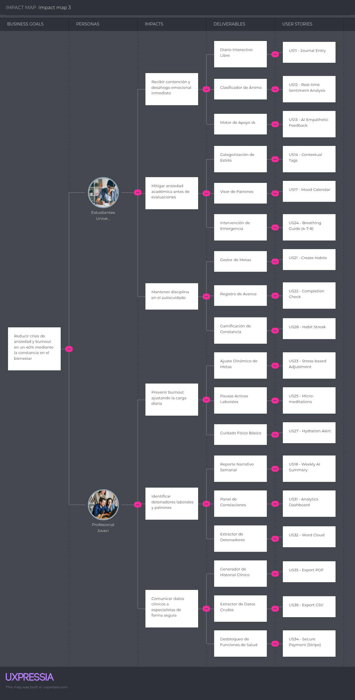

*Figura: Impact Mapping de MindFlow.*

### 2.4.3. Product Backlog

El **Product Backlog** de MindFlow organiza las User Stories según el valor que aportan al usuario, las dependencias funcionales y técnicas, y la necesidad de validar progresivamente la propuesta de valor del producto.

A diferencia de una organización basada únicamente en el identificador de cada User Story, el presente backlog prioriza primero las funcionalidades que permiten comunicar y validar el producto, seguidas por las capacidades centrales de diario emocional, Inteligencia Artificial, gestión de hábitos y analítica.

Las User Stories correspondientes a la **Landing Page** se ubican en las primeras posiciones debido a que forman parte del alcance inicial del producto y permiten comunicar la propuesta de valor de MindFlow desde el primer Sprint.

La columna **Priority** representa la importancia relativa de cada elemento dentro del producto, mientras que los **Story Points** representan una estimación relativa del esfuerzo necesario para su implementación.

| # Orden | User Story ID | Título | Descripción | Priority | Story Points |
|---|---|---|---|---|---|
| 1 | US41 | Navegación principal de la Landing Page | Como visitante, quiero contar con un menú de navegación claro, para acceder rápidamente a las secciones más importantes de la Landing Page. | High | 2 |
| 2 | US42 | CTA principal | Como visitante, quiero visualizar un CTA principal claramente identificable, para comenzar rápidamente a utilizar MindFlow. | High | 2 |
| 3 | US43 | Grid de funcionalidades | Como visitante, quiero visualizar las principales funcionalidades de MindFlow, para comprender rápidamente las capacidades que ofrece el producto. | High | 3 |
| 4 | US50 | Vista previa de Insight de IA | Como visitante, quiero visualizar un ejemplo de una entrada de diario y su Insight generado por IA, para comprender cómo funciona la retroalimentación emocional de MindFlow. | High | 3 |
| 5 | US44 | Vista previa de la interfaz | Como visitante, quiero visualizar ejemplos de la aplicación, para comprender cómo funciona MindFlow antes de registrarme. | Medium | 3 |
| 6 | US48 | Vista previa de tendencias emocionales | Como visitante, quiero visualizar un ejemplo de las tendencias emocionales, para comprender el tipo de análisis que MindFlow puede proporcionar. | Medium | 3 |
| 7 | US49 | Detalle de beneficios de funcionalidades | Como visitante, quiero conocer el beneficio asociado a cada funcionalidad principal de MindFlow, para identificar cómo el producto puede contribuir a mi bienestar. | Medium | 3 |
| 8 | US45 | CTA de conversión | Como visitante, quiero visualizar un CTA adicional al final de la Landing Page, para comenzar a utilizar MindFlow después de conocer sus beneficios. | High | 2 |
| 9 | US46 | Navegación del footer | Como visitante, quiero acceder a enlaces legales e informativos desde el footer, para consultar información relevante sobre MindFlow. | Medium | 1 |
| 10 | US47 | Enlaces a redes sociales | Como visitante, quiero acceder a los perfiles oficiales de MindFlow en redes sociales, para visitar sus canales externos de comunicación. | Low | 1 |
| 11 | SP01 | Investigación de viabilidad de integración de IA | Como equipo de desarrollo, queremos investigar y validar alternativas para integrar análisis de sentimientos y retroalimentación empática mediante IA, para seleccionar una solución adecuada antes de completar la implementación. | High | 5 |
| 12 | US11 | Entrada de diario | Como usuario, quiero escribir entradas en mi diario, para registrar mis pensamientos, sentimientos y experiencias emocionales. | High | 3 |
| 13 | US12 | Análisis de sentimientos | Como usuario, quiero que MindFlow analice el tono emocional de mi entrada de diario, para comprender mejor mi estado emocional actual. | High | 5 |
| 14 | US13 | Retroalimentación empática mediante IA | Como usuario, quiero recibir retroalimentación empática después de registrar mis emociones, para obtener orientación y acompañamiento inmediato. | High | 5 |
| 15 | US19 (T) | Integración con API de LLM | Como desarrollador, quiero integrar un servicio basado en LLM, para que MindFlow pueda generar respuestas contextuales y empáticas. | High | 8 |
| 16 | US21 | Creación de hábitos | Como usuario, quiero crear hábitos personalizados de bienestar, para construir una rutina constante de autocuidado. | High | 3 |
| 17 | US22 | Registro de cumplimiento de hábitos | Como usuario, quiero marcar mis hábitos como completados, para monitorear mi progreso diario. | High | 2 |
| 18 | US23 | Ajuste basado en nivel de estrés | Como usuario que experimenta un nivel elevado de estrés, quiero que MindFlow adapte sus recomendaciones de bienestar según mi estado emocional, para evitar sentirme sobrecargado. | High | 8 |
| 19 | US31 | Dashboard de analítica | Como usuario, quiero visualizar analíticas de mi actividad emocional, para comprender cómo evoluciona mi bienestar a lo largo del tiempo. | High | 5 |
| 20 | US01 | Registro con OAuth (Google) | Como nuevo usuario, quiero registrarme utilizando mi cuenta de Google, para acceder rápidamente a la plataforma. | High | 3 |
| 21 | US02 | Inicio de sesión tradicional | Como usuario, quiero iniciar sesión con correo electrónico y contraseña, para disponer de una alternativa de acceso manual. | High | 3 |
| 22 | US10 (T) | Seguridad de API mediante JWT | Como desarrollador, quiero autenticar las solicitudes protegidas mediante JWT, para evitar accesos no autorizados a los servicios del backend. | High | 3 |
| 23 | US08 (T) | Encriptación AES-256 | Como arquitecto, quiero que la información sensible del diario se almacene cifrada, para proteger la confidencialidad de los datos del usuario. | High | 8 |
| 24 | US07 | Eliminación de cuenta | Como usuario, quiero eliminar mi cuenta y mis registros personales, para mantener control sobre mi información. | High | 3 |
| 25 | US30 (T) | Sincronización de datos offline | Como usuario de la aplicación móvil, quiero registrar información del diario sin conexión y sincronizarla posteriormente, para que una conexión intermitente a Internet no me impida registrar mis pensamientos. | High | 8 |
| 26 | US38 (T) | Pruebas automatizadas | Como desarrollador, quiero disponer de pruebas automatizadas para los flujos críticos, para detectar regresiones antes de liberar cambios. | High | 5 |
| 27 | US03 | Recuperación de cuenta | Como usuario, quiero restablecer mi contraseña mediante un enlace enviado por correo electrónico, para recuperar el acceso a mi cuenta si la olvido. | Medium | 3 |
| 28 | US04 | Bloqueo mediante PIN | Como usuario, quiero configurar un PIN de seguridad, para proteger mi información privada frente a accesos físicos no autorizados. | Medium | 2 |
| 29 | US05 | Perfil de usuario | Como usuario, quiero editar mis datos personales, para que MindFlow pueda personalizar mi experiencia. | Medium | 2 |
| 30 | US14 | Etiquetas contextuales | Como usuario, quiero categorizar mis entradas mediante etiquetas, para identificar situaciones o áreas relacionadas con mi estado emocional. | Medium | 2 |
| 31 | US15 | Adjuntos multimedia | Como usuario, quiero adjuntar contenido multimedia a mis entradas de diario, para enriquecer mis registros emocionales. | Medium | 5 |
| 32 | US16 | Búsqueda por palabras clave | Como usuario, quiero buscar entradas anteriores mediante palabras clave, para localizar rápidamente experiencias específicas. | Medium | 3 |
| 33 | US17 | Calendario de estado de ánimo | Como usuario, quiero visualizar mis registros emocionales a lo largo del tiempo, para identificar patrones en mi estado de ánimo. | Medium | 5 |
| 34 | US18 | Resumen semanal mediante IA | Como usuario, quiero recibir un resumen semanal de mi actividad emocional, para reflexionar sobre los cambios en mi bienestar. | Medium | 5 |
| 35 | US20 (T) | Registro de interacciones de IA | Como desarrollador, quiero registrar métricas relevantes de las interacciones con IA, para monitorear el funcionamiento y comportamiento de esta funcionalidad. | Medium | 2 |
| 36 | US24 | Guía de respiración 4-7-8 | Como usuario, quiero acceder a un ejercicio guiado de respiración, para utilizar una técnica rápida de relajación durante momentos de estrés. | Medium | 5 |
| 37 | US25 | Micro-meditaciones | Como usuario, quiero acceder a ejercicios cortos de meditación, para incorporar actividades breves de bienestar dentro de mi rutina. | Medium | 3 |
| 38 | US26 | Feedback sobre recomendaciones | Como usuario, quiero calificar las recomendaciones de la IA, para que MindFlow registre cuáles me resultan útiles. | Medium | 2 |
| 39 | US28 | Racha de hábitos | Como usuario, quiero visualizar mis rachas de hábitos, para mantenerme motivado mediante el seguimiento de mi constancia. | Medium | 3 |
| 40 | US32 | Nube de palabras | Como usuario, quiero visualizar términos recurrentes de mi actividad en el diario, para identificar temas frecuentes o posibles detonantes de estrés. | Medium | 5 |
| 41 | US33 | Planes Premium | Como usuario, quiero comparar los planes disponibles, para determinar si las funcionalidades Premium me resultan útiles. | Medium | 2 |
| 42 | US34 | Pago seguro | Como usuario, quiero realizar el pago de mi suscripción mediante un proveedor seguro, para activar las funcionalidades Premium de manera confiable. | Medium | 8 |
| 43 | US35 | Exportación en PDF | Como usuario Premium, quiero exportar un reporte estructurado en PDF, para guardar o compartir un resumen legible de mi información emocional. | Medium | 5 |
| 44 | US37 | Soporte técnico | Como usuario, quiero crear una solicitud de soporte, para reportar problemas técnicos o solicitar asistencia. | Medium | 3 |
| 45 | US39 (T) | Diseño responsive | Como desarrollador, quiero que la Landing Page y las interfaces compatibles se adapten a diferentes tamaños de pantalla, para que puedan utilizarse correctamente desde distintos dispositivos. | Medium | 5 |
| 46 | US40 (T) | Rate Limiting | Como administrador, quiero aplicar límites a las solicitudes realizadas a la API, para proteger el backend frente a un uso excesivo o abusivo. | Medium | 3 |
| 47 | US29 (T) | Indexación de base de datos | Como desarrollador, quiero indexar adecuadamente la información consultada con frecuencia, para mantener tiempos de respuesta eficientes. | Medium | 3 |
| 48 | US09 (T) | Pipeline CI/CD | Como desarrollador, quiero contar con un flujo automatizado de integración y despliegue, para realizar entregas de manera consistente y eficiente. | Medium | 5 |
| 49 | US06 | Modo oscuro | Como usuario, quiero activar el modo oscuro, para reducir la fatiga visual durante el uso nocturno. | Low | 2 |
| 50 | US27 | Alerta de hidratación | Como usuario, quiero recibir recordatorios para beber agua, para mantener hábitos saludables durante mi rutina diaria. | Low | 2 |
| 51 | US36 | Exportación en CSV | Como usuario Premium, quiero exportar mi información en formato CSV, para analizar los datos mediante herramientas externas. | Low | 3 |

## 2.5. Strategic-Level Domain-Driven Design

### 2.5.1. EventStorming

Partiendo del Big Picture explorado en la sección 2.3.5, el equipo realizó una segunda sesión de EventStorming, más enfocada (aproximadamente 2 horas, usando Miro), para alcanzar el nivel de detalle necesario y poder descomponer MindFlow en Bounded Contexts. A diferencia del Big Picture, esta sesión avanzó deliberadamente hacia un pensamiento más cercano al nivel de diseño, introduciendo Commands, Policies y Actors/Agents para cada evento.

**Paso 1 — Events**

El equipo retomó la lista de eventos del Big Picture y la amplió con eventos más granulares por cada área funcional, llegando a 25 eventos de dominio en total —expresados todavía en puro lenguaje de negocio, en tiempo pasado.

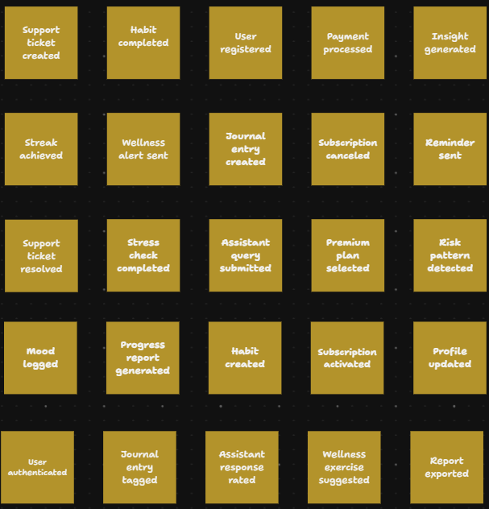
*Figura: Domain Events ampliados con mayor nivel de detalle por área funcional.*

**Paso 2 — Commands & Policies**

Para cada evento, el equipo identificó qué lo dispara. La mayoría de los eventos son resultado directo de un **Command** —una acción deliberada realizada por un actor (ej. *Write journal entry* → *Journal entry created*). Sin embargo, 7 de los 25 eventos son reacciones automáticas a un evento anterior, en vez de un comando deliberado, y se modelaron como **Policies** ("Cada vez que... entonces..."): *Insight generated*, *Reminder sent*, *Streak achieved*, *Wellness exercise suggested*, *Risk pattern detected*, *Wellness alert sent*, y *Subscription activated*. Tratar estos casos como policies en vez de inventar comandos artificiales mantiene el modelo fiel a cómo realmente se comporta la automatización de MindFlow.

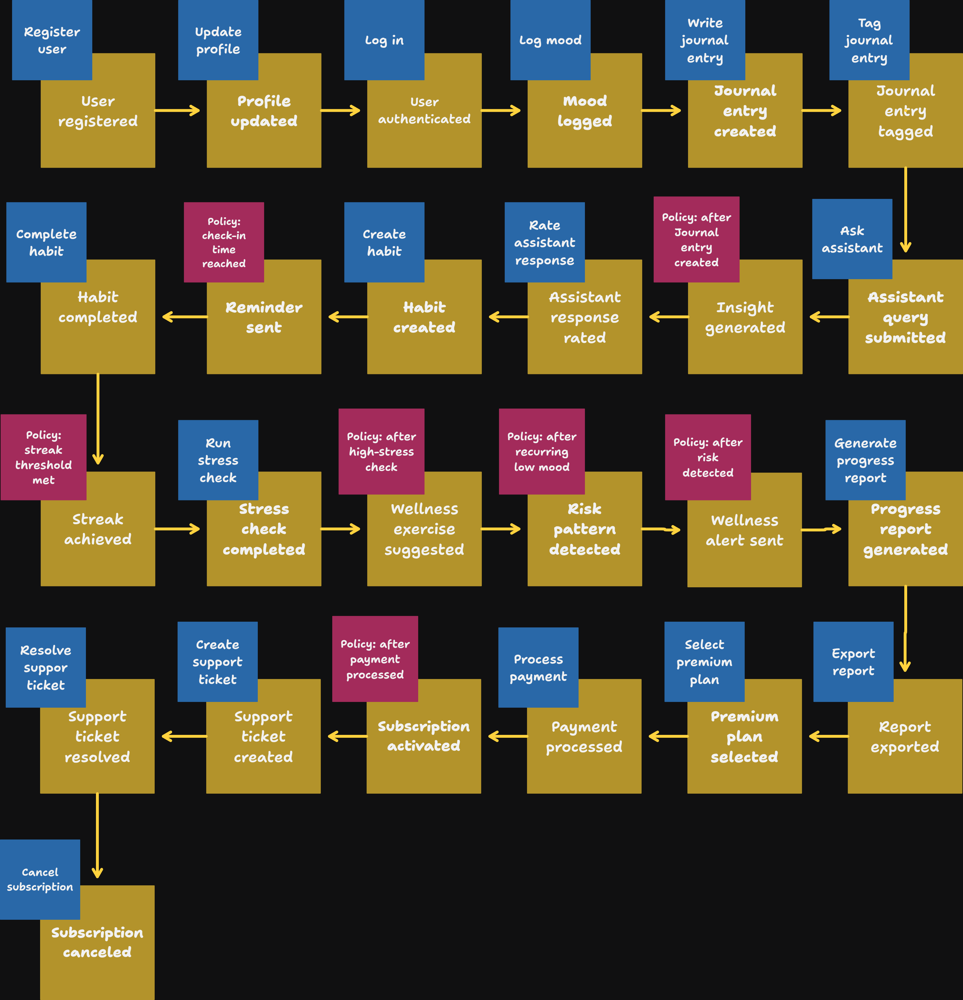
*Figura: Commands y Policies identificados para cada Domain Event.*

**Paso 3 — Actors / Agents**

El equipo identificó luego quién —o qué— emite cada comando o ejecuta cada policy: el **User** para la mayoría de las acciones directas, el **AI Engine** para la generación de insights, evaluación de riesgo y sugerencias de bienestar, el **System** para policies programadas o basadas en umbrales, el **Payment Gateway** para la confirmación de pagos, y un **Support Agent** para la resolución de tickets. Este paso comenzó a revelar costuras naturales en el dominio —grupos de eventos consistentemente impulsados por el mismo tipo de actor y que operan sobre los mismos datos subyacentes.

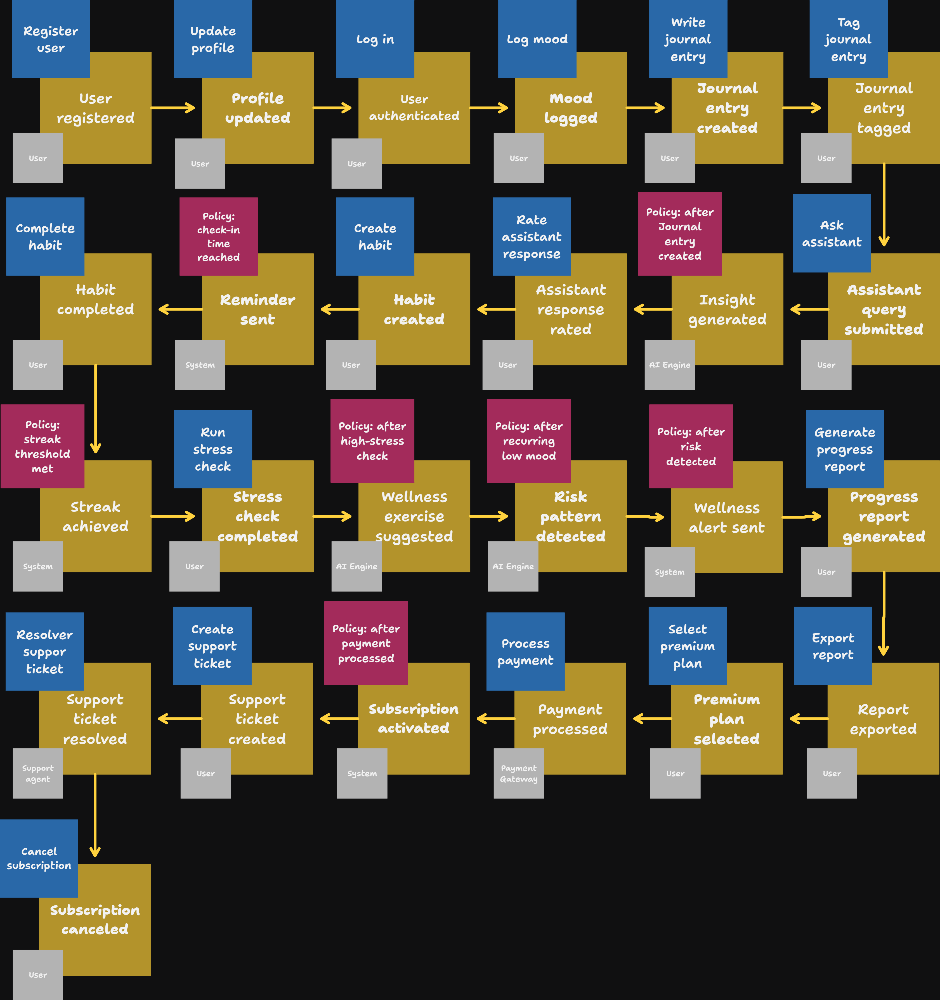
*Figura: Actors y Agents identificados para cada Command y Policy.*

**Paso 4 — Agrupación en Bounded Contexts**

Finalmente, el equipo reagrupó físicamente las mismas notas —ya no siguiendo la línea de tiempo, sino agrupando eventos, commands, policies y actors que comparten fuerte cohesión y un lenguaje de negocio común. Esto produjo 8 clústeres candidatos: **IAM**, **Journal**, **AI Assistant**, **Habits & Wellness**, **Notifications**, **Analytics & Reporting**, **Subscriptions**, y **Support**. Varias policies cruzan visiblemente entre clústeres (por ejemplo, la policy detrás de *Insight generated* depende de un evento que vive dentro de *Journal*, pero la reacción en sí pertenece a *AI Assistant*) —una señal temprana de las relaciones entre contextos que se formalizarán después en la sección 2.5.2 Context Mapping.

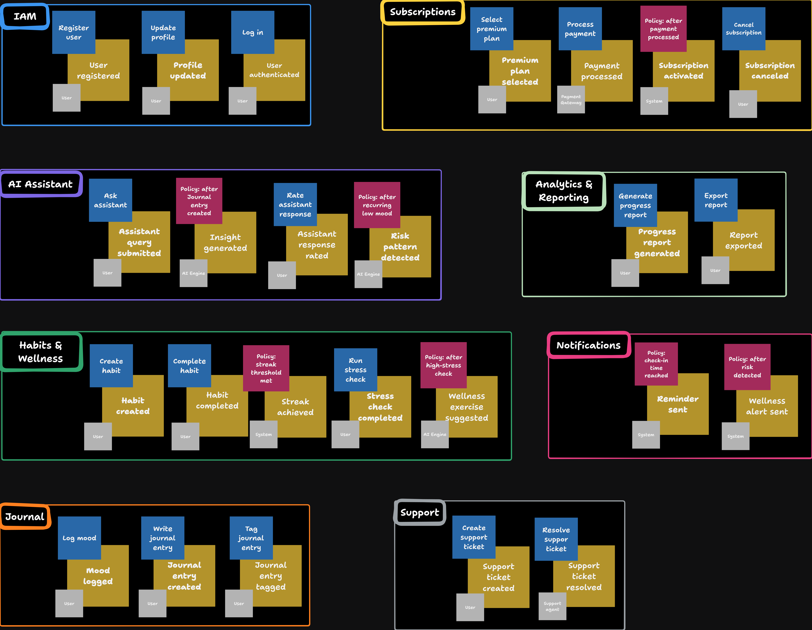
*Figura: Reagrupación final de eventos, commands, policies y actors en los 8 Bounded Contexts candidatos.*

#### 2.5.1.1. Candidate Context Discovery

Partiendo de la sesión de EventStorming documentada en 2.5.1, el equipo realizó una sesión dedicada de Candidate Context Discovery (aproximadamente 1.5 horas, usando Miro) para formalizar los límites naturales dentro del dominio de MindFlow, comparando el estado del tablero antes del reagrupamiento (Paso 3) contra el estado después del reagrupamiento (Paso 4).

*Figura: Estado del tablero antes del reagrupamiento (Actors/Agents identificados, aún sobre la línea de tiempo).*

*Figura: Estado del tablero después del reagrupamiento en los 8 Bounded Contexts candidatos.*

La técnica principal aplicada fue **look-for-pivotal-events**: el equipo recorrió la línea de tiempo producida en el Paso 3 y marcó cada evento que representara un cambio significativo de responsabilidad o capacidad de negocio —un punto donde "empieza a pasar algo distinto." Estos eventos pivote se convirtieron en las costuras a lo largo de las cuales se reagrupó el tablero en el Paso 4.

Se identificaron los siguientes eventos pivote como marcadores de límite:

- **User registered / User authenticated** → marca el inicio de toda relación con el usuario; todo lo que sigue depende de una identidad conocida. Esto ancla el contexto **IAM**, confirmado de forma independiente mediante **start-with-value**, ya que la identidad y el acceso están en la base de toda otra capacidad que ofrece MindFlow.
- **Journal entry created** → marca el cambio de "gestionar una cuenta" a "expresar un estado emocional", una capacidad core distinta con su propio lenguaje (mood, tags, entries). Esto ancla el contexto **Journal**.
- **Assistant query submitted / Insight generated** → marca el cambio de datos crudos de journaling hacia una interpretación generada por IA —una responsabilidad distinta (procesamiento de lenguaje natural, sugerencias contextuales) de simplemente almacenar lo que el usuario escribió. Esto ancla el contexto **AI Assistant**.
- **Habit created** → marca una vía paralela de compromiso del usuario, independiente del journaling: cambio de comportamiento proactivo en vez de expresión reflexiva. Esto ancla **Habits & Wellness**, que también absorbe la capacidad de chequeo de estrés y sugerencias de bienestar, ya que ambas operan sobre el mismo agregado (la rutina de bienestar continua del usuario).
- **Progress report generated** → marca el cambio de "producir datos" (entradas de diario, hábitos completados) a "interpretar datos de forma agregada", una responsabilidad de reporting/analytics distinta de cualquier contexto fuente individual. Esto ancla **Analytics & Reporting**.
- **Premium plan selected / Payment processed** → marca el cambio hacia una relación comercial, gobernada por reglas de facturación ajenas al lenguaje del dominio de bienestar. Esto ancla **Subscriptions**.
- **Support ticket created** → marca el cambio hacia una relación de servicio al cliente, con su propio ciclo de vida (abierto → resuelto) desacoplado del resto del producto. Esto ancla **Support**.
- **Reminder sent / Wellness alert sent** → estos dos eventos no pertenecen a un único contexto upstream; son disparados por policies que se originan en lugares distintos (un horario, un patrón de riesgo) pero comparten la misma responsabilidad —llegar al usuario fuera de la app. Esto ancla **Notifications** como contexto de soporte transversal.

Complementando esto con un pase rápido de **start-with-value** se confirmó que Journal y Habits & Wellness son los contextos que entregan más directamente la propuesta de valor central de MindFlow (autoconciencia emocional y cambio de comportamiento), mientras que IAM, Notifications, Subscriptions y Support se identificaron consistentemente como contextos de soporte/genéricos.

**Tabla: Candidate Bounded Contexts**

| # | Bounded Context | Evento(s) pivote | Capacidad core |
|---|---|---|---|
| 1 | IAM | User registered, User authenticated | Identidad, autenticación, perfil |
| 2 | Journal | Journal entry created | Diario emocional, seguimiento de ánimo |
| 3 | AI Assistant | Assistant query submitted, Insight generated | IA conversacional, insights generados, feedback de respuestas |
| 4 | Habits & Wellness | Habit created, Stress check completed | Seguimiento de hábitos, chequeos de estrés, sugerencias de bienestar |
| 5 | Analytics & Reporting | Progress report generated | KPIs, tendencias, exportaciones |
| 6 | Notifications | Reminder sent, Wellness alert sent | Notificaciones push, recordatorios, alertas |
| 7 | Subscriptions | Premium plan selected, Payment processed | Facturación, planes premium |
| 8 | Support | Support ticket created | Tickets de soporte al cliente |

#### 2.5.1.2. Domain Message Flows Modeling

El **Domain Message Flows Modeling** permite representar cómo circulan los mensajes de dominio entre los diferentes **Bounded Contexts** de MindFlow, considerando **Commands, Domain Events, Policies, Actors/Agents** y sistemas externos.

A partir de los eventos y límites identificados previamente durante el **EventStorming** y el **Candidate Context Discovery**, se modelaron los principales escenarios de interacción del sistema. Estos flujos permiten visualizar qué actor inicia una acción, qué Bounded Context asume la responsabilidad, qué mensaje se genera y cómo dicho mensaje puede provocar nuevas acciones en otros contextos.

Los escenarios considerados son:

1. Registro y autenticación de usuario.
2. Registro emocional y diario.
3. Generación de Insight con IA.
4. Gestión de hábitos y recordatorios.
5. Detección de estrés y bienestar.
6. Generación y exportación de reportes.
7. Suscripción Premium.
8. Gestión de soporte.

Para la representación gráfica se empleó la siguiente convención:

- **Azul:** Command.
- **Amarillo:** Domain Event.
- **Rosado:** Policy.
- **Gris:** Actor, Agent, Bounded Context o External System.
- **Flechas:** dirección en la que se produce el flujo de mensajes.

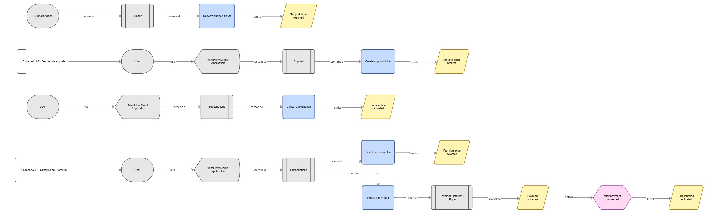

*Figura: Domain Message Flows Modeling de MindFlow - Parte 1.*

La primera parte representa los flujos relacionados con la identidad del usuario, el registro de estados emocionales y las operaciones principales del diario. El usuario interactúa mediante la **MindFlow Mobile Application**, que dirige las operaciones hacia los Bounded Contexts correspondientes.

El contexto **IAM** administra los Commands `Register user`, `Update profile` y `Log in`, generando respectivamente los Domain Events `User registered`, `Profile updated` y `User authenticated`.

Por su parte, **Journal** administra el registro emocional mediante `Log mood`, `Write journal entry` y `Tag journal entry`, generando los eventos `Mood logged`, `Journal entry created` y `Journal entry tagged`.

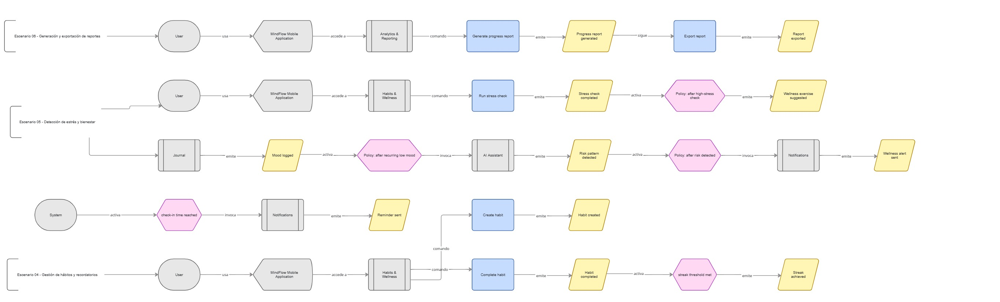

*Figura: Domain Message Flows Modeling de MindFlow - Parte 2.*

La segunda parte representa los escenarios donde se producen interacciones entre distintos Bounded Contexts.

Cuando una entrada de diario es creada, el Domain Event `Journal entry created` activa la Policy `after Journal entry created`, permitiendo que **AI Assistant** procese la información con apoyo de **Google Gemini API** y genere el evento `Insight generated`. El usuario también puede valorar la respuesta generada, produciendo `Assistant response rated`.

En **Habits & Wellness**, los Commands `Create habit` y `Complete habit` permiten registrar y actualizar los hábitos del usuario. Cuando se alcanza el umbral correspondiente se activa la Policy `streak threshold met`, produciendo `Streak achieved`.

De manera independiente, el **System** puede activar la Policy `check-in time reached`, que invoca al Bounded Context **Notifications** para producir el evento `Reminder sent`.

El flujo de bienestar comienza con `Run stress check`, generando `Stress check completed`. Ante un nivel elevado de estrés se activa la Policy `after high-stress check`, produciendo `Wellness exercise suggested`.

Asimismo, los registros emocionales recurrentes pueden activar `after recurring low mood`. **AI Assistant** identifica entonces el evento `Risk pattern detected`, el cual activa `after risk detected` y permite que **Notifications** produzca `Wellness alert sent`.

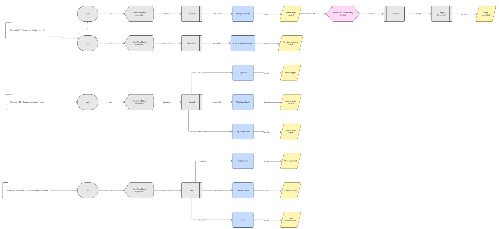

*Figura: Domain Message Flows Modeling de MindFlow - Parte 3.*

La tercera parte representa los flujos relacionados con analítica, monetización y soporte.

El Bounded Context **Analytics & Reporting** permite generar un reporte mediante `Generate progress report`, produciendo `Progress report generated`. Posteriormente, el usuario puede ejecutar `Export report`, generando el evento `Report exported`.

En **Subscriptions**, el usuario selecciona un plan mediante `Select premium plan`, produciendo `Premium plan selected`. El pago es procesado mediante un **Payment Gateway / Stripe**, generando `Payment processed`. Este evento activa la Policy `after payment processed`, dando como resultado `Subscription activated`. El usuario también puede ejecutar `Cancel subscription`, produciendo `Subscription canceled`.

Finalmente, el Bounded Context **Support** administra las solicitudes de asistencia. El usuario ejecuta `Create support ticket`, produciendo `Support ticket created`, mientras que el **Support Agent** puede ejecutar `Resolve support ticket`, generando `Support ticket resolved`.

En conjunto, estos flujos evidencian cómo los diferentes Bounded Contexts colaboran sin perder sus responsabilidades individuales, utilizando mensajes de dominio para coordinar las capacidades principales de MindFlow.

#### 2.5.1.3. Bounded Context Canvases

Los **Bounded Context Canvases** permiten documentar de manera estructurada las responsabilidades, lenguaje, reglas de negocio y formas de comunicación de cada uno de los Bounded Contexts identificados durante el proceso de Strategic-Level Domain-Driven Design.

Para MindFlow se definieron ocho Bounded Contexts: **IAM**, **Journal**, **AI Assistant**, **Habits & Wellness**, **Analytics & Reporting**, **Notifications**, **Subscriptions** y **Support**. Cada canvas describe su propósito, clasificación estratégica, lenguaje ubicuo, decisiones de negocio y mecanismos de comunicación de entrada y salida.

### IAM

El bounded context **IAM (Identity and Access Management)** concentra las responsabilidades relacionadas con la identidad de los usuarios, autenticación, perfiles y mecanismos de acceso a MindFlow. Funciona como un contexto de soporte para el resto de las capacidades del sistema.

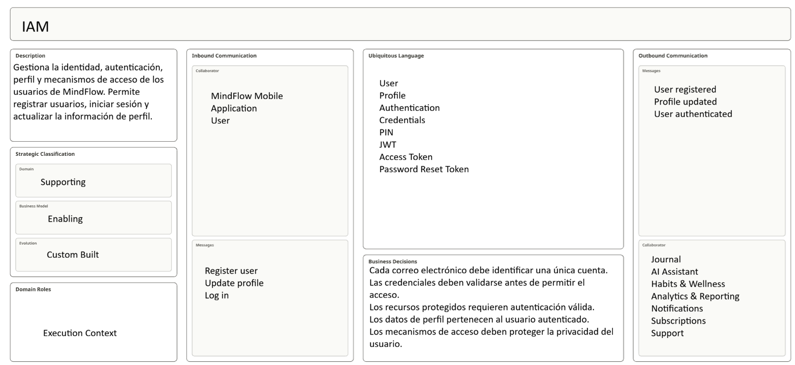

*Figura: Bounded Context Canvas correspondiente a IAM.*

### Journal

El bounded context **Journal** administra el diario emocional del usuario, incluyendo el registro de estados de ánimo, creación de entradas y organización de información mediante etiquetas. Se considera uno de los contextos centrales de MindFlow debido a su relación directa con la autoconciencia emocional.

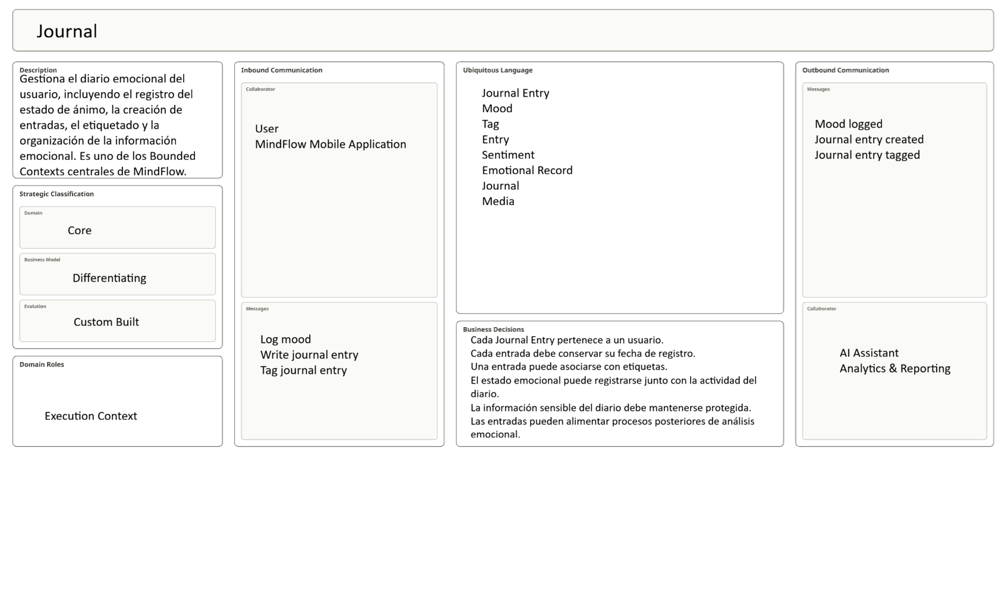

*Figura: Bounded Context Canvas correspondiente a Journal.*

### AI Assistant

El bounded context **AI Assistant** concentra las capacidades relacionadas con la interacción conversacional basada en Inteligencia Artificial, la generación de insights, el análisis del contexto emocional y la detección de patrones relevantes a partir de la información del usuario.

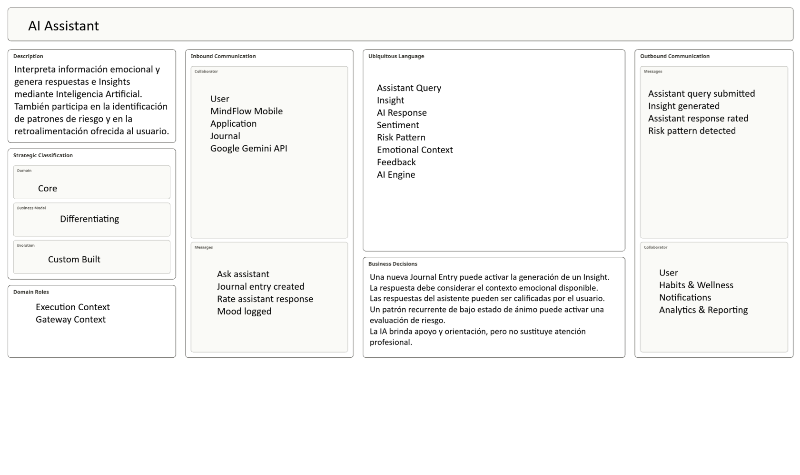

*Figura: Bounded Context Canvas correspondiente a AI Assistant.*

### Habits & Wellness

El bounded context **Habits & Wellness** administra la creación y seguimiento de hábitos, el cumplimiento de actividades, las rachas de progreso, los chequeos de estrés y las sugerencias orientadas al bienestar del usuario.

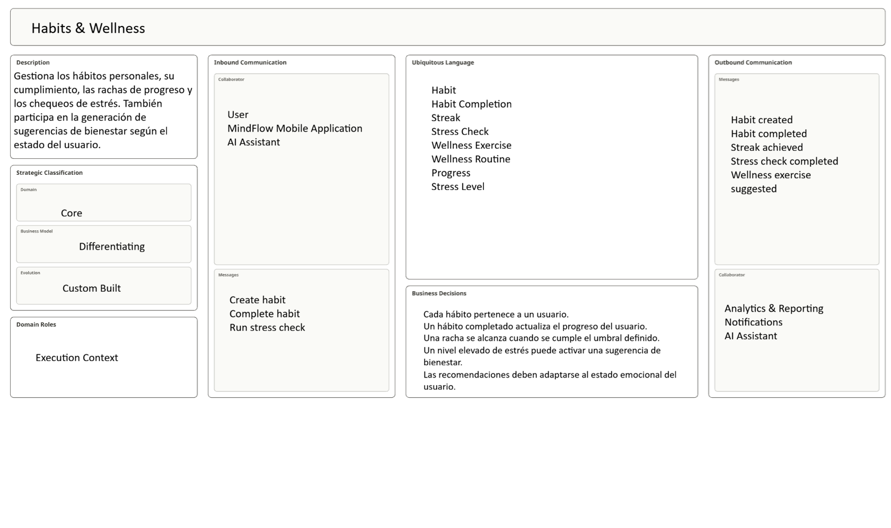

*Figura: Bounded Context Canvas correspondiente a Habits & Wellness.*

### Analytics & Reporting

El bounded context **Analytics & Reporting** transforma la información generada en otros contextos en métricas, tendencias y reportes que permiten al usuario visualizar y comprender su evolución emocional y el progreso de sus hábitos.

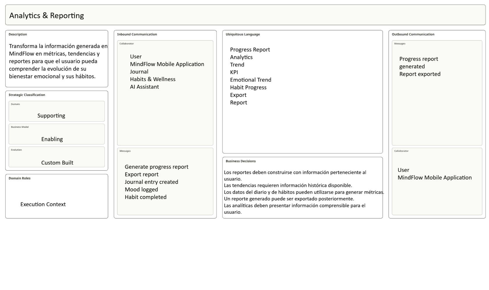

*Figura: Bounded Context Canvas correspondiente a Analytics & Reporting.*

### Notifications

El bounded context **Notifications** se encarga de gestionar recordatorios, alertas de bienestar y notificaciones dirigidas al usuario. Funciona como un contexto transversal que recibe información originada en otros Bounded Contexts y la comunica mediante los canales disponibles.

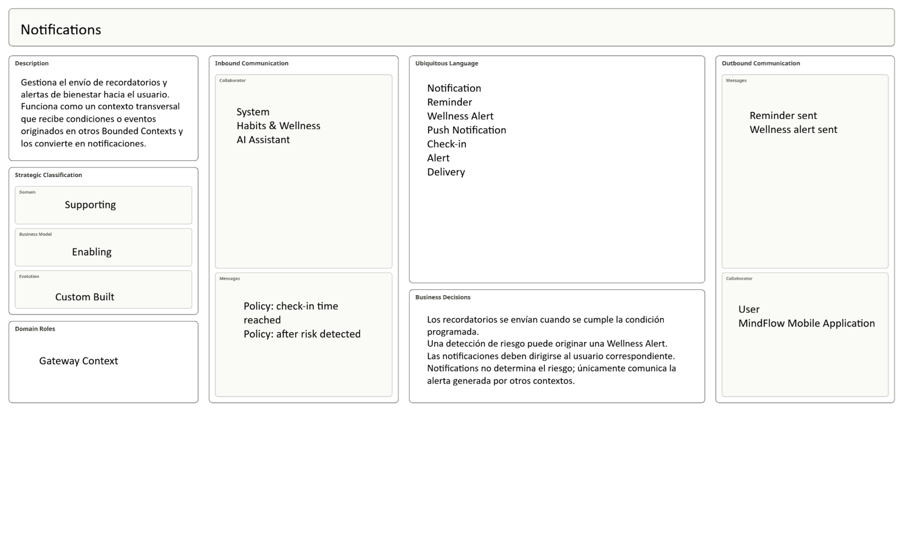

*Figura: Bounded Context Canvas correspondiente a Notifications.*

### Subscriptions

El bounded context **Subscriptions** administra las capacidades comerciales de MindFlow relacionadas con los planes Premium, procesamiento de pagos, activación de suscripciones y cancelaciones, manteniendo estas responsabilidades separadas de las funcionalidades centrales de bienestar.

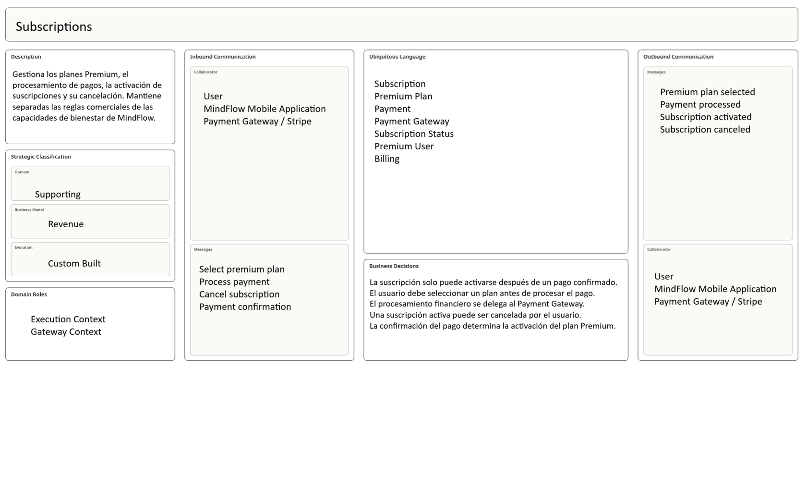

*Figura: Bounded Context Canvas correspondiente a Subscriptions.*

### Support

El bounded context **Support** gestiona las solicitudes de asistencia de los usuarios mediante tickets de soporte, controlando su ciclo de vida desde la creación hasta su resolución por parte del equipo correspondiente.

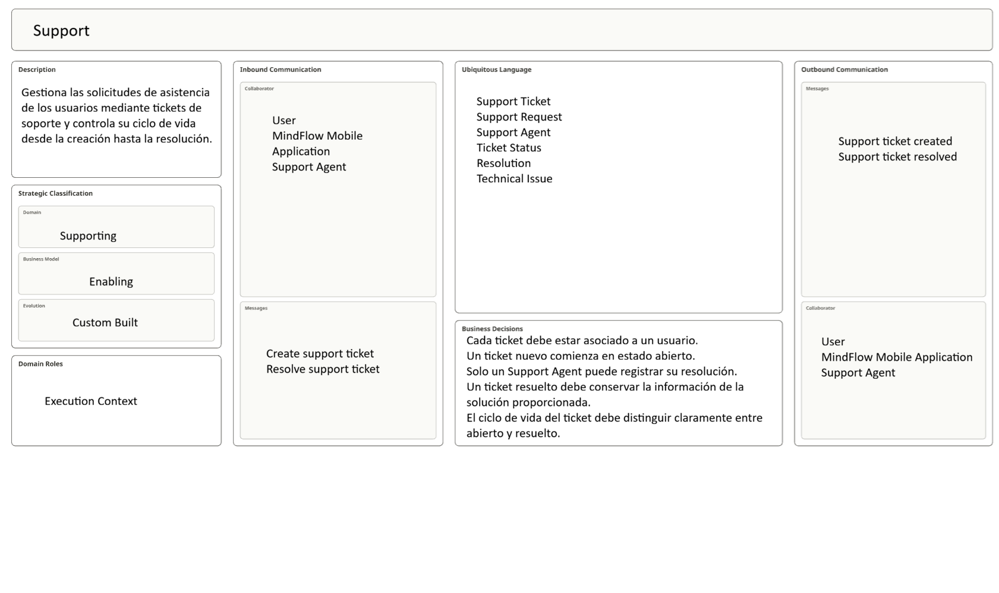

*Figura: Bounded Context Canvas correspondiente a Support.*

En conjunto, estos canvases permiten establecer límites claros entre las responsabilidades del dominio de MindFlow y documentar cómo cada Bounded Context mantiene su propio lenguaje y reglas de negocio, mientras colabora con otros contextos mediante mensajes y eventos de dominio.

### 2.5.2. Context Mapping

El **Context Mapping** permite representar las relaciones existentes entre los diferentes **Bounded Contexts** de MindFlow, identificando cuáles actúan como **Upstream (U)** y cuáles como **Downstream (D)**, así como el patrón de integración utilizado entre ellos.

A partir de los Bounded Contexts identificados durante el EventStorming y el Candidate Context Discovery, se definieron relaciones de tipo **Conformist** y **Customer-Supplier**. Estas relaciones permiten mantener separados los modelos de dominio, al mismo tiempo que hacen explícitas las dependencias necesarias para el funcionamiento de la solución.

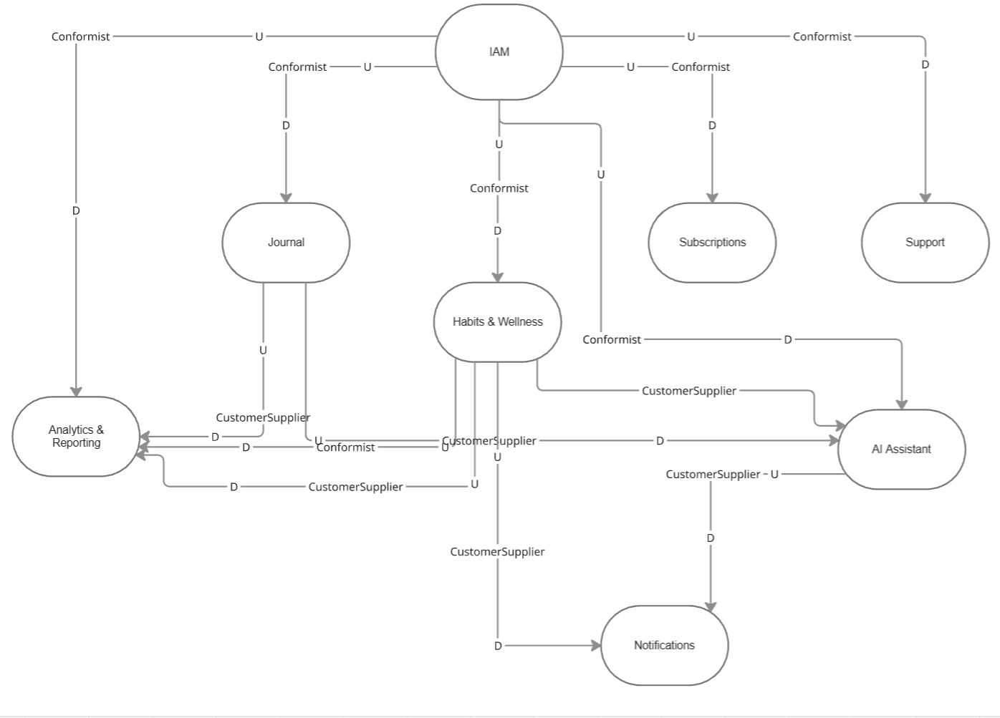

*Figura: Context Mapping de los Bounded Contexts de MindFlow.*

### Relaciones entre Bounded Contexts

**IAM – Journal (Conformist)**

En esta relación, **IAM** actúa como **Upstream**, ya que proporciona la identidad autenticada del usuario. **Journal** actúa como **Downstream**, utilizando dicha identidad para asociar las entradas del diario y los registros emocionales al usuario correspondiente.

La relación se define como **Conformist**, debido a que Journal adopta la información de identidad proporcionada por IAM sin requerir un modelo de traducción adicional.

**IAM – AI Assistant (Conformist)**

**IAM** es el contexto **Upstream**, ya que proporciona la identidad del usuario autenticado. **AI Assistant** actúa como **Downstream**, utilizando esta información para asociar conversaciones, respuestas e insights con el usuario correspondiente.

La relación se establece como **Conformist**, ya que AI Assistant utiliza directamente la identidad definida por IAM.

**IAM – Habits & Wellness (Conformist)**

**IAM** funciona como **Upstream**, mientras que **Habits & Wellness** funciona como **Downstream**. La identidad proporcionada por IAM permite asociar hábitos, chequeos de estrés y actividades de bienestar con un usuario específico.

Habits & Wellness adopta el modelo de identidad de IAM, por lo que la relación se clasifica como **Conformist**.

**IAM – Analytics & Reporting (Conformist)**

En esta relación, **IAM** actúa como **Upstream** y **Analytics & Reporting** como **Downstream**. Los reportes, métricas y tendencias generados por MindFlow deben corresponder a un usuario previamente identificado.

Analytics & Reporting utiliza la identidad proporcionada por IAM, estableciendo una relación de tipo **Conformist**.

**IAM – Subscriptions (Conformist)**

**IAM** es **Upstream**, proporcionando la identidad del usuario, mientras que **Subscriptions** es **Downstream**, ya que necesita asociar los planes Premium, pagos y estados de suscripción a un usuario determinado.

Subscriptions adopta directamente la identificación del usuario gestionada por IAM, por lo que se utiliza el patrón **Conformist**.

**IAM – Support (Conformist)**

**IAM** funciona como **Upstream**, proporcionando la información de identidad necesaria para registrar solicitudes de soporte. **Support** actúa como **Downstream**, asociando cada ticket con el usuario que lo generó.

La relación se define como **Conformist**, ya que Support utiliza directamente el modelo de identidad proporcionado por IAM.

**Journal – AI Assistant (Customer-Supplier)**

En esta relación, **Journal** actúa como **Upstream (Supplier)**, ya que produce información emocional como entradas de diario y estados de ánimo.

**AI Assistant** funciona como **Downstream (Customer)**, consumiendo dicha información para generar insights, respuestas contextualizadas y detectar patrones emocionales.

La relación se clasifica como **Customer-Supplier**, debido a que AI Assistant depende de información generada por Journal para ejecutar parte de sus capacidades.

**Journal – Analytics & Reporting (Customer-Supplier)**

**Journal** actúa como **Upstream (Supplier)** al proporcionar información relacionada con entradas emocionales y estados de ánimo.

**Analytics & Reporting** funciona como **Downstream (Customer)**, utilizando estos datos para construir métricas, tendencias y reportes sobre la evolución emocional del usuario.

Por ello, la relación se establece como **Customer-Supplier**.

**Habits & Wellness – Analytics & Reporting (Customer-Supplier)**

**Habits & Wellness** funciona como **Upstream (Supplier)**, ya que genera información relacionada con hábitos, cumplimiento, rachas y chequeos de estrés.

**Analytics & Reporting** actúa como **Downstream (Customer)**, consumiendo estos datos para generar indicadores y reportes relacionados con el progreso del usuario.

La relación se clasifica como **Customer-Supplier**.

**AI Assistant – Notifications (Customer-Supplier)**

**AI Assistant** actúa como **Upstream (Supplier)** al detectar patrones de riesgo y generar información que puede requerir una comunicación hacia el usuario.

**Notifications** funciona como **Downstream (Customer)**, reaccionando ante estos eventos para generar y enviar alertas de bienestar.

Esta relación se modela como **Customer-Supplier**.

**Habits & Wellness – Notifications (Customer-Supplier)**

**Habits & Wellness** actúa como **Upstream (Supplier)** al generar información relacionada con hábitos, chequeos y condiciones de bienestar.

**Notifications** funciona como **Downstream (Customer)** al utilizar estas condiciones para generar recordatorios y comunicaciones dirigidas al usuario.

Por ello, la relación se establece como **Customer-Supplier**.

En conjunto, el Context Mapping permite visualizar las dependencias entre los Bounded Contexts de MindFlow y establecer de manera explícita la dirección de la comunicación entre ellos. IAM funciona como proveedor transversal de identidad, mientras que Journal, Habits & Wellness y AI Assistant generan información de dominio que posteriormente es utilizada por contextos como Analytics & Reporting y Notifications.

### 2.5.3. Software Architecture

#### 2.5.3.1. Software Architecture Context Level Diagrams

El **Software Architecture Context Level Diagram** representa a MindFlow como un único sistema y muestra su interacción con los usuarios y los servicios externos necesarios para su funcionamiento.

En este nivel del modelo C4 no se detallan los componentes internos de MindFlow, sino únicamente los actores y sistemas externos con los que se relaciona.

*Figura: Software Architecture Context Level Diagram de MindFlow.*

**Explicación del diagrama**

El usuario interactúa con **MindFlow** para registrar información emocional, gestionar hábitos, consultar insights generados mediante Inteligencia Artificial, revisar reportes de progreso, gestionar su cuenta y acceder a funcionalidades Premium.

MindFlow se integra con diversos servicios externos:

- **Google Gemini API**: utilizado para generar respuestas, insights emocionales y sugerencias basadas en Inteligencia Artificial.
- **Firebase Cloud Messaging**: utilizado para el envío de notificaciones push y alertas de bienestar.
- **Google OAuth**: permite la autenticación de usuarios mediante Google Sign-In.
- **Stripe**: procesa los pagos relacionados con las suscripciones Premium.
- **Cloudinary**: almacena y sirve archivos multimedia asociados a las entradas del diario.
- **Email Provider**: permite el envío de correos transaccionales, como recuperación de contraseña y notificaciones relacionadas con soporte.

Este diagrama permite visualizar el límite del sistema MindFlow y las principales dependencias externas que colaboran con la solución.

#### 2.5.3.2. Software Architecture Container Level Diagrams

El **Software Architecture Container Level Diagram** representa la estructura interna de MindFlow a nivel de contenedores, mostrando las principales aplicaciones, servicios y mecanismos de persistencia que componen la solución.

A diferencia del Context Level Diagram, en este nivel del modelo C4 se detalla cómo MindFlow se divide internamente y cómo sus contenedores se comunican entre sí y con los servicios externos.

*Figura: Software Architecture Container Level Diagram de MindFlow.*

**Explicación del diagrama**

MindFlow está compuesto por cuatro contenedores principales:

- **Mobile Application**: aplicación Android utilizada por los usuarios para acceder a las funcionalidades de MindFlow, incluyendo diario emocional, hábitos, asistente de IA, analíticas, suscripciones y soporte.

- **Landing Page**: sitio web público desarrollado con HTML5, CSS3 y JavaScript, utilizado para presentar MindFlow y sus principales características.

- **Web Services API**: backend desarrollado con ASP.NET Core / .NET 10. Centraliza la lógica de negocio, procesa las solicitudes provenientes de la aplicación móvil e integra los servicios externos utilizados por la plataforma.

- **Database**: base de datos relacional MySQL 8.0 utilizada para persistir información de usuarios, entradas del diario, hábitos, información analítica, suscripciones y tickets de soporte.

La **Mobile Application** se comunica con la **Web Services API** mediante HTTPS/JSON utilizando JWT para la autenticación de solicitudes. La API, a su vez, realiza operaciones de lectura y escritura sobre la base de datos MySQL.

La Web Services API también mantiene integraciones con diferentes servicios externos:

- **Google Gemini API**: generación de respuestas, insights emocionales y sugerencias mediante Inteligencia Artificial.
- **Firebase Cloud Messaging**: envío de notificaciones push y alertas de bienestar.
- **Google OAuth**: autenticación mediante Google Sign-In.
- **Stripe**: procesamiento de pagos asociados a suscripciones Premium.
- **Cloudinary**: almacenamiento y recuperación de archivos multimedia asociados a las entradas del diario.
- **Email Provider**: envío de correos transaccionales mediante SMTP.

Este nivel del modelo C4 permite comprender cómo se distribuyen las responsabilidades principales de la solución y cómo los contenedores internos de MindFlow colaboran para ofrecer las funcionalidades del sistema.

#### 2.5.3.3. Software Architecture Deployment Diagrams

Se elaboró el Deployment Diagram siguiendo el C4 Model, con el objetivo de representar la distribución física de la solución MindFlow: los nodos de hardware e infraestructura sobre los que se despliega cada contenedor de software, así como las relaciones y dependencias entre ellos. 

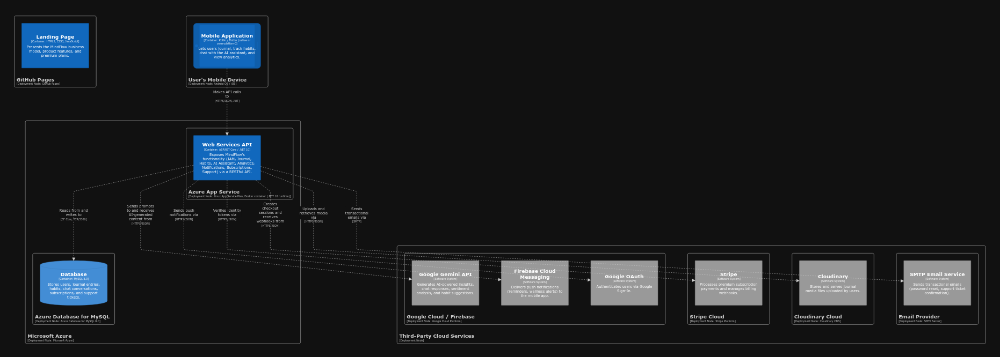
*Figura: Deployment Diagram (C4 Model) de la solución MindFlow en producción.*

**Explicación del diagrama**

El sistema MindFlow está compuesto por cuatro contenedores (Landing Page, Mobile Application, Web Services API y Database) desplegados sobre nodos físicos y de infraestructura distintos:

- **User's Mobile Device**: dispositivo físico (Android) sobre el que corre la Mobile Application. Se comunica con el backend mediante llamadas HTTPS/JSON autenticadas con JWT.

- **GitHub Pages**: plataforma de hosting de sitios estáticos que aloja el Landing Page (HTML5, CSS3, JavaScript), distribuido a través de su CDN global bajo protocolo HTTPS.

- **Microsoft Azure**: proveedor cloud que aloja toda la infraestructura del backend, compuesto por dos nodos:
  - **Azure App Service**: plataforma PaaS que ejecuta el contenedor Docker de la **Web Services API** (ASP.NET Core / .NET 10), publicado automáticamente desde el repositorio de GitHub.
  - **Azure Database for MySQL**: servicio de base de datos relacional administrado (Flexible Server) que aloja la **Database** (MySQL 8.0), donde se persisten usuarios, entradas de diario, hábitos, conversaciones de chat, suscripciones y tickets de soporte.

- **Servicios externos de terceros** (agrupados como Third-Party Cloud Services), consumidos por la Web Services API mediante llamadas HTTPS/JSON (o SMTP en el caso del correo):
  - **Google Cloud / Firebase**: aloja **Google Gemini API** (generación de insights de IA, respuestas del chat, análisis de sentimiento y sugerencias de hábitos), **Firebase Cloud Messaging** (notificaciones push) y **Google OAuth** (autenticación con Google Sign-In).
  - **Stripe Cloud**: procesa los pagos de las suscripciones premium y envía webhooks de confirmación.
  - **Cloudinary Cloud**: almacena y sirve los archivos multimedia adjuntos a las entradas del diario.
  - **Email Provider**: servidor SMTP utilizado para el envío de correos transaccionales (recuperación de contraseña, confirmación de tickets de soporte).

## 2.6. Tactical-Level Domain-Driven Design

<!-- Se agrega una sub-sección "2.6.x. Bounded Context: <Nombre>" por cada bounded context identificado en 2.5, una vez completado el Strategic-Level DDD. -->

### 2.6.1. Bounded Context: IAM

El bounded context **IAM (Identity & Access Management)** es responsable de la identidad, autenticación y perfil de los usuarios de MindFlow. Ancla el evento *User registered / User authenticated*, y es consumido por el resto de bounded contexts, ya que toda operación sobre Journal, Habits & Wellness, AI Assistant, Analytics, Subscriptions, Notifications y Support requiere un usuario autenticado.

#### 2.6.1.1. Domain Layer

El Domain Layer concentra el agregado raíz `User`, la entidad `PasswordResetToken` y la abstracción `IUserRepository`, que encapsulan las reglas de negocio de identidad (hashing de contraseña y PIN, promoción a administrador, vínculo con Google) independientemente de cómo se exponen o se persisten.

| Clase | Tipo | Propósito | Atributos | Métodos | Relaciones |
|---|---|---|---|---|---|
| `User` | Aggregate Root (implementa `IAuditableEntity`) | Representa la identidad de un usuario de MindFlow y encapsula las reglas de negocio sobre su contraseña, PIN de seguridad y rol. | `Id: int`, `Email: string`, `Name: string?`, `Occupation: string?`, `GoogleId: string?`, `PasswordHash: string` (privado), `PinHash: string?` (privado), `Role: string`, `CreatedAt: DateTimeOffset?`, `UpdatedAt: DateTimeOffset?`, `AdminRole`/`DefaultRole: const string` | `User(email, password)`, `User(email, googleId, name)`, `PromoteToAdmin()`, `LinkGoogle(googleId)`, `UpdatePasswordHash(password)`, `UpdateProfile(name, occupation)`, `SetPin(pin)`, `VerifyPin(pin): bool`, `RemovePin()`, propiedades calculadas `IsAdmin`, `HasPin` | Es el agregado que `IUserRepository` persiste; `PasswordResetToken` referencia su `Id` (relación lógica, sin FK físico) |
| `PasswordResetToken` | Entity | Representa un token de un solo uso, con expiración, para el flujo de recuperación de contraseña. Solo se persiste el hash del token; el valor crudo viaja únicamente en el correo enviado al usuario. | `Id: int`, `UserId: int`, `Token: string` (hash SHA-256), `ExpiresAt: DateTime`, `Used: bool` | *(entidad anémica, sin comportamiento propio — el ciclo de vida lo gestiona `UserCommandService`)* | Referencia lógica a `User` por `UserId` (0..* a 1, sin constraint físico en BD) |
| `IUserRepository` | Repository Interface (extiende `IBaseRepository<User>`) | Abstrae el acceso a datos de `User` para que el Domain/Application Layer no dependa de la tecnología de persistencia. | — | `FindByEmailAsync(email): Task<User?>`, `FindByGoogleIdAsync(googleId): Task<User?>`, `ExistsByEmailAsync(email): Task<bool>` + heredados de `IBaseRepository<User>` (`AddAsync`, `FindByIdAsync`, `Update`, `Remove`, `ListAsync`) | Implementada por `UserRepository` (Infrastructure Layer); consumida por `UserCommandService` (Application Layer) |

#### 2.6.1.2. Interface Layer

El Interface Layer expone las capacidades de IAM como una API REST, y traduce entre el contrato HTTP (Resources) y los Commands del Application Layer.

| Clase | Tipo | Propósito | Atributos / Métodos | Relaciones |
|---|---|---|---|---|
| `UsersController` | REST Controller (`api/v1/users`) | Expone los endpoints de registro, autenticación (email/password y Google), recuperación de contraseña, perfil y gestión de PIN. | Endpoints: `POST /sign-up`, `POST /sign-in`, `POST /google-auth`, `POST /forgot-password`, `POST /reset-password`, `GET /profile`, `PUT /profile`, `DELETE /`, `POST /pin`, `POST /pin/verify`, `DELETE /pin`, `GET /pin/status` | Depende de `IUserCommandService`; usa los *Assemblers* para transformar Resources ↔ Commands/Entities |
| `SignUpResource`, `SignInResource`, `GoogleAuthResource`, `ForgotPasswordResource`, `ResetPasswordResource`, `UpdateProfileResource`, `SetPinResource`, `VerifyPinResource` | Request DTOs (records) | Representan el cuerpo (`body`) de cada petición HTTP entrante, desacoplado de los Commands del dominio. | Atributos según el endpoint (p. ej. `SignUpResource(Email, Password, Name?)`) | Transformados a Commands por los Assemblers o instanciados directamente en el Controller |
| `UserResource`, `AuthenticatedUserResource` | Response DTOs (records) | Representan la forma pública de un `User` en las respuestas HTTP; `AuthenticatedUserResource` añade el JWT emitido. | `UserResource(Id, Email, Name?, Occupation?)`, `AuthenticatedUserResource(Id, Email, Token)` | Construidos a partir de `User` mediante `UserResourceFromEntityAssembler` |
| `SignUpCommandFromResourceAssembler` | Assembler (static) | Convierte un `SignUpResource` en un `SignUpCommand`. | `ToCommandFromResource(resource): SignUpCommand` | Traduce Interface Layer → Application Layer |
| `UserResourceFromEntityAssembler` | Assembler (static) | Convierte un `User` (Domain) en un `UserResource` (Interface). | `ToResourceFromEntity(entity): UserResource` | Traduce Domain Layer → Interface Layer |

#### 2.6.1.3. Application Layer

El Application Layer orquesta los flujos de negocio de IAM a través de Commands y del servicio `UserCommandService`, que actúa como Command Handler unificado para todos los casos de uso de identidad.

| Clase | Tipo | Propósito | Atributos / Métodos | Relaciones |
|---|---|---|---|---|
| `SignUpCommand`, `SignInCommand`, `UpdateProfileCommand`, `DeleteAccountCommand`, `GoogleAuthCommand`, `ForgotPasswordCommand`, `ResetPasswordCommand`, `SetPinCommand`, `VerifyPinCommand`, `RemovePinCommand` | Commands (records) | Encapsulan la intención y los datos necesarios para cada caso de uso de IAM (registro, login, actualización de perfil, eliminación de cuenta, login con Google, recuperación/reset de contraseña, gestión de PIN). | P. ej. `SignUpCommand(Email, Password, Name?)`, `SignInCommand(Email, Password)`, `SetPinCommand(UserId, Pin)` | Producidos por el Interface Layer (directamente o vía Assembler); consumidos por `IUserCommandService` |
| `IUserCommandService` | Application Service Interface | Define el contrato de todos los casos de uso de IAM como métodos `Handle(...)` sobrecargados por tipo de Command. | Un `Handle(TCommand)` por cada Command, más `HasPinAsync(userId)` y `GetProfileAsync(userId)` | Implementada por `UserCommandService`; consumida por `UsersController` |
| `UserCommandService` | Application Service (Command Handler) | Implementa `IUserCommandService`: valida entradas (formato de email, longitud de contraseña/PIN), aplica reglas de negocio sobre `User`, coordina `IUserRepository`, `ITokenService`, `IEmailService`, `IGoogleAuthService` y el `IUnitOfWork`. En `DeleteAccountCommand` además orquesta el borrado en cascada de datos del usuario en los demás bounded contexts (Journal, Habits, Analytics, Chat, Support, Subscriptions, Notifications, AiFeedback) dentro de una transacción. | Un método `Handle` por cada Command (ver tabla de Commands) | Depende de `IUserRepository`, `IUnitOfWork`, `ITokenService`, `IEmailService`, `IGoogleAuthService`, `AppDbContext` (acceso directo para el borrado en cascada multi-contexto) |
| `ITokenService` | Service Port | Abstrae la generación de tokens de acceso. | `GenerateToken(user: User): string` | Implementada por `TokenService` (Infrastructure) |
| `IEmailService` | Service Port | Abstrae el envío de correos transaccionales. | `SendPasswordResetAsync(toEmail, resetToken): Task` | Implementada por `EmailService` (Infrastructure) |
| `IGoogleAuthService` | Service Port | Abstrae la validación de credenciales de Google Sign-In. | `ValidateAsync(credential): Task<GoogleUserInfo?>` | Implementada por `GoogleAuthService` (Infrastructure); retorna el record `GoogleUserInfo(GoogleId, Email, Name?)` |
| `SignUpError`, `SignInError` | Error Enums | Códigos de error tipados para las respuestas `Result<T>.Failure(...)` de sign-up y sign-in/reset. | `SignUpError`: `EmailAlreadyInUse`, `InvalidEmailFormat`, `UnexpectedError`. `SignInError`: `InvalidCredentials`, `UnexpectedError` | Usados por `UserCommandService` al construir resultados fallidos |

#### 2.6.1.4. Infrastructure Layer

El Infrastructure Layer contiene las implementaciones concretas de los puertos definidos en Domain/Application Layer: persistencia con EF Core, emisión de JWT, envío de correo por SMTP, y validación de credenciales de Google.

| Clase | Tipo | Propósito | Atributos / Métodos | Relaciones |
|---|---|---|---|---|
| `UserRepository` | Repository (EF Core) | Implementa `IUserRepository` sobre `AppDbContext`, extendiendo `BaseRepository<User>` para el CRUD genérico. | `FindByEmailAsync(email)`, `FindByGoogleIdAsync(googleId)`, `ExistsByEmailAsync(email)` | Implementa `IUserRepository`; hereda de `BaseRepository<User>`; opera sobre la tabla `users` vía `AppDbContext` |
| `TokenService` | Infrastructure Service | Implementa `ITokenService` generando un JWT firmado con HMAC-SHA256, con claims `user_id`, `email` y `role`, expiración de 7 días. | `GenerateToken(user): string` | Implementa `ITokenService`; lee `TokenSettings:Secret`, `Jwt:Issuer`, `Jwt:Audience` de configuración |
| `EmailService` | Infrastructure Service | Implementa `IEmailService` enviando el correo de recuperación de contraseña vía SMTP (`System.Net.Mail`), con el enlace hacia `FrontendUrl` configurado. | `SendPasswordResetAsync(toEmail, resetToken): Task` | Implementa `IEmailService`; depende del servicio externo **SMTP Email Service** |
| `GoogleAuthService` | Infrastructure Service | Implementa `IGoogleAuthService` validando el `credential` (ID token) recibido contra la librería oficial `Google.Apis.Auth`, verificando el `Audience` contra `Google:ClientId`. | `ValidateAsync(credential): Task<GoogleUserInfo?>` | Implementa `IGoogleAuthService`; depende del servicio externo **Google OAuth** |

---

#### 2.6.1.5. Bounded Context Software Architecture Component Level Diagrams

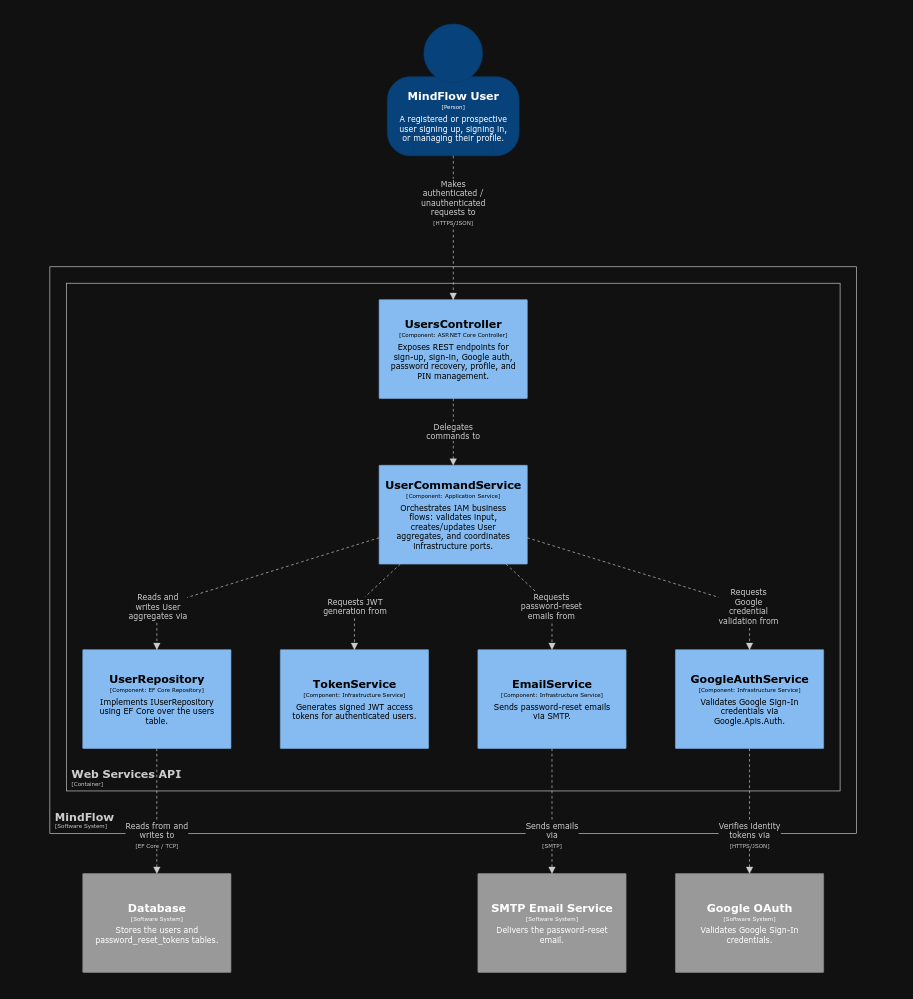
*Figura: Component Diagram (C4 Model) del bounded context IAM dentro del container Web Services API.*

El diagrama descompone el container **Web Services API** en los componentes que implementan IAM: `UsersController` recibe las peticiones HTTP y delega en `UserCommandService`, que a su vez coordina `UserRepository` (persistencia), `TokenService` (emisión de JWT), `EmailService` (correo de recuperación vía SMTP) y `GoogleAuthService` (validación de credenciales contra Google OAuth). Cada componente de infraestructura encapsula la comunicación con su dependencia externa correspondiente, de modo que `UserCommandService` permanece desacoplado de los detalles técnicos (hashing JWT, protocolo SMTP, SDK de Google).

#### 2.6.1.6. Bounded Context Software Architecture Code Level Diagrams

##### 2.6.1.6.1. Bounded Context Domain Layer Class Diagrams

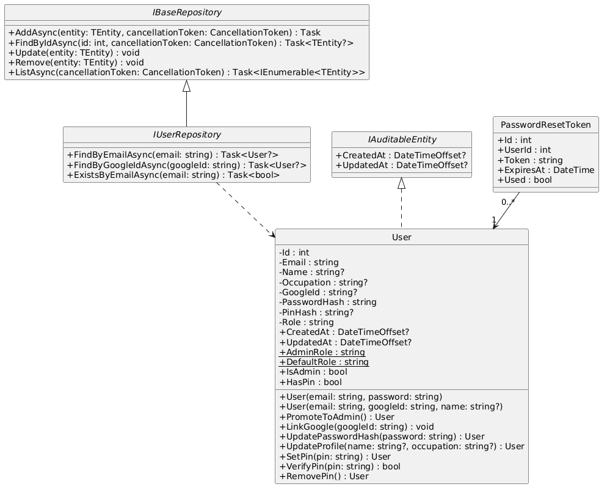
*Figura: Class Diagram (UML) del Domain Layer del bounded context IAM.*

El diagrama muestra el agregado `User` (que implementa `IAuditableEntity`), la entidad `PasswordResetToken` y la interfaz `IUserRepository` (que extiende `IBaseRepository`).

##### 2.6.1.6.2. Bounded Context Database Design Diagram

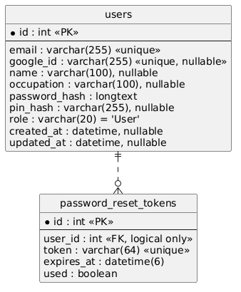

*Figura: Database Diagram del bounded context IAM.*

El bounded context IAM persiste en dos tablas: `users` (con índices únicos sobre `email` y `google_id`) y `password_reset_tokens` (con índice único sobre `token` y un índice simple sobre `user_id`).

---

### 2.6.2. Bounded Context: Journal

El bounded context **Journal** es responsable del diario emocional: creación, edición, borrado (soft-delete), etiquetado, adjuntos multimedia y búsqueda de entradas. Ancla el evento pivote *Journal entry created* identificado en el EventStorming (sección 2.5.1.1), y es uno de los dos contexts core que entregan directamente la propuesta de valor de MindFlow (autoconciencia emocional), junto con Habits & Wellness.

A diferencia de IAM, Journal **no define un repository interface propio**: los Command Handlers usan directamente `IBaseRepository<TEntity>` (abstracción genérica del Shared Kernel) para `JournalEntry`, `EntryTag` y `Media`, mientras que los Query Handlers acceden directamente a `AppDbContext` para construir lecturas optimizadas con `Include`/joins — un patrón CQRS explícito: comandos vía repository + Unit of Work, queries de solo lectura sin pasar por el repository. Tampoco existe una capa de Resources/Assemblers como en IAM: el `JournalController` consume los DTOs del Application Layer directamente como contrato de entrada/salida.

#### 2.6.2.1. Domain Layer

| Clase | Tipo | Propósito | Atributos | Métodos | Relaciones |
|---|---|---|---|---|---|
| `JournalEntry` | Aggregate Root (implementa `IAuditableEntity`) | Representa una entrada del diario emocional del usuario, con soporte de sincronización offline-first y soft-delete. `Content` se persiste **cifrado en reposo** (AES, `EncryptedStringConverter`) y la entidad tiene un query filter global (`DeletedAt == null`). | `Id: int`, `UserId: int`, `ClientId: string?` (correlación offline-first), `Date: DateOnly`, `Title: string`, `Content: string`, `Sentiment: string`, `Category: string`, `HasPreview: bool`, `AiResponse: string?`, `CreatedAt/UpdatedAt/DeletedAt: DateTimeOffset?` | *(entidad anémica — el comportamiento vive en los Command Handlers)* | Raíz del agregado: `1` a `0..*` con `EntryTag` (colección `EntryTags`) y con `Media` (colección `Media`); referenciada por `JournalSearchToken` (FK enforced, sin navegación inversa) |
| `Tag` | Entity | Representa una etiqueta que el usuario puede asociar a sus entradas. `UserId` nulo indica una etiqueta global/del sistema. | `Id: int`, `UserId: int?`, `Name: string` | *(anémica)* | `1` a `0..*` con `EntryTag` (colección `EntryTags`) |
| `EntryTag` | Entity (tabla de asociación) | Representa la asociación many-to-many entre `JournalEntry` y `Tag`. | `Id: int`, `EntryId: int`, `TagId: int` | *(anémica)* | `0..*` a `1` con `JournalEntry` (navegación `Entry`, FK enforced, cascade) y con `Tag` (navegación `Tag`, FK enforced, cascade); único por `(EntryId, TagId)` |
| `Media` | Entity (implementa `IAuditableEntity`) | Representa un archivo multimedia (imagen, audio, video, documento) adjunto a una entrada. | `Id: int`, `EntryId: int`, `Type: string`, `Url: string`, `CreatedAt/UpdatedAt: DateTimeOffset?` | *(anémica)* | `0..*` a `1` con `JournalEntry` (navegación `Entry`, FK enforced, cascade) |
| `JournalSearchToken` | Entity | Representa el hash HMAC de una palabra normalizada extraída de una entrada, usado como índice de búsqueda ciego: el `WHERE` corre sobre el hash, así las entradas que no calzan nunca se desencriptan. | `Id: int`, `EntryId: int`, `UserId: int`, `TokenHash: string` | *(anémica)* | `0..*` a `1` con `JournalEntry` (navegación `Entry`, FK enforced, cascade — sin colección inversa en `JournalEntry`) |
| `JournalError` | Domain Error Enum | Códigos de error de dominio para resultados fallidos. | — | `JournalEntryNotFound`, `EntryTagNotFound` | Usado por los Handlers al construir `Result.Failure(...)` |
| `JournalSearchTokenizer` | Domain Service (estático) | Normaliza texto libre en un conjunto de palabras indexables: minúsculas, sin tildes, separadas por límites no alfanuméricos, deduplicadas. Se usa idénticamente al indexar una entrada y al parsear una query de búsqueda, para que ambos lados hasheen igual. | — | `{static} Tokenize(text: string?): IReadOnlySet<string>` | Consumida por `JournalSearchIndexer` (Infrastructure) y por `GetJournalEntriesHandler` (Application) |

#### 2.6.2.2. Interface Layer

| Clase | Tipo | Propósito | Endpoints / Métodos | Relaciones |
|---|---|---|---|---|
| `JournalController` | REST Controller (`/journal`) | Expone las 12 operaciones REST de Journal: entradas, tags, entry-tags y media (incluyendo upload de archivos). Resuelve el `user_id` del JWT y valida ownership antes de delegar en el Application Layer. | `GET/POST /entries`, `GET/PUT/DELETE /entries/{id}`, `POST /entries/sync`, `GET /tags`, `GET/POST /entry-tags`, `DELETE /entry-tags/{id}`, `GET/POST /media`, `POST /media/upload` | Depende de `IMediator` (Cortex.Mediator) para despachar Commands/Queries, de `IFileStorageService` para subir archivos, y de `AppDbContext` (acceso puntual en `DeleteEntryTag` para resolver el `EntryId` antes de validar ownership) |

#### 2.6.2.3. Application Layer

| Clase | Tipo | Propósito | Atributos / Métodos | Relaciones |
|---|---|---|---|---|
| `CreateJournalEntryCommand`, `UpdateJournalEntryCommand`, `DeleteJournalEntryCommand`, `CreateEntryTagCommand`, `DeleteEntryTagCommand`, `CreateMediaCommand`, `SyncJournalEntriesCommand` | Commands | Encapsulan la intención de cada caso de uso de escritura de Journal. `SyncJournalEntriesCommand` agrupa una lista de `SyncJournalEntryItemRequest` para reconciliar ediciones offline. | P. ej. `CreateJournalEntryCommand{UserId, Date, Title, Content, Sentiment, Category}` | Despachadas por `JournalController` vía `IMediator.SendAsync` |
| `GetJournalEntriesQuery`, `GetJournalEntryByIdQuery`, `GetTagsQuery`, `GetEntryTagsQuery`, `GetMediaQuery` | Queries | Encapsulan cada caso de uso de lectura, con soporte de filtros (`_sort`, `_order`, `_limit`, `q` para búsqueda en `GetJournalEntriesQuery`). | P. ej. `GetJournalEntriesQuery{UserId, Sort?, Order?, Limit?, Q?}` | Despachadas por `JournalController` vía `IMediator.QueryAsync` |
| `CreateJournalEntryHandler`, `UpdateJournalEntryHandler`, `DeleteJournalEntryHandler`, `CreateEntryTagHandler`, `DeleteEntryTagHandler`, `CreateMediaHandler`, `SyncJournalEntriesHandler` | Command Handlers (`ICommandHandler<TCommand, Result<T>>`) | Implementan las reglas de negocio de escritura: detección automática de sentimiento (si no se especifica o es `"auto"`, analiza palabras clave positivas/negativas), soft-delete, y en `SyncJournalEntriesHandler`, reconciliación *last-write-wins* de un lote de ediciones offline contra el estado del servidor (ver `US54`). | Un método `Handle` por Command | Dependen de `IBaseRepository<TEntity>` + `IUnitOfWork` (persistencia), `IAnalyticsCacheInvalidator` (**dependencia cruzada hacia el bounded context Analytics & Reporting** — invalida la caché de analíticas del usuario tras cada cambio) y `IJournalSearchIndexer` (reindexado tras crear/actualizar) |
| `GetJournalEntriesHandler`, `GetJournalEntryByIdHandler`, `GetTagsHandler`, `GetEntryTagsHandler`, `GetMediaHandler` | Query Handlers (`IQueryHandler<TQuery, Result<T>>`) | Implementan las lecturas optimizadas directamente sobre `AppDbContext` (con `AsNoTracking()`, `Include` para tags/media, filtros y orden). `GetJournalEntriesHandler` además resuelve la búsqueda por texto (`q`) tokenizando la query con `JournalSearchTokenizer` y comparando hashes vía `ISearchTokenHasher` contra `JournalSearchToken`, sin desencriptar entradas que no calzan. | Un método `Handle` por Query | Dependen de `AppDbContext` directamente (sin pasar por `IBaseRepository`) y, en el caso de `GetJournalEntriesHandler`, de `ISearchTokenHasher` |
| `JournalEntryDto`, `TagDto`, `EntryTagDto`, `MediaDto` | Response DTOs | Representan la forma pública de cada entidad para las respuestas de la API. | P. ej. `JournalEntryDto{Id, UserId, Date, Title, Content, Sentiment, Category, HasPreview, AiResponse, Tags, Media, CreatedAt, UpdatedAt, DeletedAt}` | Construidos por los Handlers a partir de las entidades de dominio |
| `CreateJournalEntryRequest`, `UpdateJournalEntryRequest` | Request DTOs | Representan el cuerpo de las peticiones HTTP de creación/actualización, consumidos directamente por `JournalController` (sin Assembler intermedio). | `CreateJournalEntryRequest{UserId, Date, Title, Content, Sentiment, Category}`, `UpdateJournalEntryRequest{Title, Content, Sentiment, Category}` | El Controller los transforma manualmente en el Command correspondiente |
| `SyncJournalEntryItemRequest`, `SyncJournalEntryResultDto` | Sync DTOs | Representan, respectivamente, una entrada editada offline enviada en un lote de sincronización, y el resultado de reconciliarla (`created`/`updated`/`deleted`/`conflict_kept_server`). | `SyncJournalEntryItemRequest{ClientId, Date, Title, Content, Sentiment, Category, ClientUpdatedAt, Deleted}`, `SyncJournalEntryResultDto{ClientId, Action, Entry?}` | Usados por `SyncJournalEntriesCommand`/`SyncJournalEntriesHandler` |
| `IFileStorageService` | Service Port | Abstrae el almacenamiento de archivos multimedia, desacoplando al Controller de la tecnología de almacenamiento concreta. | `SaveAsync(file: IFormFile, userId: int): Task<(string Url, string Type)>` | Implementada por `CloudinaryFileStorageService` y `LocalFileStorageService` (Infrastructure) |
| `IJournalSearchIndexer` | Service Port | Abstrae la (re)indexación de una entrada en tokens de búsqueda. | `IndexAsync(entry: JournalEntry, ct): Task` | Implementada por `JournalSearchIndexer` (Infrastructure); invocada por los Command Handlers tras crear/actualizar |
| `ISearchTokenHasher` | Service Port | Abstrae el hashing determinístico de un token de búsqueda. | `Hash(token: string): string` | Implementada por `SearchTokenHasher` (Infrastructure); consumida por `GetJournalEntriesHandler` y `JournalSearchIndexer` |

#### 2.6.2.4. Infrastructure Layer

| Clase | Tipo | Propósito | Atributos / Métodos | Relaciones |
|---|---|---|---|---|
| `CloudinaryFileStorageService` | Infrastructure Service | Implementa `IFileStorageService` subiendo el archivo a Cloudinary (imagen/video/raw según extensión), validando extensiones permitidas (`.jpg`, `.png`, `.mp3`, `.mp4`, `.pdf`, etc.). | `SaveAsync(file, userId): Task<(Url, Type)>` | Implementa `IFileStorageService`; depende del servicio externo **Cloudinary** |
| `LocalFileStorageService` | Infrastructure Service | Implementa `IFileStorageService` guardando el archivo en `wwwroot/uploads/{userId}/` del servidor y construyendo la URL pública a partir del request HTTP actual. Actúa como alternativa a Cloudinary (p. ej. entornos sin credenciales configuradas). | `SaveAsync(file, userId): Task<(Url, Type)>` | Implementa `IFileStorageService`; depende de `IWebHostEnvironment` e `IHttpContextAccessor` |
| `SearchTokenHasher` | Infrastructure Service | Implementa `ISearchTokenHasher` con HMAC-SHA256 keyed hashing (clave de 256 bits en Base64), evitando que un atacante con acceso a la BD recupere palabras comunes vía diccionario precomputado. | `Hash(token): string`, `{static} GenerateKey(): string` | Implementa `ISearchTokenHasher` |
| `JournalSearchIndexer` | Infrastructure Service | Implementa `IJournalSearchIndexer`: borra los tokens previos de la entrada, tokeniza título+contenido con `JournalSearchTokenizer` y guarda los nuevos `JournalSearchToken` vía `AppDbContext`. | `IndexAsync(entry, ct): Task` | Implementa `IJournalSearchIndexer`; depende de `AppDbContext` y `ISearchTokenHasher` |
| `JournalSearchBackfillService` | Background Service (`BackgroundService`) | Job de arranque, idempotente y no bloqueante, que indexa retroactivamente las entradas creadas antes de que existiera la búsqueda (US53), sin demorar el health check de despliegue. | `ExecuteAsync(stoppingToken): Task` (override) | Depende de `AppDbContext` e `IJournalSearchIndexer`, resueltos vía `IServiceScopeFactory` |

---

#### 2.6.2.5. Bounded Context Software Architecture Component Level Diagrams

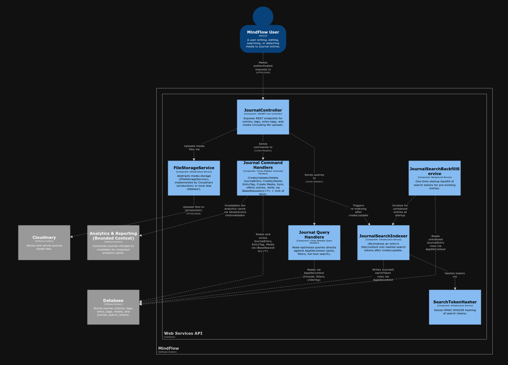
*Figura: Component Diagram (C4 Model) del bounded context Journal dentro del container Web Services API.*

El diagrama refleja la separación CQRS: `JournalController` despacha hacia dos grupos de componentes vía `IMediator` — los **Journal Command Handlers** (escritura, vía `IBaseRepository<T>` + Unit of Work) y los **Journal Query Handlers** (lectura, directo contra la base de datos con joins). Los Command Handlers disparan además el reindexado de búsqueda (`JournalSearchIndexer`) y la invalidación de caché de Analytics — esta última cruzando el límite del bounded context. La subida de archivos pasa por `FileStorageService`, que abstrae Cloudinary (producción) de un fallback local.

#### 2.6.2.6. Bounded Context Software Architecture Code Level Diagrams

##### 2.6.2.6.1. Bounded Context Domain Layer Class Diagrams

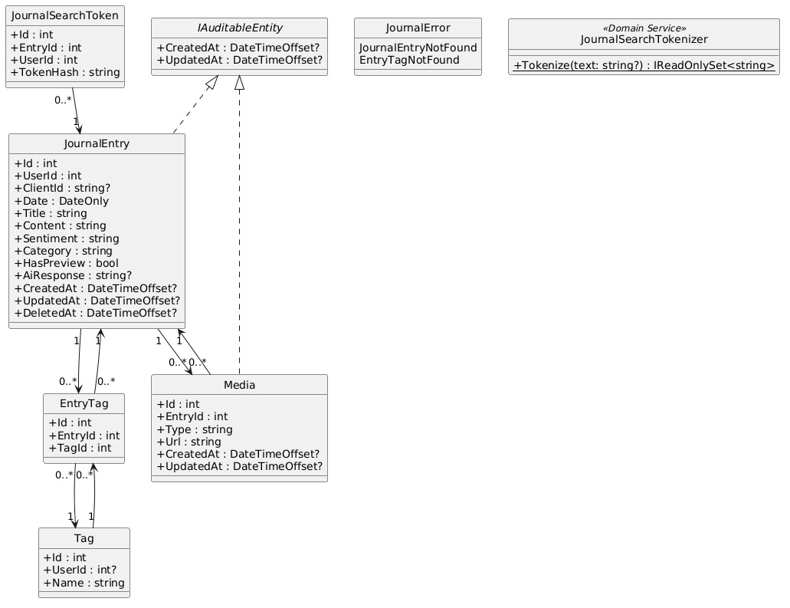
*Figura: Class Diagram (UML) del Domain Layer del bounded context Journal.*

`JournalEntry` es el agregado raíz, con colecciones navegables hacia `EntryTag` y `Media` (ambas con Foreign Key enforced y `DeleteBehavior.Cascade`). `EntryTag` es la tabla de asociación many-to-many hacia `Tag`. `JournalSearchToken` referencia a `JournalEntry` con FK enforced pero **sin colección inversa navegable** desde el agregado (se consulta directamente vía `AppDbContext.Set<JournalSearchToken>()`). `JournalSearchTokenizer` es un Domain Service estático sin estado.

##### 2.6.2.6.2. Bounded Context Database Design Diagram

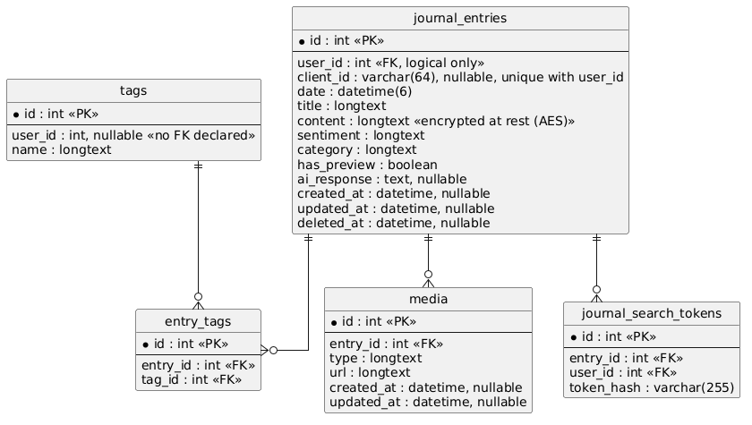
*Figura: Database Diagram del bounded context Journal.*

Las tablas `entry_tags`, `media` y `journal_search_tokens` tienen **Foreign Key física enforced** hacia `journal_entries.id`, todas con `ON DELETE CASCADE`. `entry_tags` además tiene FK enforced hacia `tags.id` y un índice único compuesto `(entry_id, tag_id)` que impide duplicar la misma etiqueta en la misma entrada. La columna `tags.user_id` **no tiene Foreign Key declarada** hacia `users.id` (relación lógica, nullable — permite tags globales del sistema cuando es `NULL`). `journal_entries.content` se almacena cifrado en reposo (AES) a nivel de aplicación, transparente para el esquema de base de datos.

---

### 2.6.3. Bounded Context: AI Assistant

El bounded context **AI Assistant** agrupa las capacidades de inteligencia artificial de MindFlow: el chat conversacional (módulo `Chat`), la integración con el proveedor de IA (módulo `AiIntegration`) y la valoración de usuarios sobre contenido generado por IA (módulo `AiFeedback`). Ancla los eventos pivote *Assistant query submitted* e *Insight generated* identificados en el EventStorming (sección 2.5.1.1), y es uno de los contexts core que constituyen el diferenciador tecnológico de MindFlow frente a la competencia.

A diferencia de IAM (Command Service unificado) y de Journal (CQRS con Cortex.Mediator), AI Assistant usa un **tercer patrón de Application Layer**: Application Services planos (`ChatService`, `AiFeedbackService`) inyectados directamente en el Controller, sin Commands, Queries ni Mediator — el método del servicio se invoca de forma síncrona y directa. Tampoco hay repository interfaces ni Domain Services propios: toda la persistencia se resuelve con `AppDbContext` inyectado directamente en los Application Services (que, en la práctica, funcionan como su propia capa de Infrastructure).

Se identificaron además dos dependencias cruzadas reales hacia otros bounded contexts: `AiFeedbackService` consulta directamente `JournalEntries` y el agregado `Habit` (Journal y Habits & Wellness) para validar que el contenido calificado existe; y `IAiService`/`GeminiService` es consumido no solo por `ChatService`, sino también por Analytics & Reporting (resúmenes semanales) y Habits & Wellness (consejos de estrés, sugerencias de hábitos) — es, en la práctica, un servicio compartido transversal más que un componente exclusivo de este bounded context.

#### 2.6.3.1. Domain Layer

| Clase | Tipo | Propósito | Atributos | Métodos | Relaciones |
|---|---|---|---|---|---|
| `Conversation` | Aggregate Root (implementa `IAuditableEntity`) | Representa una conversación de chat entre el usuario y el asistente de IA. | `Id: int`, `UserId: int`, `Title: string` (autogenerado de los primeros 50 caracteres del primer mensaje), `Category: string` (default `"Personal"`), `CreatedAt/UpdatedAt: DateTimeOffset?` | *(anémica)* | Raíz del agregado: `1` a `0..*` con `ChatMessage` (colección `Messages`) |
| `ChatMessage` | Entity (implementa `IAuditableEntity`) | Representa un mensaje individual dentro de una conversación, sea del usuario o del asistente. | `Id: int`, `ConversationId: int`, `Role: string` (`"user"` / `"assistant"`), `Content: string`, `CreatedAt/UpdatedAt: DateTimeOffset?` | *(anémica)* | `0..*` a `1` con `Conversation` (navegación `Conversation`, FK enforced, cascade) |
| `AiFeedbackRating` | Entity (implementa `IAuditableEntity`) | Representa la calificación (1-5) que un usuario da a una pieza de contenido generado por IA (insight de journal o sugerencia de hábito). | `Id: int`, `UserId: int`, `ContentId: int`, `ContentType: string` (`"journal"` / `"habit"`), `Rating: int`, `Comment: string?`, `CreatedAt/UpdatedAt: DateTimeOffset?` | *(anémica)* | Única por `(UserId, ContentId, ContentType)`; `ContentId` referencia lógicamente (sin FK) a `JournalEntry` o `Habit` según `ContentType` |
| `AiMetricLog` | Entity | Registra telemetría operacional de cada llamada al proveedor de IA (latencia, éxito, longitudes de prompt/respuesta, error). **No está asociada a un usuario** — es un log de sistema, no de dominio de negocio. | `Id: int`, `Operation: string`, `LatencyMs: int`, `Success: bool`, `PromptLength: int`, `ResponseLength: int`, `ErrorMessage: string?`, `CreatedAt: DateTimeOffset` (default `UtcNow`, no nullable) | *(anémica)* | Escrita exclusivamente por `GeminiService` tras cada llamada a Gemini |

#### 2.6.3.2. Interface Layer

| Clase | Tipo | Propósito | Endpoints / Métodos | Relaciones |
|---|---|---|---|---|
| `ChatController` | REST Controller (`/chat`) | Expone la creación de conversaciones, envío de mensajes, listado y borrado. Valida longitud del contenido (máx. 5000 caracteres) antes de delegar. | `POST/GET /conversations`, `DELETE /conversations/{id}`, `POST /conversations/{id}/messages`, `GET /conversations/{id}/messages` | Depende de `IChatService` |
| `AiFeedbackController` | REST Controller (`/api/v1/ai-feedback`) | Expone el registro de calificaciones sobre contenido de IA y su resumen agregado. | `POST /`, `GET /`, `GET /summary` | Depende de `IAiFeedbackService` |
| `CreateConversationRequest`, `SendMessageRequest` | Request DTOs (records) | Cuerpo de las peticiones de creación de conversación y envío de mensaje. | `CreateConversationRequest(Content, Category?)`, `SendMessageRequest(Content)` | Consumidos directamente por `ChatController` |
| `SubmitRatingRequest` | Request DTO (record) | Cuerpo de la petición para registrar una calificación. Definido directamente en el archivo del Controller. | `SubmitRatingRequest(ContentId, ContentType, Rating, Comment?)` | Consumido directamente por `AiFeedbackController` |

#### 2.6.3.3. Application Layer

| Clase | Tipo | Propósito | Atributos / Métodos | Relaciones |
|---|---|---|---|---|
| `IChatService` | Application Service Interface | Contrato de los casos de uso de chat. | `CreateConversationAsync`, `GetUserConversationsAsync`, `DeleteConversationAsync`, `SendMessageAsync`, `GetConversationMessagesAsync` | Implementada por `ChatService` (Infrastructure); consumida por `ChatController` |
| `IAiFeedbackService` | Application Service Interface | Contrato de los casos de uso de calificación de contenido de IA. | `SubmitRatingAsync(userId, contentId, contentType, rating, comment)`, `GetUserRatingsAsync(userId)`, `GetSummaryAsync(userId)` | Implementada por `AiFeedbackService` (Infrastructure); consumida por `AiFeedbackController` |
| `IAiService` | Service Port | Abstrae el proveedor de IA generativa para los 5 casos de uso que lo consumen en todo el sistema. | `GenerateEmpathicResponseAsync`, `GenerateWeeklySummaryAsync`, `GenerateStressAdviceAsync`, `GenerateHabitSuggestionsAsync`, `GenerateChatResponseAsync` | Implementada por `GeminiService` (Infrastructure); consumida por `ChatService` (este BC) y por servicios de Analytics & Reporting y Habits & Wellness (otros BC) |
| `ChatMessageDto`, `ConversationDto`, `ConversationDetailDto`, `SendMessageResponseDto` | Response DTOs | Representan la forma pública de mensajes y conversaciones en las respuestas de la API. | P. ej. `ConversationDetailDto{Id, Title, Category, CreatedAt, Messages}` | Construidos por `ChatService` a partir de las entidades de dominio |
| `AiFeedbackSummaryDto` | Response DTO (record) | Representa el resumen agregado de calificaciones de un usuario. | `AiFeedbackSummaryDto(TotalRatings, AverageRating, Distribution)` | Construido por `AiFeedbackService` |

#### 2.6.3.4. Infrastructure Layer

| Clase | Tipo | Propósito | Atributos / Métodos | Relaciones |
|---|---|---|---|---|
| `ChatService` | Application/Infrastructure Service | Implementa `IChatService`: crea la conversación y el primer mensaje, invoca `IAiService` para la respuesta del asistente (con fallback de texto fijo si falla), persiste todo vía `AppDbContext` + `IUnitOfWork`, y mantiene una ventana de las últimas 10 respuestas como historial de contexto para el modelo. | `CreateConversationAsync`, `GetUserConversationsAsync`, `DeleteConversationAsync`, `SendMessageAsync`, `GetConversationMessagesAsync` | Implementa `IChatService`; depende de `AppDbContext`, `IUnitOfWork`, `IAiService` |
| `AiFeedbackService` | Application/Infrastructure Service | Implementa `IAiFeedbackService`: valida `ContentType` (`journal`/`habit`) y rango de `Rating` (1-5), verifica que el contenido referenciado exista consultando directamente `JournalEntries` o `Habit` **(dependencia cruzada hacia Journal y Habits & Wellness)**, y hace upsert de la calificación (única por usuario+contenido). | `SubmitRatingAsync`, `GetUserRatingsAsync`, `GetSummaryAsync` | Implementa `IAiFeedbackService`; depende de `AppDbContext`, `IUnitOfWork` |
| `GeminiService` | Infrastructure Service | Implementa `IAiService` construyendo prompts específicos por caso de uso (respuesta empática, resumen semanal, consejo de estrés, sugerencias de hábitos, respuesta de chat) y llamando a la API REST de Google Gemini vía `IHttpClientFactory`. Registra un `AiMetricLog` por cada llamada (éxito/fallo, latencia, longitudes), incluso ante error o timeout. | `GenerateEmpathicResponseAsync`, `GenerateWeeklySummaryAsync`, `GenerateStressAdviceAsync`, `GenerateHabitSuggestionsAsync`, `GenerateChatResponseAsync` | Implementa `IAiService`; depende del servicio externo **Google Gemini API** y de `AppDbContext` (para `AiMetricLog`) |

---

#### 2.6.3.5. Bounded Context Software Architecture Component Level Diagrams

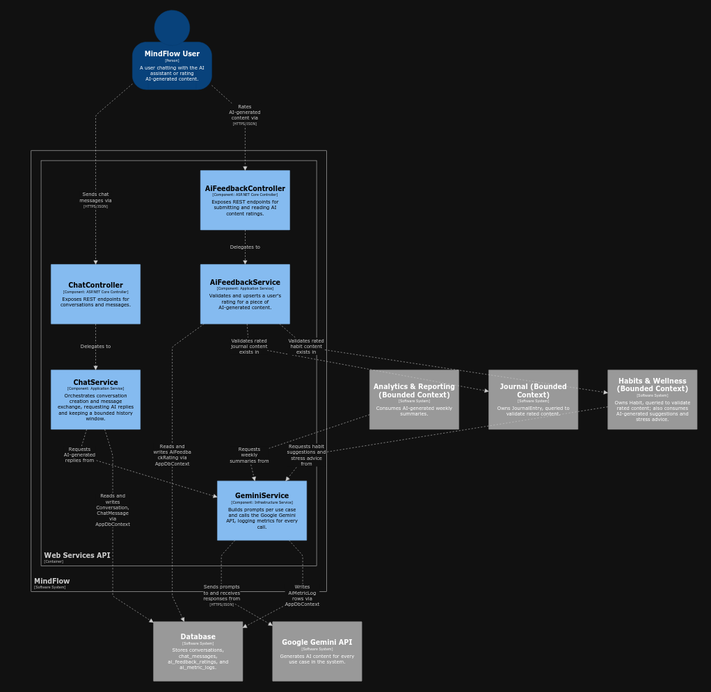
*Figura: Component Diagram (C4 Model) del bounded context AI Assistant dentro del container Web Services API.*

El diagrama muestra `ChatController` y `AiFeedbackController` delegando directamente en sus respectivos Application Services (sin Mediator). `GeminiService` aparece como un componente central consumido no solo por `ChatService`, sino también desde Analytics & Reporting y Habits & Wellness, reflejando su rol de servicio transversal de IA. `AiFeedbackService` cruza el límite del bounded context para validar la existencia del contenido calificado en Journal y en Habits & Wellness.

#### 2.6.3.6. Bounded Context Software Architecture Code Level Diagrams

##### 2.6.3.6.1. Bounded Context Domain Layer Class Diagrams

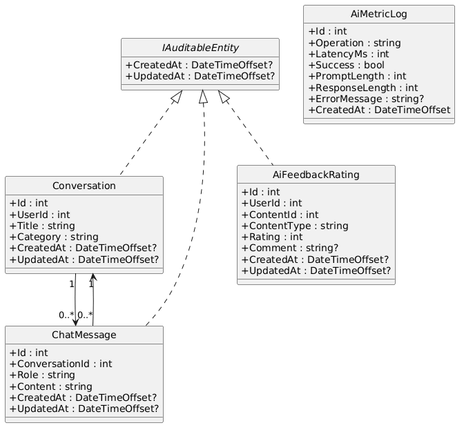
*Figura: Class Diagram (UML) del Domain Layer del bounded context AI Assistant.*

`Conversation` es el agregado raíz del módulo Chat, con una colección navegable de `ChatMessage` (FK enforced, cascade). `AiFeedbackRating` y `AiMetricLog` son entidades independientes, sin relaciones de asociación declaradas hacia el resto del modelo — sus referencias a contenido de otros bounded contexts (`ContentId`, y en `AiFeedbackRating` implícitamente `UserId`) son lógicas, no navegables.

##### 2.6.3.6.2. Bounded Context Database Design Diagram

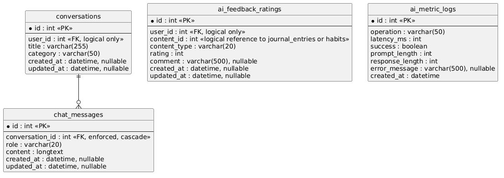
*Figura: Database Diagram del bounded context AI Assistant.*

`chat_messages` tiene **Foreign Key física enforced** hacia `conversations.id` con `ON DELETE CASCADE`. `conversations`, `ai_feedback_ratings` y `ai_metric_logs` **no tienen ninguna Foreign Key declarada** hacia `users.id` (relación lógica vía columna `user_id`) — y `ai_metric_logs` ni siquiera tiene columna `user_id`, al ser un log de sistema. `ai_feedback_ratings` tiene un índice único compuesto `(user_id, content_id, content_type)` que garantiza una sola calificación por usuario y contenido.

---

### 2.6.4. Bounded Context: Habits & Wellness

El bounded context **Habits & Wellness** agrupa el seguimiento de hábitos (módulo `habits`), la evaluación automática de estrés y ajuste de rutinas (módulo `WellnessEngine`) y el catálogo de contenido de bienestar — ejercicios de respiración y meditación (módulo `WellnessContent`). Ancla los eventos pivote *Habit created* y *Stress check completed* identificados en el EventStorming (sección 2.5.1.1), y es, junto con Journal, uno de los dos contexts core que entregan directamente la propuesta de valor de MindFlow.

Es el bounded context más heterogéneo de los cuatro cubiertos en este informe: sus tres módulos usan **tres patrones de Application Layer distintos**, cada uno igual a uno ya visto en otro bounded context — `habits` usa Command/Query Services dedicados con repository interfaces propios (similar a IAM), `WellnessContent` usa Cortex.Mediator con Commands/Queries/Handlers (idéntico a Journal), y `WellnessEngine` no tiene modelo de dominio propio en absoluto: es un único Application Service (`WellnessService`) que orquesta el agregado `Habit` y lee `JournalEntry` (Journal) directamente. Se identificaron tres dependencias cruzadas reales: `HabitsController` e `IWellnessService` consumen `IAiService` (AI Assistant) para sugerencias de hábitos y consejos de estrés respectivamente, y ambos leen `JournalEntries` (Journal) directamente vía `AppDbContext` para estimar el nivel de estrés reciente del usuario.

También destaca un patrón de **consistencia perezosa** (*lazy consistency*): `HabitQueryService` recalcula el streak y revierte el estado `Completed` a `Pending` si corresponde **en el momento de la consulta** (no mediante un job programado), comparando la fecha/semana/mes actual contra los `HabitCompletionLog` existentes.

#### 2.6.4.1. Domain Layer

| Clase | Tipo | Propósito | Atributos | Métodos | Relaciones |
|---|---|---|---|---|---|
| `Habit` | Aggregate Root (implementa `IAuditableEntity`) | Representa un hábito que el usuario quiere construir, con su racha (streak), estado y si fue pausado automáticamente por IA. | `Id: int`, `UserId: int`, `Name: string`, `Category: string`, `Frequency: HabitFrequency`, `Streak: int`, `Status: HabitStatus`, `PausedByAi: bool`, `CreatedAt/UpdatedAt/DeletedAt` | `MarkCompleted()`, `MarkPending()`, `SetStreak(streak)`, `PauseByAi()`, `Resume()`, `UpdateDetails(...)`, `UpdateFull(...)`, `SoftDelete()` | Raíz del agregado: `1` a `0..*` con `HabitCompletionLog` (colección `CompletionLogs`, sin navegación inversa) |
| `HabitCompletionLog` | Entity | Representa el registro de que un hábito fue completado en una fecha específica. Duplica `HabitName`/`Category` del hábito al momento del registro (denormalización histórica). | `Id: int`, `HabitId: int`, `HabitName: string`, `Category: string`, `Date: DateTime`, `Completed: bool`, `CompletedAt: DateTime?`, `CreatedAt: DateTimeOffset` | `UpdateDetails(habitName, category, completed, completedAt)` | `0..*` a `1` con `Habit` (FK enforced, cascade, **sin propiedad de navegación** — solo `HabitId`) |
| `CachedHabitSuggestion` | Entity (anémica) | Cachea en base de datos (no en memoria) las últimas sugerencias de hábitos generadas por IA para un usuario, válidas por 24 horas. | `Id: int`, `UserId: int`, `SuggestionsJson: string`, `GeneratedAt: DateTimeOffset` | *(anémica)* | Única por `UserId` |
| `HabitFrequency` | Value Object (enum) | Frecuencia esperada del hábito. | — | `Daily`, `Weekly`, `Monthly` | Usado por `Habit` y por el cálculo de streak |
| `HabitStatus` | Value Object (enum) | Estado actual del hábito. | — | `Pending`, `Completed`, `PausedByAi` | Usado por `Habit` |
| `HabitsError` | Domain Error Enum | Códigos de error de dominio para `habits` y `habit-logs`. | — | `HabitNotFound`, `HabitCreationFailed`, `HabitUpdateFailed`, `HabitDeletionFailed`, `HabitLogNotFound`, `HabitLogCreationFailed`, `HabitLogUpdateFailed`, `HabitLogDeletionFailed`, `InvalidHabitFrequency`, `InvalidHabitStatus`, `InvalidHabitCategory`, `UserIdMismatch` | Usado por los Command Services y mapeado a status HTTP por `HabitsActionResultAssembler` |
| `IHabitRepository` | Repository Interface (extiende `IBaseRepository<Habit>`) | Abstrae el acceso a datos de `Habit`. | — | `FindByUserIdAsync(userId)`, `FindByIdAndUserIdAsync(id, userId)` + heredados | Implementada por `HabitRepository` (Infrastructure) |
| `IHabitCompletionLogRepository` | Repository Interface (extiende `IBaseRepository<HabitCompletionLog>`) | Abstrae el acceso a datos de `HabitCompletionLog`. | — | `FindByHabitIdAsync(habitId)`, `FindByUserIdAsync(userId)` + heredados | Implementada por `HabitCompletionLogRepository` (Infrastructure) |
| `WellnessExercise` | Entity (implementa `IAuditableEntity`) | Representa un ejercicio de bienestar (respiración o meditación) editable sin necesidad de release del cliente. Campos de respiración (`InhaleSeconds`, `HoldSeconds`, etc.) y de meditación (`AudioUrl`) son mutuamente excluyentes según `Type`. | `Id: int`, `Type: string` (`"breathing"`/`"meditation"`), `Name/Description: string`, `DurationSeconds: int`, `InhaleSeconds/HoldSeconds/ExhaleSeconds/HoldAfterExhaleSeconds/Cycles: int?`, `AudioUrl: string?`, `IsActive: bool`, `SortOrder: int`, `CreatedAt/UpdatedAt` | *(anémica)* | Sin relaciones hacia otras entidades |
| `WellnessContentError` | Domain Error Enum | Códigos de error para el catálogo de ejercicios. | — | `ExerciseNotFound`, `InvalidType` | Usado por los Handlers de `WellnessContent` |

**Nota:** `WellnessEngine` no define entidades ni Value Objects propios — opera exclusivamente sobre `Habit` (mismo bounded context) y `JournalEntry` (Journal, dependencia cruzada).

#### 2.6.4.2. Interface Layer

| Clase | Tipo | Propósito | Endpoints / Métodos | Relaciones |
|---|---|---|---|---|
| `HabitsController` | REST Controller (`/habits`) | CRUD de hábitos, resumen de rachas y sugerencias de IA (con caché en BD de 24h y fallback local si Gemini falla). | `GET/POST /`, `GET/PUT/DELETE /{id}`, `GET /streak-summary`, `POST /suggestions` | Depende de `IHabitCommandService`, `IHabitQueryService`, `IAiService` (AI Assistant), `AppDbContext`, `ICacheService` |
| `HabitLogsController` | REST Controller (`/habit-logs`) | CRUD de registros de cumplimiento de hábitos, validando ownership del hábito padre en cada operación. | `GET/POST /`, `GET/PUT/DELETE /{id}` | Depende de `IHabitLogCommandService`, `IHabitLogQueryService`, `IHabitRepository`, `ICacheService` |
| `WellnessController` | REST Controller (`/wellness`) | Expone el chequeo de estrés semanal. | `POST /stress-check` | Depende de `IWellnessService` |
| `WellnessExercisesController` | REST Controller (`/wellness/exercises`) | Catálogo público de ejercicios activos, y CRUD restringido a administradores (`Authorize(Roles = User.AdminRole)`, **referencia cruzada a IAM**). | `GET /`, `GET /all` (admin), `GET/POST/PUT/DELETE /{id}` (admin) | Depende de `IMediator` |
| `CreateHabitResource`, `UpdateHabitResource`, `HabitResource`, `CreateHabitLogResource`, `UpdateHabitLogResource`, `HabitLogResource` | Request/Response DTOs (records, JSON `snake_case`) | Contrato HTTP de hábitos y logs, desacoplado de los Commands. | P. ej. `HabitResource(Id, UserId, Name, Category, Frequency, Streak, Status, PausedByAi, ...)` | Transformados por los Assemblers |
| `CreateHabitCommandFromResourceAssembler`, `UpdateHabitCommandFromResourceAssembler`, `HabitResourceFromEntityAssembler`, `CreateHabitLogCommandFromResourceAssembler`, `UpdateHabitLogCommandFromResourceAssembler`, `HabitLogResourceFromEntityAssembler` | Assemblers (static) | Traducen Resource ↔ Command ↔ Entity, incluyendo el parseo de `Frequency`/`Status` desde string. | `ToCommandFromResource(...)`, `ToResourceFromEntity(...)` | Traducen Interface Layer ↔ Application/Domain Layer |
| `HabitsActionResultAssembler` | Assembler (static, genérico) | Traduce un `Result<T>`/`Result` en un `IActionResult`, mapeando el nombre del error de dominio a status HTTP (`"NotFound"` → 404, `"Mismatch"` → 403, resto → 400) vía `ProblemDetailsFactory`. | `ToActionResultFromCreateResult`, `ToActionResultFromDeleteResult`, `ToActionResultFromGetResult`, `ToActionResultFromGetAllResult` | Usado por `HabitsController` y `HabitLogsController` |

#### 2.6.4.3. Application Layer

| Clase | Tipo | Propósito | Atributos / Métodos | Relaciones |
|---|---|---|---|---|
| `CreateHabitCommand`, `UpdateHabitCommand`, `DeleteHabitCommand`, `CreateHabitLogCommand`, `UpdateHabitLogCommand`, `DeleteHabitLogCommand` | Commands (records) | Encapsulan la intención de cada caso de uso de escritura. | P. ej. `CreateHabitCommand(UserId, Name, Category, Frequency)` | Producidos por los Assemblers; consumidos por los Command Services |
| `GetHabitByIdQuery`, `GetAllHabitsByUserIdQuery`, `GetHabitLogByIdQuery`, `GetAllHabitLogsQuery` | Queries (records) | Encapsulan cada caso de uso de lectura. | P. ej. `GetAllHabitsByUserIdQuery(UserId)` | Consumidos por los Query Services |
| `IHabitCommandService` / `HabitCommandService` | Application Service | Contrato e implementación de creación/actualización/borrado de hábitos, validando ownership (`UserIdMismatch`). | Un `Handle` por Command | Depende de `IHabitRepository`, `IUnitOfWork` |
| `IHabitLogCommandService` / `HabitLogCommandService` | Application Service | Contrato e implementación de creación/actualización/borrado de logs. Tras cada cambio, **recalcula y persiste el streak** del hábito padre con un algoritmo específico por frecuencia (Daily/Weekly/Monthly, comparando contra "hoy" o "ayer"/semana o mes previos). | Un `Handle` por Command; `{static} ComputeStreak(dates, frequency)`, `ComputeDailyStreak`, `ComputeWeeklyStreak`, `ComputeMonthlyStreak` | Depende de `IHabitCompletionLogRepository`, `IHabitRepository`, `IUnitOfWork`; `ComputeStreak` es reutilizado por `HabitQueryService` |
| `IHabitQueryService` / `HabitQueryService` | Application Service | Contrato e implementación de lectura de hábitos. Recalcula el streak y **revierte `Completed` a `Pending`** en el momento de la consulta si no hay un log para el período vigente (día/semana/mes actual) — consistencia perezosa, sin job programado. | `Handle(GetHabitByIdQuery)`, `Handle(GetAllHabitsByUserIdQuery)` | Depende de `IHabitRepository`, `IHabitCompletionLogRepository`; reutiliza `HabitLogCommandService.ComputeStreak` |
| `IHabitLogQueryService` / `HabitLogQueryService` | Application Service | Contrato e implementación de lectura de logs, con filtro opcional por hábito o por usuario. | `Handle(GetHabitLogByIdQuery)`, `Handle(GetAllHabitLogsQuery)` | Depende de `IHabitCompletionLogRepository` |
| `IWellnessService` / `WellnessService` | Application Service | Contrato e implementación del chequeo de estrés: lee las últimas 10 entradas de journal de los últimos 7 días, calcula un score 0-100 según sentimiento, pausa (`PauseByAi`) todos los hábitos si el estrés es alto o los reanuda (`Resume`) si es bajo, y pide un consejo empático a `IAiService`. | `RunStressCheckAsync(userId)` | Depende de `AppDbContext` **(lee `JournalEntries` — dependencia cruzada hacia Journal)**, `IHabitRepository`, `IUnitOfWork`, `IAiService` (AI Assistant) |
| `StressCheckResultDto`, `HabitAdjustmentDto` | Response DTOs | Representan el resultado del chequeo de estrés y cada hábito pausado/reanudado. | `StressCheckResultDto{StressLevel, Score, AnalyzedEntries, PausedHabits, ResumedHabits, Advice}` | Construidos por `WellnessService` |
| `CreateWellnessExerciseCommand`, `UpdateWellnessExerciseCommand`, `DeleteWellnessExerciseCommand` | Commands | Encapsulan la intención de cada caso de uso de escritura del catálogo de ejercicios (solo administradores). | P. ej. `CreateWellnessExerciseCommand{Type, Name, Description, DurationSeconds, ...}` | Despachadas por `WellnessExercisesController` vía `IMediator.SendAsync` |
| `GetActiveWellnessExercisesQuery`, `GetAllWellnessExercisesQuery`, `GetWellnessExerciseByIdQuery` | Queries | Encapsulan cada caso de uso de lectura (catálogo público activo vs. catálogo completo para administración). | P. ej. `GetActiveWellnessExercisesQuery{Type?}` | Despachadas vía `IMediator.QueryAsync` |
| `CreateWellnessExerciseHandler`, `UpdateWellnessExerciseHandler`, `DeleteWellnessExerciseHandler`, `GetActiveWellnessExercisesHandler`, `GetAllWellnessExercisesHandler`, `GetWellnessExerciseByIdHandler` | Command/Query Handlers (Cortex.Mediator) | Implementan las reglas de negocio del catálogo de ejercicios, incluyendo la validación de `Type` (`"breathing"`/`"meditation"`), directo sobre `AppDbContext` (mismo patrón que Journal). | Un método `Handle` por Command/Query | Dependen de `AppDbContext` directamente |
| `WellnessExerciseDto` | Response DTO | Representa la forma pública de un `WellnessExercise`. | `WellnessExerciseDto{Id, Type, Name, Description, DurationSeconds, ...}` | Construido por los Handlers |

#### 2.6.4.4. Infrastructure Layer

| Clase | Tipo | Propósito | Atributos / Métodos | Relaciones |
|---|---|---|---|---|
| `HabitRepository` | Repository (EF Core) | Implementa `IHabitRepository` sobre `AppDbContext`, extendiendo `BaseRepository<Habit>`. | `FindByUserIdAsync(userId)`, `FindByIdAndUserIdAsync(id, userId)` | Implementa `IHabitRepository`; hereda de `BaseRepository<Habit>` |
| `HabitCompletionLogRepository` | Repository (EF Core) | Implementa `IHabitCompletionLogRepository` sobre `AppDbContext`, extendiendo `BaseRepository<HabitCompletionLog>`. `FindByUserIdAsync` resuelve primero los `HabitId` del usuario y luego filtra los logs por esos IDs (no hay FK directa `UserId` en la tabla de logs). | `FindByHabitIdAsync(habitId)`, `FindByUserIdAsync(userId)` | Implementa `IHabitCompletionLogRepository`; hereda de `BaseRepository<HabitCompletionLog>` |

**Nota:** `WellnessEngine` y `WellnessContent` no tienen clases de Infrastructure propias — `WellnessService` y los Handlers de `WellnessContent` acceden a `AppDbContext` directamente desde el Application Layer, sin una capa de Repository intermedia.

---

#### 2.6.4.5. Bounded Context Software Architecture Component Level Diagrams

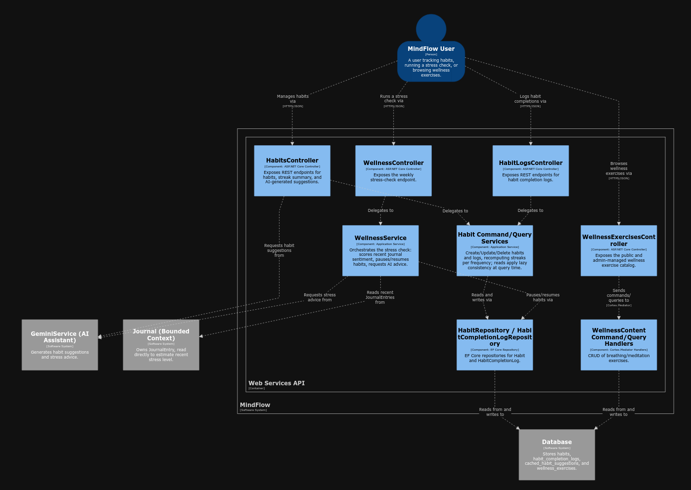
*Figura: Component Diagram (C4 Model) del bounded context Habits & Wellness dentro del container Web Services API.*

El diagrama muestra los tres módulos como grupos de componentes diferenciados: `HabitsController`/`HabitLogsController` delegando en sus Command/Query Services (con `IHabitRepository`/`IHabitCompletionLogRepository` de por medio), `WellnessController` delegando en `WellnessService` (que cruza hacia Journal y hacia `GeminiService`), y `WellnessExercisesController` delegando en sus Handlers vía Mediator. Se muestran explícitamente las tres dependencias cruzadas: hacia AI Assistant (sugerencias y consejos) y hacia Journal (lectura de entradas para estimar estrés).

#### 2.6.4.6. Bounded Context Software Architecture Code Level Diagrams

##### 2.6.4.6.1. Bounded Context Domain Layer Class Diagrams

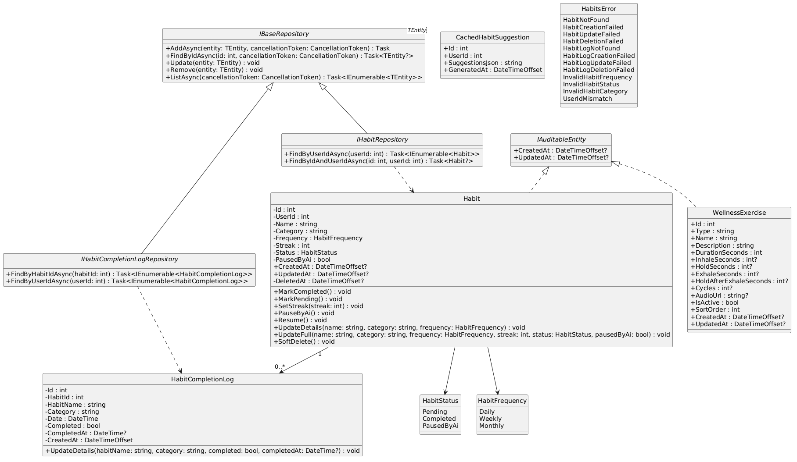
*Figura: Class Diagram (UML) del Domain Layer del bounded context Habits & Wellness.*

`Habit` es el agregado raíz con una colección de `HabitCompletionLog` sin navegación inversa (la FK existe en base de datos, pero el modelo de objetos solo navega en un sentido). `CachedHabitSuggestion` y `WellnessExercise` son entidades independientes sin relaciones declaradas. `IHabitRepository` e `IHabitCompletionLogRepository` extienden el repositorio genérico del Shared Kernel.

##### 2.6.4.6.2. Bounded Context Database Design Diagram

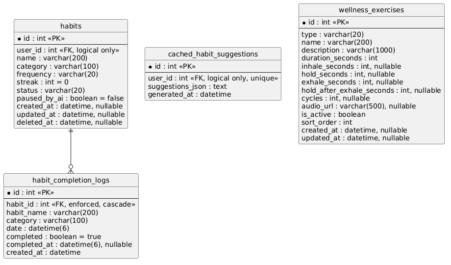
*Figura: Database Diagram del bounded context Habits & Wellness.*

`habit_completion_logs` tiene **Foreign Key física enforced** hacia `habits.id` con `ON DELETE CASCADE`. `habits` y `cached_habit_suggestions` **no tienen Foreign Key declarada** hacia `users.id` (relación lógica). `cached_habit_suggestions` tiene índice único por `user_id` (una sola caché vigente por usuario). `wellness_exercises` no tiene relación con ninguna otra tabla de este bounded context — es un catálogo independiente.

---

### 2.6.5. Bounded Context: Analytics & Reporting

El bounded context **Analytics & Reporting** transforma el registro emocional del usuario en información accionable: un puntaje semanal de bienestar con su tendencia, un calendario de estados de ánimo, una nube de palabras frecuentes, y —para los usuarios con suscripción Premium— la exportación de un reporte personal en PDF o CSV. El equipo decidió agrupar ambas capacidades (analítica interna y exportación de reportes) en un mismo bounded context porque comparten la misma fuente de datos (las entradas del diario del usuario) y el mismo propósito de negocio: convertir datos crudos en una narrativa comprensible para el usuario.

A diferencia de IAM, Analytics **no define un repository interface propio**: tanto los Command/Query Handlers de `AnalyticsCache` y `WordCloud` como el servicio de cómputo pesado acceden directamente a `AppDbContext`, siguiendo el mismo patrón CQRS explícito adoptado en Journal (sin una capa de repositorios intermedia). El único puerto de dominio propio del sub-modelo Analytics es `IAnalyticsCacheInvalidator`, pensado exclusivamente para ser invocado **desde otro bounded context** (Journal) cuando el diario de un usuario cambia; el sub-modelo Reporting, por su parte, no persiste ningún agregado propio —un reporte es un documento generado al vuelo a partir de las entradas del diario, no un dato nuevo que el sistema deba retener— y expone su propio puerto, `IReportingService`.

#### 2.6.5.1. Domain Layer

El Domain Layer concentra los agregados `AnalyticsCache` y `WordCloud`, la enumeración `AnalyticsError`, y los dos puertos de dominio del bounded context: `IAnalyticsCacheInvalidator` (consumido por Journal) e `IReportingService` (consumido por el propio Interface Layer de Reporting).

| Clase | Tipo | Propósito | Atributos | Métodos | Relaciones |
|---|---|---|---|---|---|
| `AnalyticsCache` | Aggregate Root (implementa `IAuditableEntity`) | Representa el resultado precomputado del análisis semanal de bienestar de un usuario. Se decidió modelarlo como un caché reemplazable en lugar de un historial inmutable: si el usuario agrega una entrada de diario a mitad de semana, el registro se recalcula por completo en vez de ajustarse incrementalmente. | `Id: int`, `UserId: int`, `WeekStart: DateOnly`, `Score: int`, `TrendPercentage: string`, `StartDate: DateOnly?`, `EndDate: DateOnly?`, `AiInsight: string?`, `AiInsightLocalized: string?`, `Kpis: string?` (JSON), `FluctuationData: string?` (JSON), `TrendData: string?` (JSON), `CreatedAt/UpdatedAt: DateTimeOffset?` | *(entidad anémica — el cómputo vive en `AnalyticsComputationService`)* | Único por `(UserId, WeekStart)`; `UserId` es una referencia lógica al agregado `User` del bounded context IAM (sin FK física) |
| `WordCloud` | Aggregate Root (implementa `IAuditableEntity`) | Representa la nube de palabras más frecuentes extraídas de las entradas de diario recientes de un usuario, con un único registro por usuario. | `Id: int`, `UserId: int`, `Words: string?` (JSON), `CreatedAt/UpdatedAt: DateTimeOffset?` | *(anémica)* | `UserId` es una referencia lógica al agregado `User` del bounded context IAM (sin FK física) |
| `AnalyticsError` | Domain Error Enum | Códigos de error de dominio para resultados fallidos del sub-modelo Analytics. | — | `AnalyticsCacheNotFound`, `AnalyticsCacheCreationFailed`, `AnalyticsCacheUpdateFailed`, `WordCloudNotFound`, `WordCloudCreationFailed` | Usado por los Handlers al construir `Result.Failure(...)` |
| `IAnalyticsCacheInvalidator` | Service Port | Único puerto de dominio expuesto hacia otros bounded contexts: permite que Journal notifique que el análisis de un usuario quedó desactualizado, sin conocer cómo Analytics calcula ni almacena sus datos internamente. | — | `InvalidateAsync(userId: int, entryDate: DateOnly, ct: CancellationToken): Task` | Implementada por `AnalyticsCacheInvalidator` (Infrastructure Layer); consumida por los Command Handlers de Journal |
| `IReportingService` | Service Port | Abstrae la generación del reporte personal del usuario, dejando oculta la biblioteca de generación de documentos detrás de la interfaz. | — | `GeneratePdfAsync(userId: int): Task<byte[]>`, `GenerateCsvAsync(userId: int): Task<byte[]>` | Implementada por `ReportingService` (Infrastructure Layer); consumida por `ReportingController` |

#### 2.6.5.2. Interface Layer

El Interface Layer expone Analytics y Reporting como dos controladores REST independientes; ninguno de los dos usa una capa de Resources/Assemblers, siguiendo el mismo criterio adoptado en Journal: los DTOs del Application Layer se consumen directamente como contrato de entrada/salida.

| Clase | Tipo | Propósito | Endpoints / Métodos | Relaciones |
|---|---|---|---|---|
| `AnalyticsController` | REST Controller (`""`, rutas de nivel raíz) | Expone las operaciones de consulta y cómputo del caché analítico semanal, la nube de palabras y el calendario de estados de ánimo. Resuelve el `user_id` del JWT y, si no existe caché para la semana solicitada, dispara su cómputo bajo demanda. | `GET/POST/PUT /analyticsCache`, `POST /analyticsCache/compute`, `GET/POST /wordCloud`, `POST /wordCloud/compute`, `GET /moodCalendar` | Depende de `IMediator` (Cortex.Mediator) para las operaciones simples, de `AnalyticsComputationService` para el cómputo pesado bajo demanda, y de `ICacheService` (Redis) para el calendario de estados de ánimo |
| `ReportingController` | REST Controller (`api/v1/reporting`) | Expone la exportación del reporte personal del usuario, restringida a suscriptores Premium. | `GET /export/pdf`, `GET /export/csv` | Depende de `IReportingService` para generar el documento y de `AppDbContext` (acceso puntual) para verificar la suscripción activa del usuario |

#### 2.6.5.3. Application Layer

El Application Layer combina dos estilos: manejadores CQRS livianos (vía Cortex.Mediator) para las operaciones simples de lectura/escritura sobre `AnalyticsCache` y `WordCloud`, y un servicio de aplicación dedicado (`AnalyticsComputationService`) para el cómputo pesado, deliberadamente separado de los Handlers para no mezclar una operación costosa con el flujo estándar de consulta.

| Clase | Tipo | Propósito | Atributos / Métodos | Relaciones |
|---|---|---|---|---|
| `CreateAnalyticsCacheCommand`, `UpdateAnalyticsCacheCommand`, `CreateWordCloudCommand` | Commands | Encapsulan la intención de cada caso de uso de escritura simple sobre `AnalyticsCache`/`WordCloud`. | P. ej. `CreateAnalyticsCacheCommand{UserId, WeekStart, Score, ...}` | Despachadas por `AnalyticsController` vía `IMediator.SendAsync` |
| `GetAnalyticsCacheQuery`, `GetWordCloudQuery` | Queries | Encapsulan cada caso de uso de lectura sobre `AnalyticsCache`/`WordCloud`. | `GetAnalyticsCacheQuery{UserId, WeekStart?}`, `GetWordCloudQuery{UserId}` | Despachadas por `AnalyticsController` vía `IMediator.QueryAsync` |
| `CreateAnalyticsCacheCommandHandler`, `UpdateAnalyticsCacheCommandHandler`, `CreateWordCloudCommandHandler` | Command Handlers (`ICommandHandler<TCommand, Result<T>>`) | Implementan la creación/actualización directa de `AnalyticsCache`/`WordCloud` contra `AppDbContext`. | Un método `Handle` por Command | Dependen de `AppDbContext` directamente (sin `IBaseRepository`) |
| `GetAnalyticsCacheQueryHandler`, `GetWordCloudQueryHandler` | Query Handlers (`IQueryHandler<TQuery, Result<T>>`) | Implementan la lectura de `AnalyticsCache`/`WordCloud`, mapeando la entidad a su DTO correspondiente. | Un método `Handle` por Query | Dependen de `AppDbContext` directamente |
| `AnalyticsComputationService` | Application Service | Orquesta el cómputo pesado: puntaje semanal y tendencia respecto a la semana anterior, calendario de estados de ánimo, extracción de nube de palabras, y el insight narrativo (con reserva local en español si el proveedor de IA no responde). | `ComputeAndSaveWeeklyAsync(userId, weekStart): Task<AnalyticsCache>`, `ComputeMoodCalendarAsync(userId, year, month): Task<List<object>>`, `ComputeAndSaveWordCloudAsync(userId): Task<WordCloud>` | Depende de `AppDbContext` (lee `JournalEntries`, escribe `AnalyticsCache`/`WordCloud`) y de `IAiService` (bounded context AI Assistant) para el insight narrativo |
| `AnalyticsCacheDto`, `KpiItemDto`, `ChartDataDto`, `WordCloudDto` | Response DTOs | Representan la forma pública de cada agregado, ya lista para que el cliente renderice sus gráficos sin transformar el JSON almacenado. | P. ej. `AnalyticsCacheDto{Id, UserId, WeekStart, Score, TrendPercentage, AiInsightLocalized, Kpis, FluctuationData, TrendData}` | Construidos por los Query Handlers y por `AnalyticsController` a partir de las entidades de dominio |

#### 2.6.5.4. Infrastructure Layer

El Infrastructure Layer contiene las implementaciones concretas de los dos puertos definidos en el Domain Layer, además de la tarea programada que mantiene el análisis de todos los usuarios actualizado sin que tengan que esperar el cómputo bajo demanda.

| Clase | Tipo | Propósito | Atributos / Métodos | Relaciones |
|---|---|---|---|---|
| `AnalyticsCacheInvalidator` | Infrastructure Service | Implementa `IAnalyticsCacheInvalidator`: elimina el caché semanal y la nube de palabras vigentes de un usuario, y limpia también su entrada de caché de corta duración del calendario de estados de ánimo. | `InvalidateAsync(userId, entryDate, ct): Task` | Implementa `IAnalyticsCacheInvalidator`; depende de `AppDbContext` y de `ICacheService` (Redis) |
| `ReportingService` | Infrastructure Service | Implementa `IReportingService`: construye el documento PDF con la identidad visual de MindFlow (biblioteca de maquetado de documentos) y el archivo CSV tabular (biblioteca de escritura tabular estándar), ambos a partir de las entradas de diario del usuario. | `GeneratePdfAsync(userId): Task<byte[]>`, `GenerateCsvAsync(userId): Task<byte[]>` | Implementa `IReportingService`; depende de `AppDbContext` |
| `WeeklySummaryScheduler` | Background Service (`BackgroundService`) | Job en segundo plano que, una vez por semana, recalcula automáticamente el caché analítico y la nube de palabras de todos los usuarios registrados, para que la información esté lista antes de que el usuario la consulte. | `ExecuteAsync(stoppingToken): Task` (override) | Depende de `AnalyticsComputationService` y `AppDbContext`, resueltos vía `IServiceScopeFactory` |
| Caché de corta duración (Redis) | Infrastructure Concern | Se decidió cachear el resultado del calendario de estados de ánimo por un tiempo de vida corto (15 minutos), al ser una vista que se recalcula sobre un rango de fechas y no necesita reflejar cambios al instante. | `ICacheService.GetAsync<T>(key)`, `SetAsync<T>(key, value, ttl)` | Consumida por `AnalyticsController`; invalidada puntualmente por `AnalyticsCacheInvalidator` |

---

#### 2.6.5.5. Bounded Context Software Architecture Component Level Diagrams

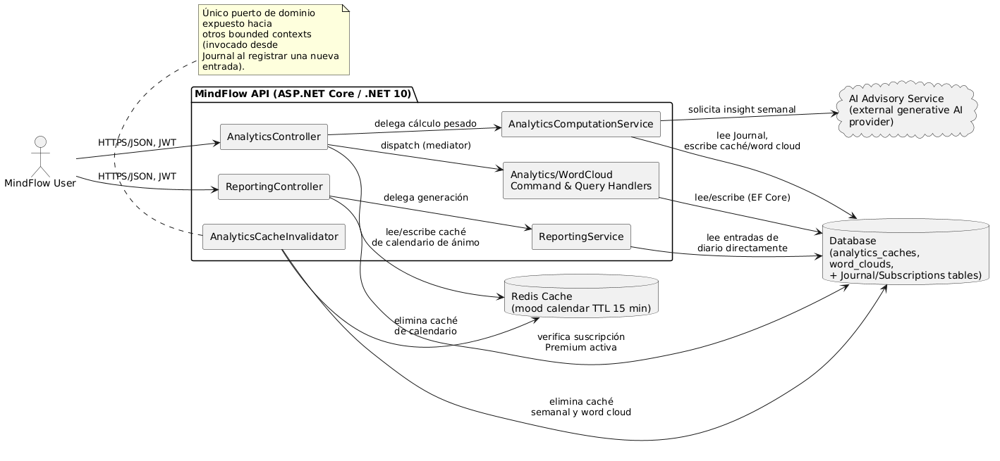
*Figura: Component Diagram (C4 Model) del bounded context Analytics & Reporting dentro del container Web Services API.*

El diagrama muestra los dos sub-modelos del bounded context: `AnalyticsController` despacha las operaciones simples hacia los **Analytics/WordCloud Command & Query Handlers** (vía mediador) y delega el cómputo pesado en `AnalyticsComputationService`, que a su vez solicita el insight narrativo al **AI Advisory Service** externo. `AnalyticsCacheInvalidator` aparece como el único componente invocado desde fuera del bounded context (por Journal), cruzando el límite entre contexts a través de un puerto explícito. `ReportingController` delega en `ReportingService`, que lee directamente las entradas de diario para construir el PDF o el CSV, tras validar la suscripción Premium del usuario.

#### 2.6.5.6. Bounded Context Software Architecture Code Level Diagrams

##### 2.6.5.6.1. Bounded Context Domain Layer Class Diagrams

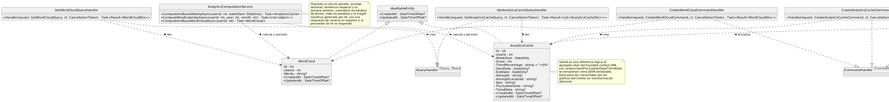
*Figura: Class Diagram (UML) del Domain Layer del bounded context Analytics & Reporting.*

El diagrama muestra los agregados `AnalyticsCache` y `WordCloud` (ambos implementan `IAuditableEntity`), la enumeración `AnalyticsError`, el puerto `IAnalyticsCacheInvalidator` y el puerto `IReportingService`, junto con los Command/Query Handlers de Analytics y el servicio `AnalyticsComputationService` que los complementa.

##### 2.6.5.6.2. Bounded Context Database Design Diagram

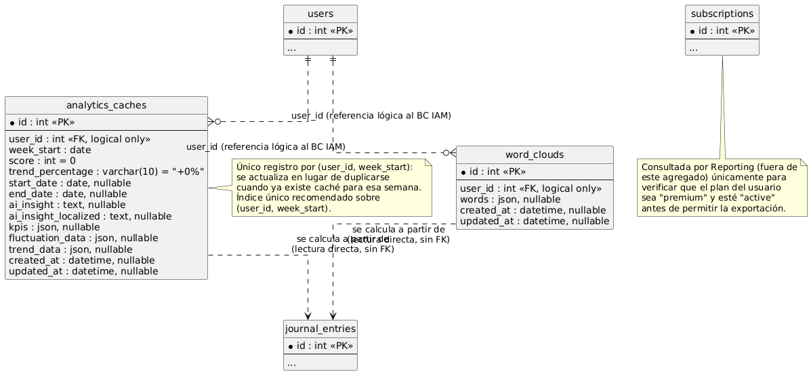
*Figura: Database Diagram del bounded context Analytics & Reporting.*

El bounded context Analytics & Reporting persiste en dos tablas propias: `analytics_caches` (con un registro único por `(user_id, week_start)`) y `word_clouds` (un único registro por usuario). Ninguna de las dos tiene Foreign Key física hacia `users`, `journal_entries` ni `subscriptions`: `user_id` es siempre una referencia lógica al bounded context IAM, y tanto el cómputo de Analytics como la exportación de Reporting leen `journal_entries` (y, en el caso de Reporting, `subscriptions`) directamente, sin relación física declarada en el esquema.

---

### 2.6.6. Bounded Context: Notifications

El bounded context **Notifications** es responsable de la bandeja de notificaciones del usuario y del envío de notificaciones push a sus dispositivos registrados. El equipo decidió mantenerlo deliberadamente simple: a diferencia de Journal o Analytics, la mayoría de sus operaciones (listar notificaciones, marcarlas como leídas, registrar o eliminar un dispositivo) son consultas y escrituras directas sin reglas de negocio adicionales, por lo que **no se introdujeron Commands, Queries ni un Application Service dedicado** para ellas: `NotificationsController` accede directamente a `AppDbContext` e `IUnitOfWork` para esos casos. La única regla de negocio real del bounded context —que toda notificación enviada quede primero registrada en la bandeja del usuario, y solo después se intente entregar como push— se aisló detrás de un único puerto de dominio, `INotificationService`.

#### 2.6.6.1. Domain Layer

El Domain Layer concentra las dos entidades del bounded context. Ninguna define un repository interface propio: al ser operaciones simples de consulta/escritura, el equipo decidió que tanto el Interface Layer como la implementación del puerto de notificación accedan directamente a `AppDbContext`, sin una capa de repositorio intermedia.

| Clase | Tipo | Propósito | Atributos | Métodos | Relaciones |
|---|---|---|---|---|---|
| `Notification` | Aggregate Root (implementa `IAuditableEntity`) | Representa una notificación en la bandeja de un usuario, con su estado de lectura. | `Id: int`, `UserId: int`, `Title: string`, `Body: string`, `IsRead: bool`, `CreatedAt/UpdatedAt: DateTimeOffset?` | *(entidad anémica — el ciclo de vida lo gestiona `NotificationsController` y `INotificationService`)* | `UserId` es una referencia lógica al agregado `User` del bounded context IAM (sin FK física); sin relación física con `DeviceToken` |
| `DeviceToken` | Entity | Representa el token de un dispositivo (web, Android o iOS) habilitado para recibir notificaciones push. | `Id: int`, `UserId: int`, `Token: string`, `Platform: string`, `CreatedAt: DateTimeOffset` | *(anémica)* | `UserId` es una referencia lógica al agregado `User` del bounded context IAM (sin FK física); un mismo `Token` se reasigna de usuario en lugar de duplicarse |

#### 2.6.6.2. Interface Layer

El Interface Layer expone la bandeja de notificaciones y el registro de dispositivos como un único controlador REST, que para las operaciones de consulta/escritura simple actúa también como su propio orquestador (sin pasar por un Application Service intermedio).

| Clase | Tipo | Propósito | Endpoints / Métodos | Relaciones |
|---|---|---|---|---|
| `NotificationsController` | REST Controller (`/notifications`) | Expone el listado de notificaciones del usuario (las 50 más recientes), marcarlas como leídas, y el registro/baja de un token de dispositivo. Resuelve el `user_id` del JWT y valida ownership antes de operar. | `GET /`, `PATCH /{id}/read`, `POST /register-device`, `DELETE /unregister-device` | Depende directamente de `AppDbContext` (lecturas) e `IUnitOfWork` (persistencia de cambios); no despacha Commands ni Queries |
| `RegisterDeviceRequest`, `UnregisterDeviceRequest` | Request DTOs | Representan el cuerpo de las peticiones de registro y baja de un dispositivo. | `RegisterDeviceRequest{Token, Platform}`, `UnregisterDeviceRequest{Token}` | Consumidos directamente por `NotificationsController`, sin Assembler intermedio |

#### 2.6.6.3. Application Layer

El Application Layer de este bounded context se reduce, por diseño, a un único puerto: la lógica de negocio real de Notifications —el envío efectivo de una notificación, individual o masiva— vive detrás de `INotificationService`, mientras que las operaciones de simple consulta/escritura del inbox quedan resueltas en el Interface Layer, tal como se explica en la introducción de esta sección.

| Clase | Tipo | Propósito | Atributos / Métodos | Relaciones |
|---|---|---|---|---|
| `INotificationService` | Service Port | Abstrae el envío de una notificación, garantizando que siempre quede primero registrada en la bandeja del destinatario antes de intentar entregarla como push. | `SendToAllAsync(title, body, ct): Task`, `SendToUserAsync(userId, title, body, ct): Task` | Implementada por `FcmNotificationService` (Infrastructure Layer); consumida por `HydrationReminderService` y por cualquier otro bounded context que necesite notificar a un usuario |

#### 2.6.6.4. Infrastructure Layer

El Infrastructure Layer implementa el puerto de notificación sobre el proveedor de push externo, y contiene el job en segundo plano que dispara el único recordatorio automático de MindFlow.

| Clase | Tipo | Propósito | Atributos / Métodos | Relaciones |
|---|---|---|---|---|
| `FcmNotificationService` | Infrastructure Service | Implementa `INotificationService`: registra la `Notification` correspondiente, obtiene un token de acceso OAuth2 para el proveedor de push, y envía el payload a cada `DeviceToken` del destinatario. Los tokens que el proveedor reporta como inválidos se eliminan automáticamente de `device_tokens`. | `SendToAllAsync(title, body, ct): Task`, `SendToUserAsync(userId, title, body, ct): Task` | Implementa `INotificationService`; depende de `AppDbContext` y del servicio externo **Push Notification Service** (FCM) |
| `HydrationReminderService` | Background Service (`BackgroundService`) | Job en segundo plano que, cada dos horas, envía a todos los usuarios registrados un recordatorio de bienestar (hidratación), como el único ejemplo de notificación proactiva y no solicitada por el usuario. | `ExecuteAsync(stoppingToken): Task` (override) | Depende de `INotificationService`, resuelto vía `IServiceScopeFactory` |

---

#### 2.6.6.5. Bounded Context Software Architecture Component Level Diagrams

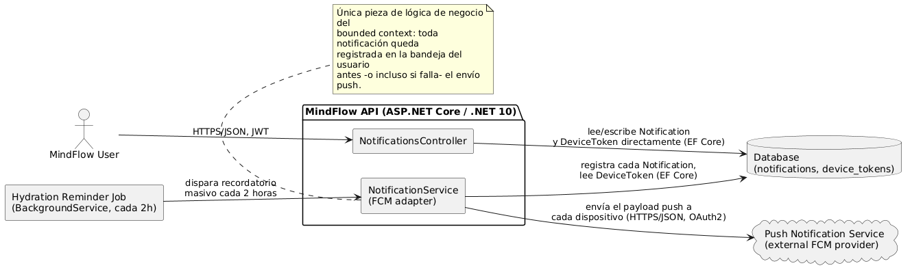
*Figura: Component Diagram (C4 Model) del bounded context Notifications dentro del container Web Services API.*

El diagrama refleja la asimetría deliberada del bounded context: `NotificationsController` accede directamente a la base de datos para sus operaciones de bandeja y registro de dispositivos, mientras que `NotificationService` concentra la única lógica de negocio (registrar y enviar) y es el componente al que recurre el job `HydrationReminderService` para su recordatorio periódico, cruzando hacia el proveedor externo de push notifications.

#### 2.6.6.6. Bounded Context Software Architecture Code Level Diagrams

##### 2.6.6.6.1. Bounded Context Domain Layer Class Diagrams

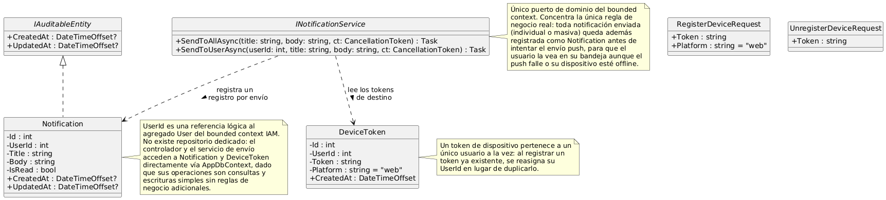
*Figura: Class Diagram (UML) del Domain Layer del bounded context Notifications.*

El diagrama muestra las dos entidades del bounded context, `Notification` (que implementa `IAuditableEntity`) y `DeviceToken`, junto con el puerto `INotificationService` que las relaciona: registra una `Notification` por cada envío y lee los `DeviceToken` del destinatario para la entrega push.

##### 2.6.6.6.2. Bounded Context Database Design Diagram

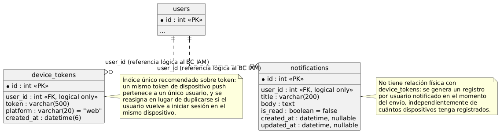
*Figura: Database Diagram del bounded context Notifications.*

El bounded context Notifications persiste en dos tablas independientes entre sí: `notifications` y `device_tokens`. Ninguna tiene Foreign Key física hacia `users`: `user_id` es en ambos casos una referencia lógica al bounded context IAM. Se recomienda un índice único sobre `device_tokens.token`, dado que el mismo token de dispositivo se reasigna de usuario en lugar de duplicarse.

---

### 2.6.7. Bounded Context: Subscriptions

El bounded context **Subscriptions** es responsable del plan de suscripción del usuario (gratuito o Premium) y de toda su facturación: iniciar el pago, verificar que se completó, sincronizar los cambios de estado que reporta el proveedor de pagos, y permitir la cancelación. El equipo decidió modelarlo con un único agregado plano y un único servicio de aplicación: a diferencia de Journal o Analytics, aquí no hay un catálogo de casos de uso lo bastante grande como para justificar Commands, Queries o manejadores separados — toda la lógica de facturación cabe naturalmente en una sola interfaz orientada a los verbos del ciclo de vida de una suscripción (iniciar checkout, verificar, cancelar, reconciliar webhook).

#### 2.6.7.1. Domain Layer

El Domain Layer se reduce a un único agregado, sin repository interface propio: al tener una única suscripción por usuario y operaciones acotadas, el equipo decidió que el servicio de aplicación acceda directamente a `AppDbContext`, sin una capa de repositorio intermedia.

| Clase | Tipo | Propósito | Atributos | Métodos | Relaciones |
|---|---|---|---|---|---|
| `Subscription` | Aggregate Root (implementa `IAuditableEntity`) | Representa el plan de facturación de un usuario. Se decidió modelar un único agregado plano —sin una entidad separada de "transacción de pago"— porque el estado completo de facturación que MindFlow necesita conocer (plan, estado, identificadores del proveedor de pagos) cabe en un solo registro; el historial detallado de cobros queda delegado por completo al proveedor externo. | `Id: int`, `UserId: int`, `Plan: string` ("free"/"premium"), `Status: string` ("active"/"past_due"/"canceled"), `StripeCustomerId: string?`, `StripeSubscriptionId: string?`, `ExpiresAt: DateTimeOffset?`, `CreatedAt/UpdatedAt: DateTimeOffset?` | `Activate(stripeCustomerId, stripeSubscriptionId)`, `Cancel()`, `MarkPastDue()`, propiedad calculada `IsPremium` | `UserId` es una referencia lógica al agregado `User` del bounded context IAM (sin FK física); único registro por usuario |

#### 2.6.7.2. Interface Layer

El Interface Layer expone la suscripción del usuario y el endpoint de webhook del proveedor de pagos como un único controlador REST.

| Clase | Tipo | Propósito | Endpoints / Métodos | Relaciones |
|---|---|---|---|---|
| `SubscriptionsController` | REST Controller (`api/v1/subscriptions`) | Expone el inicio de checkout, la consulta del plan actual, la verificación de una sesión completada, la cancelación, y recibe el webhook del proveedor de pagos (único endpoint anónimo del bounded context, protegido por verificación de firma en lugar de JWT). | `POST /checkout`, `GET /me`, `POST /verify-session`, `POST /cancel`, `POST /webhook` (`[AllowAnonymous]`) | Depende directamente de `ISubscriptionService` para los cinco casos de uso; no usa Resources ni Assemblers |

#### 2.6.7.3. Application Layer

El Application Layer se reduce, igual que en Notifications, a un único puerto de dominio: toda la lógica de facturación de MindFlow queda concentrada detrás de `ISubscriptionService`.

| Clase | Tipo | Propósito | Atributos / Métodos | Relaciones |
|---|---|---|---|---|
| `ISubscriptionService` | Service Port | Abstrae toda la lógica de facturación —creación de la sesión de pago, verificación, reconciliación del webhook y cancelación— detrás de una interfaz que no expone detalles del proveedor de pagos concreto. | `CreateCheckoutSessionAsync(userId, userEmail, ct): Task<CheckoutSessionDto>`, `HandleWebhookAsync(payload, stripeSignature, ct): Task`, `GetByUserIdAsync(userId, ct): Task<SubscriptionDto>`, `VerifySessionAsync(userId, sessionId, ct): Task<SubscriptionDto>`, `CancelAsync(userId, ct): Task` | Implementada por `SubscriptionService` (Infrastructure Layer); consumida por `SubscriptionsController` |
| `SubscriptionDto`, `CheckoutSessionDto` | Response DTOs | Representan, respectivamente, el estado público del plan del usuario, y la URL de la sesión de pago que el cliente debe abrir para completar el checkout. | `SubscriptionDto{UserId, Plan, Status, IsPremium, ExpiresAt}`, `CheckoutSessionDto{CheckoutUrl}` | Construidos por `ISubscriptionService` a partir de `Subscription` o de la respuesta del proveedor de pagos |

#### 2.6.7.4. Infrastructure Layer

El Infrastructure Layer implementa el puerto de facturación sobre el proveedor de pagos externo, siendo el punto de integración más denso del bounded context: reconcilia tanto las llamadas directas del usuario como los eventos asíncronos del webhook.

| Clase | Tipo | Propósito | Atributos / Métodos | Relaciones |
|---|---|---|---|---|
| `SubscriptionService` | Infrastructure Service | Implementa `ISubscriptionService`: crea la sesión de checkout, verifica una sesión completada, cancela la suscripción, y procesa los eventos entrantes del webhook (sesión completada, suscripción actualizada/eliminada, pago fallido/exitoso), manteniendo `Subscription` sincronizada con el estado real del proveedor de pagos. | `CreateCheckoutSessionAsync(...)`, `HandleWebhookAsync(...)`, `GetByUserIdAsync(...)`, `VerifySessionAsync(...)`, `CancelAsync(...)` | Implementa `ISubscriptionService`; depende de `AppDbContext` y del servicio externo **Payment Provider** (Stripe) |

---

#### 2.6.7.5. Bounded Context Software Architecture Component Level Diagrams

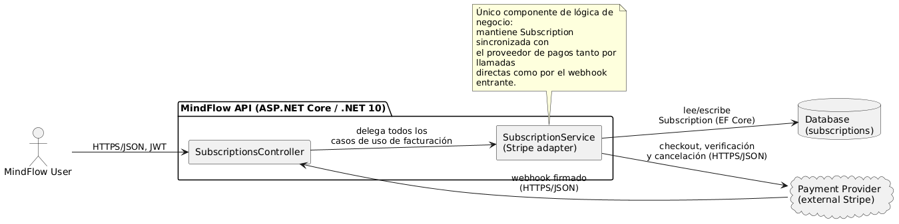
*Figura: Component Diagram (C4 Model) del bounded context Subscriptions dentro del container Web Services API.*

El diagrama muestra el flujo bidireccional con el proveedor de pagos: `SubscriptionsController` recibe tanto las peticiones del usuario como el webhook entrante del proveedor, y delega ambos en `SubscriptionService`, el único componente de lógica de negocio, que mantiene `Subscription` sincronizada con el estado real de la facturación.

#### 2.6.7.6. Bounded Context Software Architecture Code Level Diagrams

##### 2.6.7.6.1. Bounded Context Domain Layer Class Diagrams

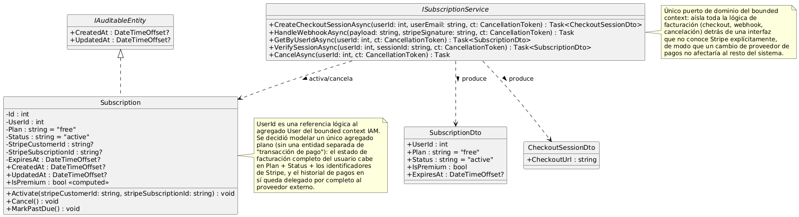
*Figura: Class Diagram (UML) del Domain Layer del bounded context Subscriptions.*

El diagrama muestra el agregado `Subscription` (que implementa `IAuditableEntity`), con sus tres transiciones de estado (`Activate`, `Cancel`, `MarkPastDue`) y su propiedad calculada `IsPremium`, junto con el puerto `ISubscriptionService` y los DTOs que produce.

##### 2.6.7.6.2. Bounded Context Database Design Diagram

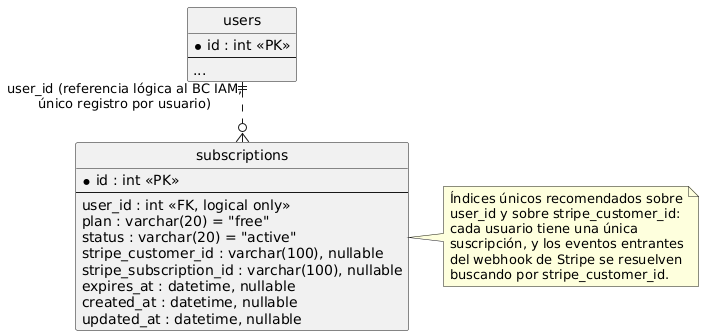
*Figura: Database Diagram del bounded context Subscriptions.*

El bounded context Subscriptions persiste en una única tabla, `subscriptions`, sin Foreign Key física hacia `users` (`user_id` es una referencia lógica al bounded context IAM). Se recomienda un índice único sobre `user_id` (una suscripción por usuario) y otro sobre `stripe_customer_id`, usado para resolver los eventos entrantes del webhook.

---

### 2.6.8. Bounded Context: Support

El bounded context **Support** es responsable de los tickets de soporte que un usuario levanta hacia el equipo de MindFlow: su creación, su confirmación por correo, y la consulta del historial propio del usuario. El equipo decidió modelarlo de la forma más simple posible: un único agregado y un único servicio de aplicación, sin Commands ni Queries, siguiendo el mismo criterio adoptado en Notifications y Subscriptions para bounded contexts cuyo catálogo de casos de uso es reducido y no justifica una capa CQRS explícita.

#### 2.6.8.1. Domain Layer

El Domain Layer se reduce a un único agregado, sin repository interface propio: al ser un catálogo acotado de operaciones, el equipo decidió que el servicio de aplicación acceda directamente a `AppDbContext`, sin una capa de repositorio intermedia.

| Clase | Tipo | Propósito | Atributos | Métodos | Relaciones |
|---|---|---|---|---|---|
| `SupportTicket` | Aggregate Root (implementa `IAuditableEntity`) | Representa un ticket de soporte levantado por un usuario. Se decidió desnormalizar el correo del usuario (`UserEmail`) directamente en el ticket, en lugar de resolverlo en tiempo de consulta contra IAM, para poder enviar la confirmación y cualquier respuesta futura sin una dependencia síncrona entre bounded contexts. | `Id: int`, `UserId: int`, `UserEmail: string`, `Subject: string`, `Message: string`, `Status: string` ("open"/"in_progress"/"closed"), `CreatedAt/UpdatedAt: DateTimeOffset?` | `MarkInProgress()`, `Close()` | `UserId` es una referencia lógica al agregado `User` del bounded context IAM (sin FK física) |

#### 2.6.8.2. Interface Layer

El Interface Layer expone la creación y consulta de tickets del usuario autenticado como un único controlador REST.

| Clase | Tipo | Propósito | Endpoints / Métodos | Relaciones |
|---|---|---|---|---|
| `SupportController` | REST Controller (`api/v1/support`) | Expone la creación de un ticket y el listado de los tickets propios del usuario autenticado, formateando el identificador visible del ticket (`#00001`). Valida longitud del asunto y traduce el rechazo por duplicado a un código `429`. | `POST /tickets`, `GET /tickets` | Depende directamente de `ISupportService`; no usa Resources ni Assemblers |
| `CreateTicketRequest` | Request DTO (record) | Representa el cuerpo de la petición de creación de un ticket. | `CreateTicketRequest(Subject, Message)` | Consumido directamente por `SupportController` |

#### 2.6.8.3. Application Layer

El Application Layer se reduce, igual que en Notifications y Subscriptions, a un único puerto de dominio.

| Clase | Tipo | Propósito | Atributos / Métodos | Relaciones |
|---|---|---|---|---|
| `ISupportService` | Service Port | Abstrae el ciclo de vida de un ticket visible para el usuario: crearlo y consultar los propios. La transición de estado por parte del equipo de soporte (`MarkInProgress`/`Close`) queda deliberadamente fuera del alcance de este puerto en la primera versión, reservada al acceso directo del equipo a la base de datos en lugar de un panel de administración dedicado. | `CreateTicketAsync(userId, userEmail, subject, message): Task<SupportTicket>`, `GetUserTicketsAsync(userId): Task<IEnumerable<SupportTicket>>` | Implementada por `SupportService` (Infrastructure Layer); consumida por `SupportController` |

#### 2.6.8.4. Infrastructure Layer

El Infrastructure Layer implementa el puerto de soporte, concentrando dos decisiones de diseño puntuales: la protección contra tickets duplicados y el envío no bloqueante de la confirmación.

| Clase | Tipo | Propósito | Atributos / Métodos | Relaciones |
|---|---|---|---|---|
| `SupportService` | Infrastructure Service | Implementa `ISupportService`: rechaza la creación de un ticket si el mismo usuario envió uno con el mismo asunto en el último minuto (protección simple contra doble envío accidental), persiste el ticket, y dispara el correo de confirmación de forma no bloqueante (*fire-and-forget*), de modo que una falla o demora del proveedor de correo nunca retrase la respuesta al usuario. | `CreateTicketAsync(userId, userEmail, subject, message): Task<SupportTicket>`, `GetUserTicketsAsync(userId): Task<IEnumerable<SupportTicket>>` | Implementa `ISupportService`; depende de `AppDbContext` y del servicio externo **SMTP Email Service** |

---

#### 2.6.8.5. Bounded Context Software Architecture Component Level Diagrams

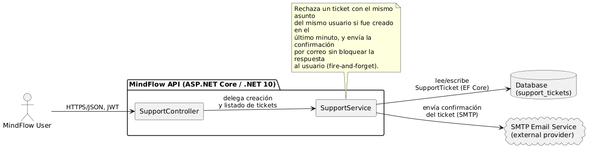
*Figura: Component Diagram (C4 Model) del bounded context Support dentro del container Web Services API.*

El diagrama muestra el flujo más simple de los seis bounded contexts restantes: `SupportController` delega ambos casos de uso en `SupportService`, que concentra tanto la persistencia del ticket como el envío no bloqueante de su confirmación por correo hacia el proveedor SMTP externo.

#### 2.6.8.6. Bounded Context Software Architecture Code Level Diagrams

##### 2.6.8.6.1. Bounded Context Domain Layer Class Diagrams

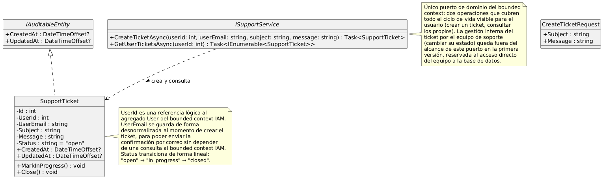
*Figura: Class Diagram (UML) del Domain Layer del bounded context Support.*

El diagrama muestra el agregado `SupportTicket` (que implementa `IAuditableEntity`), con sus dos transiciones de estado (`MarkInProgress`, `Close`) y el puerto `ISupportService` que lo crea y consulta.

##### 2.6.8.6.2. Bounded Context Database Design Diagram

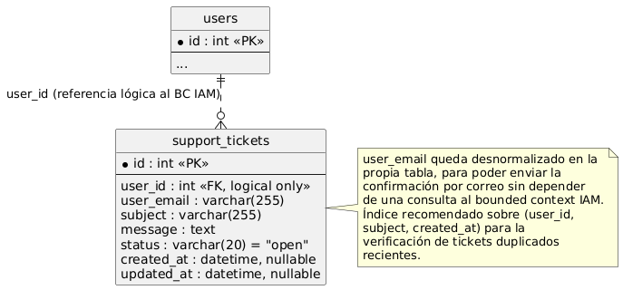
*Figura: Database Diagram del bounded context Support.*

El bounded context Support persiste en una única tabla, `support_tickets`, sin Foreign Key física hacia `users` (`user_id` es una referencia lógica al bounded context IAM). Se recomienda un índice compuesto sobre `(user_id, subject, created_at)` para acelerar la verificación de tickets duplicados recientes en cada creación.

---

<!--
# Capítulo III: Solution UI/UX Design

## 3.1. Product design

### 3.1.1. Style Guidelines

#### 3.1.1.1. General Style Guidelines

_Pendiente_

### 3.1.2. Information Architecture

#### 3.1.2.1. Organization Systems

_Pendiente_

#### 3.1.2.2. Labelling Systems

_Pendiente_

#### 3.1.2.3. SEO Tags and Meta Tags

_Pendiente_

#### 3.1.2.4. Searching Systems

_Pendiente_

#### 3.1.2.5. Navigation Systems

_Pendiente_

### 3.1.3. Landing Page UI Design

#### 3.1.3.1. Landing Page Wireframe

_Pendiente_

#### 3.1.3.2. Landing Page Mock-up

_Pendiente_

### 3.1.4. Mobile Applications UX/UI Design

#### 3.1.4.1. Mobile Applications Wireframes

_Pendiente_

#### 3.1.4.2. Mobile Applications Wireflow Diagrams

_Pendiente_

#### 3.1.4.3. Mobile Applications Mock-ups

_Pendiente_

#### 3.1.4.4. Mobile Applications User Flow Diagrams

_Pendiente_

#### 3.1.4.5. Mobile Applications Prototyping

_Pendiente_

---

# Capítulo IV: Product Implementation & Validation

## 4.1. Software Configuration Management

### 4.1.1. Software Development Environment Configuration

_Pendiente_

### 4.1.2. Source Code Management

_Pendiente_

### 4.1.3. Source Code Style Guide & Conventions

_Pendiente_

### 4.1.4. Software Deployment Configuration

_Pendiente_

## 4.2. Landing Page & Mobile Application Implementation

### 4.2.1. Sprint 1

#### 4.2.1.1. Sprint Planning 1

_Pendiente_

#### 4.2.1.2. Aspect Leaders and Collaborators

_Pendiente_

#### 4.2.1.3. Sprint Backlog 1

_Pendiente_

#### 4.2.1.4. Development Evidence for Sprint Review

_Pendiente_

#### 4.2.1.5. Testing Suite Evidence for Sprint Review

_Pendiente_

#### 4.2.1.6. Execution Evidence for Sprint Review

_Pendiente_

#### 4.2.1.7. Services Documentation Evidence for Sprint Review

_Pendiente_

#### 4.2.1.8. Software Deployment Evidence for Sprint Review

_Pendiente_

#### 4.2.1.9. Team Collaboration Insights during Sprint

_Pendiente_

## 4.3. Validation Interviews

### 4.3.1. Diseño de Entrevistas

_Pendiente_

### 4.3.2. Registro de Entrevistas

_Pendiente_

### 4.3.3. Evaluaciones según heurísticas

_Pendiente_

---
-->

# Conclusiones

## Conclusiones y recomendaciones

**Conclusiones**

1. El desarrollo del Big Picture EventStorming y de la sesión de EventStorming estratégico permitió al equipo construir un entendimiento compartido del dominio de negocio de MindFlow, sentando las bases para identificar los 8 Bounded Contexts candidatos (IAM, Journal, AI Assistant, Habits & Wellness, Analytics & Reporting, Notifications, Subscriptions y Support) que guiarán el diseño de la solución en las siguientes entregas.
2. La aplicación del Lean UX Process (Problem Statements y Assumptions) confirmó que la propuesta de valor de MindFlow —contención emocional inmediata mediante IA y seguimiento adaptativo de hábitos— responde a una necesidad real y validable en los segmentos de estudiantes universitarios y jóvenes profesionales identificados.

**Recomendaciones**

1. Se recomienda continuar con la elaboración de los Bounded Context Canvases y el Context Mapping antes de avanzar al diseño técnico detallado, con el fin de asegurar que las relaciones entre contextos (Anti-corruption Layer, Customer/Supplier, Shared Kernel, etc.) queden correctamente sustentadas.
2. Se recomienda validar las Assumptions planteadas en el Lean UX Process —en especial las relacionadas con la disposición de pago y la confianza en el motor de IA— mediante entrevistas de validación con usuarios reales, antes de comprometer recursos de desarrollo en las funcionalidades Premium.

<!--
## Video App Validation

_Pendiente_

## Video About the product

_Pendiente_

## Video About the team

_Pendiente_
-->

---

<!--# Glosario

_Pendiente_ -->

---

# Bibliografía

Organización Mundial de la Salud. (2021). *Global strategy on digital health 2020-2025*. https://www.who.int/publications/i/item/9789240020924

Organización Mundial de la Salud. (2022). *World mental health report: Transforming mental health for all*. https://www.who.int/publications/i/item/9789240049338

<!--
---

# Anexos

_Pendiente_
-->
